# Armature Schema Reference

_Schema snapshot · Generated 2026-03-03_

---

## Overview

Armature models the full instructional design artifact graph from problem definition through outcome evaluation. The schema is implemented in TerminusDB using its document interface for closed-world assumptions, native version control, and graph traversal.

**Key architectural patterns:**

- **Abstract base types** — `ArmatureDocument` and `LearningEvidence` enforce shared field contracts across subtypes. Neither is directly instantiated.
- **Junction documents** — many-to-many relationships are reified as first-class graph nodes. The relationship itself carries metadata (rationale, role, sequence, confidence) rather than being a bare edge.
- **Back-reference pattern** — child documents hold foreign keys to their parents (e.g., `Response.item`, `Assessment.module`), keeping parent documents lean regardless of child count.
- **API constraints** — some constraints (unique sequence values, required fields on creation) are enforced at the API level rather than the schema level and are noted inline.

---

## Class Diagram

```mermaid
classDiagram
  class User {
    +string displayName
    +string externalId
    +string? email
    +string? institution
  }

  class ArmatureDocument {
    <<abstract>>
    +string label
    +string? description
    +User? createdBy
  }

  class LearningEvidence {
    <<abstract>>
    +dateTime collectedAt
    +string source
  }

  class LearningMetric {
    +decimal value
    +string unit
    +LearningDataset? derivedFrom
  }

  class DescriptiveEvidence {
    +EvidenceMethod method
    +string finding
  }

  class LearningDataset {
    +date? administrationDate
    +string? cohort
    +Assessment? producedBy
  }

  class LearningNeed {
    +string rationale
    +NeedPriority? priority
  }

  class NeedEvidenceLink {
    <<junction>>
    +LearningNeed need
    +LearningEvidence evidence
    +ConfidenceLevel? confidence
  }

  class LearningObjective {
    +BloomsLevel? bloomsLevel
    +ObjectiveState state
    +LearningNeed? generatedBy
  }

  class PrerequisiteRecord {
    <<junction>>
    +string rationale
    +PrerequisiteType prerequisiteType
    +LearningObjective objective
    +LearningObjective prerequisite
  }

  class AssessmentItem {
    +string stem
    +ItemType itemType
    +BloomsLevel? bloomsLevel
    +Set<LearningObjective> assesses
    +decimal? difficultyIndex
    +decimal? discriminationIndex
  }

  class Response {
    <<junction>>
    +boolean isCorrect
    +string? incorrectFeedback
    +AssessmentItem item
  }

  class ItemInstance {
    <<junction>>
    +integer sequence
    +integer pointValue
    +boolean randomize
    +ItemStatus status
    +Assessment assessment
    +AssessmentItem implements
  }

  class Assessment {
    +boolean randomize
    +decimal? passingScore
    +integer? retakes
    +Module module
  }

  class LearningActivity {
    +ActivityType? activityType
    +Set<LearningObjective> targets
  }

  class ActivityGroup

  class ActivityGroupMember {
    <<junction>>
    +ActivityGroup group
    +LearningActivity activity
    +integer? sequence
  }

  class ModuleObjective {
    <<junction>>
    +integer? sequence
    +ObjectiveRole role
    +string? roleRationale
    +CoverageStatus coverageStatus
    +Module module
    +LearningObjective references
  }

  class Module {
    +integer? sequence
    +Course course
  }

  class ModuleActivityLink {
    <<junction>>
    +Module module
    +LearningActivity activity
    +integer? sequence
  }

  class ModuleActivityGroupLink {
    <<junction>>
    +Module module
    +ActivityGroup group
    +integer? sequence
  }

  class DesignNote {
    +string rationale
    +Set<ArmatureDocument> subject
    +DesignNoteCategory? category
  }

  class Course

  %% Inheritance
  ArmatureDocument <|-- LearningEvidence : inherits
  LearningEvidence <|-- LearningMetric : inherits
  LearningEvidence <|-- DescriptiveEvidence : inherits
  ArmatureDocument <|-- LearningDataset : inherits
  ArmatureDocument <|-- LearningNeed : inherits
  ArmatureDocument <|-- LearningObjective : inherits
  ArmatureDocument <|-- PrerequisiteRecord : inherits
  ArmatureDocument <|-- AssessmentItem : inherits
  ArmatureDocument <|-- Response : inherits
  ArmatureDocument <|-- Assessment : inherits
  ArmatureDocument <|-- LearningActivity : inherits
  ArmatureDocument <|-- ActivityGroup : inherits
  ArmatureDocument <|-- Module : inherits
  ArmatureDocument <|-- DesignNote : inherits
  ArmatureDocument <|-- Course : inherits

  %% Relationships
  ArmatureDocument ..> User : createdBy
  LearningMetric ..> LearningDataset : derivedFrom
  LearningDataset ..> Assessment : producedBy
  NeedEvidenceLink --> LearningNeed : need
  NeedEvidenceLink --> LearningEvidence : evidence
  LearningObjective ..> LearningNeed : generatedBy
  PrerequisiteRecord --> LearningObjective : objective
  PrerequisiteRecord --> LearningObjective : prerequisite
  AssessmentItem "0..*" --> LearningObjective : assesses
  Response --> AssessmentItem : item
  ItemInstance --> Assessment : assessment
  ItemInstance --> AssessmentItem : implements
  Assessment --> Module : module
  LearningActivity "0..*" --> LearningObjective : targets
  ActivityGroupMember --> ActivityGroup : group
  ActivityGroupMember --> LearningActivity : activity
  ModuleObjective --> Module : module
  ModuleObjective --> LearningObjective : references
  Module --> Course : course
  ModuleActivityLink --> Module : module
  ModuleActivityLink --> LearningActivity : activity
  ModuleActivityGroupLink --> Module : module
  ModuleActivityGroupLink --> ActivityGroup : group
  DesignNote "0..*" --> ArmatureDocument : subject
```

---

## Type Reference

## Infrastructure

_Non-artifact types that underpin the design process without being instructional design artifacts themselves._

### `User`

> A person or system agent who participates in the design process. Intentionally minimal — Armature does not manage authentication or access control. Those concerns belong to the external auth system (identity) and TerminusDB (database access). User is a domain document: it represents who someone is as a design process participant, not whether they are allowed to operate the database. externalId is the stable identifier from the auth system (e.g., OIDC sub claim) — the API uses this to resolve an authenticated identity to a User document at write time. email and institution make the record self-describing in exports and across deployments, where the original auth system may not be available. User does not inherit ArmatureDocument — it is infrastructure for the design process, not an instructional design artifact, and should not be a valid subject of a DesignNote. See ADR-0015.

| Field         | Type      | Notes    |
| ------------- | --------- | -------- |
| `displayName` | `string`  | required |
| `externalId`  | `string`  | required |
| `email`       | `string?` | optional |
| `institution` | `string?` | optional |

### `ArmatureDocument`

**_abstract_**

> Abstract base class for all primary artifact types in the Armature graph. Carries the fields shared by every named artifact: label, description, and createdBy. Junction documents and structural types (ItemInstance, ModuleObjective, NeedEvidenceLink, ActivityGroupMember, ModuleActivityLink, ModuleActivityGroupLink) do not inherit from ArmatureDocument — they are addressed by their relationship fields. createdBy records who or what is responsible for this record existing in the graph: a designer for authored artifacts, a person who entered or imported evidence or dataset records, a system agent for API-generated records. Optional to accommodate the demo context and deployments without a full auth system. See ADR-0014, ADR-0015.

| Field         | Type      | Notes    |
| ------------- | --------- | -------- |
| `label`       | `string`  | required |
| `description` | `string?` | optional |
| `createdBy`   | `User?`   | optional |

## Evidence & Needs Analysis

_Evidence of learning gaps and the needs they inform. The upstream entry point into the artifact graph._

### `LearningEvidence`

**\*abstract** · extends `ArmatureDocument`\*

> Abstract base for all evidence of learning need. Cannot be instantiated directly — tools always create LearningMetric or DescriptiveEvidence instances. Inherits label, description from ArmatureDocument. The NeedEvidenceLink.evidence field references this abstract type, accepting either subtype at runtime via TerminusDB polymorphism. See ADR-0001, ADR-0014.

| Field         | Type       | Notes    |
| ------------- | ---------- | -------- |
| `collectedAt` | `dateTime` | required |
| `source`      | `string`   | required |

### `LearningMetric`

_extends `LearningEvidence`_

> A quantitative measurement of learning performance at a point in time. Inherits label, description, collectedAt, source from LearningEvidence. Typically derived from a LearningDataset produced by an administered Assessment — the derivedFrom link preserves that provenance. Examples: pass rate, average score, completion rate.

| Field         | Type               | Notes    |
| ------------- | ------------------ | -------- |
| `value`       | `decimal`          | required |
| `unit`        | `string`           | required |
| `derivedFrom` | `LearningDataset?` | optional |

### `DescriptiveEvidence`

_extends `LearningEvidence`_

> A qualitative finding from a structured needs analysis activity. Inherits label, description, collectedAt, source from LearningEvidence. method records how the data was gathered; finding records what was observed or reported.

| Field     | Type             | Notes    |
| --------- | ---------------- | -------- |
| `method`  | `EvidenceMethod` | required |
| `finding` | `string`         | required |

### `LearningDataset`

_extends `ArmatureDocument`_

> A named collection of learning performance data, typically produced when an Assessment is administered to a cohort. Inherits label, description from ArmatureDocument. Serves as the source for LearningMetrics derived from that administration. producedBy links back to the Assessment that generated this dataset, closing the provenance chain: Assessment → LearningDataset → LearningMetric. Optional because a dataset may come from an external source or a pre-Armature assessment not yet modeled in the graph. API CONSTRAINT: producedBy is required when a dataset is created by an Armature-administered assessment.

| Field                | Type          | Notes    |
| -------------------- | ------------- | -------- |
| `administrationDate` | `date?`       | optional |
| `cohort`             | `string?`     | optional |
| `producedBy`         | `Assessment?` | optional |

### `LearningNeed`

_extends `ArmatureDocument`_

> A documented gap between current and desired learner performance, grounded in evidence. Inherits label, description from ArmatureDocument. Informed by one or more LearningEvidence instances via NeedEvidenceLink. One need may generate multiple LearningObjectives — objectives reference back to their originating need via LearningObjective.generatedBy (ADR-0004 back-reference pattern). priority captures triage decisions when a needs analysis produces more needs than a course can address.

| Field       | Type            | Notes    |
| ----------- | --------------- | -------- |
| `rationale` | `string`        | required |
| `priority`  | `NeedPriority?` | optional |

### `NeedEvidenceLink`

**_junction_**

> Reifies the many-to-many relationship between a LearningNeed and the LearningEvidence that informs it. A first-class graph node — the relationship itself carries data. The evidence field accepts any LearningEvidence subtype (LearningMetric or DescriptiveEvidence) at runtime via TerminusDB polymorphism. confidence records how much weight the designer gave this piece of evidence during analysis. See ADR-0003, ADR-0009.

| Field        | Type               | Notes    |
| ------------ | ------------------ | -------- |
| `need`       | `LearningNeed`     | required |
| `evidence`   | `LearningEvidence` | required |
| `confidence` | `ConfidenceLevel?` | optional |

## Objectives

_The central node of the Armature graph. All upstream artifacts trace forward to objectives; all downstream artifacts trace back to them._

### `LearningObjective`

_extends `ArmatureDocument`_

> A measurable statement of intended learning outcome. Inherits label, description from ArmatureDocument. The central node in the Armature artifact graph — connected upstream to LearningNeeds (via generatedBy), laterally to prerequisites (via PrerequisiteRecord), and downstream to AssessmentItems (via AssessmentItem.assesses), LearningActivities (via LearningActivity.targets), and Modules (via ModuleObjective). The back-reference pattern (ADR-0004) is used throughout: connection fields live on related documents, not here, except for generatedBy which follows ADR-0004 by placing the foreign key on the child.

| Field         | Type             | Notes    |
| ------------- | ---------------- | -------- |
| `bloomsLevel` | `BloomsLevel?`   | optional |
| `state`       | `ObjectiveState` | required |
| `generatedBy` | `LearningNeed?`  | optional |

### `PrerequisiteRecord`

\*extends `ArmatureDocument` · **junction\***

> Junction document that reifies the prerequisite relationship between two LearningObjectives. Inherits label, description from ArmatureDocument. A first-class graph node — the relationship carries rationale and type, making it a design decision preserved in the graph. 'objective' has the requirement; 'prerequisite' must be met first (or alongside, for Corequisite). prerequisiteType is required — a prerequisite relationship without a type is underspecified. rationale is required — this is the core Armature value proposition: design decisions are explicit, not implicit. prerequisite is required — a PrerequisiteRecord must connect two real objectives. If the specific prerequisite objective hasn't been written yet, create it as a Draft LearningObjective first, then create this record (the 'create prerequisite objective' button workflow). If the prerequisite relationship is suspected but the specific objective is unknown, use a DesignNote with category: PrerequisiteIntent instead. See ADR-0003, ADR-0009, ADR-0011.

| Field              | Type                | Notes    |
| ------------------ | ------------------- | -------- |
| `rationale`        | `string`            | required |
| `prerequisiteType` | `PrerequisiteType`  | required |
| `objective`        | `LearningObjective` | required |
| `prerequisite`     | `LearningObjective` | required |

## Assessment

_Reusable items in an item bank, assembled into assessments via instance documents. Produces datasets that close the evidence loop._

### `AssessmentItem`

_extends `ArmatureDocument`_

> A single reusable question or task in the item bank. Inherits label, description from ArmatureDocument. Exists independently of any specific Assessment — placed into Assessments via ItemInstance. assesses must contain at least one LearningObjective — enforced at schema level via @min_cardinality (ADR-0013). difficultyIndex and discriminationIndex are computed from LearningDataset analysis and written back by the API, closing the design-to-evidence feedback loop. See ADR-0009, ADR-0013.

| Field                 | Type                     | Notes    |
| --------------------- | ------------------------ | -------- |
| `stem`                | `string`                 | required |
| `itemType`            | `ItemType`               | required |
| `bloomsLevel`         | `BloomsLevel?`           | optional |
| `assesses`            | `Set<LearningObjective>` | required |
| `difficultyIndex`     | `decimal?`               | optional |
| `discriminationIndex` | `decimal?`               | optional |

### `Response`

\*extends `ArmatureDocument` · **junction\***

> One answer option for an AssessmentItem. Inherits label, description from ArmatureDocument. A back-reference pattern is used: Response holds the foreign key to its item rather than AssessmentItem holding an array of responses. This keeps AssessmentItem documents lean regardless of the number of responses. See ADR-0004.

| Field               | Type             | Notes    |
| ------------------- | ---------------- | -------- |
| `isCorrect`         | `boolean`        | required |
| `incorrectFeedback` | `string?`        | optional |
| `item`              | `AssessmentItem` | required |

### `ItemInstance`

**_junction_**

> Places an AssessmentItem into a specific Assessment with assessment-context configuration. The same AssessmentItem can appear in multiple Assessments (e.g., a pre-test and post-test) as separate ItemInstance documents with different sequence, pointValue, or randomize settings. All fields are required — there is no reasonable default for sequence, point value, or review status when placing an item in a formal assessment.

| Field        | Type             | Notes    |
| ------------ | ---------------- | -------- |
| `sequence`   | `integer`        | required |
| `pointValue` | `integer`        | required |
| `randomize`  | `boolean`        | required |
| `status`     | `ItemStatus`     | required |
| `assessment` | `Assessment`     | required |
| `implements` | `AssessmentItem` | required |

### `Assessment`

_extends `ArmatureDocument`_

> A named collection of ItemInstances for a specific instructional purpose within a Module. Inherits label, description from ArmatureDocument. Contained by exactly one Module (back-reference pattern — see ADR-0004). When administered, produces a LearningDataset. LearningDatasets are linked back to this Assessment via LearningDataset.producedBy, enabling outcome-to-design traceability.

| Field          | Type       | Notes    |
| -------------- | ---------- | -------- |
| `randomize`    | `boolean`  | required |
| `passingScore` | `decimal?` | optional |
| `retakes`      | `integer?` | optional |
| `module`       | `Module`   | required |

## Learning Activities & Course Structure

_Instructional activities and the hierarchical containers that organize them into deliverable courses._

### `LearningActivity`

_extends `ArmatureDocument`_

> A reusable instructional activity that targets one or more LearningObjectives. Inherits label, description from ArmatureDocument. Can appear in multiple Modules (via ModuleActivityLink) and ActivityGroups (via ActivityGroupMember) without duplication. targets must contain at least one LearningObjective — enforced at schema level via @min_cardinality (ADR-0013). activityType makes instructional strategy queryable in the graph. See ADR-0009, ADR-0013.

| Field          | Type                     | Notes    |
| -------------- | ------------------------ | -------- |
| `activityType` | `ActivityType?`          | optional |
| `targets`      | `Set<LearningObjective>` | required |

### `ActivityGroup`

_extends `ArmatureDocument`_

> A reusable, named collection of LearningActivities with a defined pedagogical sequence. Inherits label, description from ArmatureDocument. Can appear in multiple Modules via ModuleActivityGroupLink. Intentionally flat — ActivityGroups do not contain other ActivityGroups. Membership and sequence are managed through ActivityGroupMember junction documents. See ADR-0003.

_No additional fields._

### `Module`

_extends `ArmatureDocument`_

> A named instructional unit within a Course. Inherits label, description from ArmatureDocument. Contains LearningActivities (via ModuleActivityLink), ActivityGroups (via ModuleActivityGroupLink), and Assessments (back-reference on Assessment.module). Declares the LearningObjectives it intends to cover via ModuleObjective. Contained by exactly one Course (back-reference pattern — see ADR-0004).

| Field      | Type       | Notes    |
| ---------- | ---------- | -------- |
| `sequence` | `integer?` | optional |
| `course`   | `Course`   | required |

### `Course`

_extends `ArmatureDocument`_

> Top-level container for a complete instructional design project. Inherits label, description from ArmatureDocument. Contains one or more Modules. Intentionally minimal in the current schema — version, status, dates, and authorship fields are deferred. See ADR-0010.

_No additional fields._

## Junction Documents

_Reified many-to-many relationships. Each is a first-class graph node that carries metadata about the relationship itself._

### `ActivityGroupMember`

**_junction_**

> Places a LearningActivity into an ActivityGroup with a sub-sequence position. sequence is the activity's position within the group only — it is independent of the module-level sequence on ModuleActivityGroupLink and must never be combined with it. See ADR-0005.

| Field      | Type               | Notes    |
| ---------- | ------------------ | -------- |
| `group`    | `ActivityGroup`    | required |
| `activity` | `LearningActivity` | required |
| `sequence` | `integer?`         | optional |

### `ModuleObjective`

**_junction_**

> Reifies the relationship between a Module and a LearningObjective it declares. A first-class graph node that carries both design intent (role, roleRationale) and computed graph intelligence (coverageStatus). Created programmatically by the API when a designer assigns an objective to a module — not directly created or edited through the UI. coverageStatus is recomputed by the API after any change that affects coverage: modifications to AssessmentItem.assesses, ItemInstance additions/removals, or ModuleObjective role changes. See ADR-0007.

| Field            | Type                | Notes    |
| ---------------- | ------------------- | -------- |
| `sequence`       | `integer?`          | optional |
| `role`           | `ObjectiveRole`     | required |
| `roleRationale`  | `string?`           | optional |
| `coverageStatus` | `CoverageStatus`    | required |
| `module`         | `Module`            | required |
| `references`     | `LearningObjective` | required |

### `ModuleActivityLink`

**_junction_**

> Places a standalone LearningActivity into a Module with a module-level sequence position. sequence shares the same integer namespace as ModuleActivityGroupLink.sequence — both are sorted together to produce the module's ordered content list. API CONSTRAINT: sequence values must be unique across both ModuleActivityLink and ModuleActivityGroupLink for a given Module. See ADR-0005.

| Field      | Type               | Notes    |
| ---------- | ------------------ | -------- |
| `module`   | `Module`           | required |
| `activity` | `LearningActivity` | required |
| `sequence` | `integer?`         | optional |

### `ModuleActivityGroupLink`

**_junction_**

> Places an ActivityGroup into a Module with a module-level sequence position. sequence shares the same integer namespace as ModuleActivityLink.sequence — both are sorted together to produce the module's ordered content list. The activities within the group are sub-sequenced via ActivityGroupMember.sequence, which is independent of this module-level sequence. See ADR-0005.

| Field      | Type            | Notes    |
| ---------- | --------------- | -------- |
| `module`   | `Module`        | required |
| `group`    | `ActivityGroup` | required |
| `sequence` | `integer?`      | optional |

## Design Rationale

_Free-form rationale records that attach design decisions to any primary artifact._

### `DesignNote`

_extends `ArmatureDocument`_

> A free-form rationale record attached to any primary artifact in the Armature graph. Inherits label, description from ArmatureDocument. Captures design decisions that fall outside the predefined rationale fields on specific document types (PrerequisiteRecord.rationale, ModuleObjective.roleRationale, etc.). subject types to Set<ArmatureDocument> — any primary artifact can be a subject. TerminusDB enforces referential integrity natively, replacing the earlier xsd:anyURI stopgap. See ADR-0012, ADR-0014.

| Field       | Type                    | Notes    |
| ----------- | ----------------------- | -------- |
| `rationale` | `string`                | required |
| `subject`   | `Set<ArmatureDocument>` | required |
| `category`  | `DesignNoteCategory?`   | optional |

---

## Enumerations

### Objectives

### `BloomsLevel`

> Bloom's Revised Taxonomy cognitive levels. Used on both LearningObjective and AssessmentItem — sharing this enum enables alignment queries between the two types (e.g., find items whose Bloom's level does not match their target objective).

- `Remember`
- `Understand`
- `Apply`
- `Analyze`
- `Evaluate`
- `Create`

### `ObjectiveState`

> Lifecycle state of a LearningObjective. Draft: being authored. Active: in use by one or more Modules. Deprecated: no longer recommended for new Modules but may exist in existing ones. Archived: fully retired.

- `Draft`
- `Active`
- `Deprecated`
- `Archived`

### `ObjectiveRole`

> The role a LearningObjective plays within a specific Module, recorded on ModuleObjective. Primary: a main learning outcome of the module. Supporting: contextual or reinforcing content. Prerequisite: an enabling objective being addressed within this module.

- `Primary`
- `Supporting`
- `Prerequisite`

### `PrerequisiteType`

> The nature and strength of a prerequisite relationship recorded on PrerequisiteRecord. Hard: the learner cannot reasonably succeed without this prerequisite. Soft: recommended but not strictly required. Corequisite: should be learned alongside rather than before. This distinction has direct implications for curriculum sequencing.

- `Hard`
- `Soft`
- `Corequisite`

### Assessment

### `ItemType`

> The question format of an AssessmentItem. Determines the valid Response structure (e.g., MultipleChoice has exactly one correct Response; MultipleSelect has one or more).

- `MultipleChoice`
- `MultipleSelect`
- `TrueFalse`
- `ShortAnswer`
- `Essay`
- `Matching`
- `Ordering`
- `FillInTheBlank`

### `ItemStatus`

> Review lifecycle state of an ItemInstance within a specific Assessment. Draft: not yet reviewed. InReview: under SME or editorial review. Approved: cleared for administration. Retired: removed from active use.

- `Draft`
- `InReview`
- `Approved`
- `Retired`

### Evidence & Needs

### `EvidenceMethod`

> How a DescriptiveEvidence finding was collected. Used to contextualize qualitative findings and enable filtering by collection method during needs analysis.

- `Interview`
- `Survey`
- `Observation`
- `FocusGroup`
- `DocumentReview`
- `ExpertReview`
- `Other`

### `ConfidenceLevel`

> The designer's assessment of a piece of evidence's reliability, recorded on NeedEvidenceLink. Makes the weighting of evidence during needs analysis inspectable in the graph. Preliminary: early or anecdotal data. Low/Medium/High: assessed reliability.

- `High`
- `Medium`
- `Low`
- `Preliminary`

### `NeedPriority`

> Triage priority assigned to a LearningNeed when needs analysis produces more needs than a single course can address. Captures the prioritization decision in the graph rather than leaving it in a spreadsheet or designer's notes.

- `Critical`
- `High`
- `Medium`
- `Low`

### Coverage & Activities

### `CoverageStatus`

> Computed alignment status on ModuleObjective. Reflects whether the module's AssessmentItems adequately cover a declared objective. Set by the Armature API — not authored by designers. Uncovered: no items assess this objective. PartiallyAssessed: some items but insufficient coverage. FullyAssessed: adequate coverage. OverAssessed: more items than needed for the objective's scope.

- `Uncovered`
- `PartiallyAssessed`
- `FullyAssessed`
- `OverAssessed`

### `ActivityType`

> The instructional strategy type of a LearningActivity. Makes strategy a queryable graph property — enables questions like 'which objectives have no simulation or practice activity?' Optional on LearningActivity to avoid forcing categorization during early design.

- `Reading`
- `Video`
- `Simulation`
- `WorkedExample`
- `Discussion`
- `Practice`
- `Reflection`
- `Other`

### Design Rationale

### `DesignNoteCategory`

> Categories of design decisions captured by DesignNote. Enables filtering and querying of rationale by decision type. PrerequisiteIntent covers cases where a designer knows a prerequisite relationship exists but hasn't yet identified or created the prerequisite objective — use this category with a DesignNote rather than creating an incomplete PrerequisiteRecord. See ADR-0011, ADR-0012.

- `BloomsLevelChoice`
- `AssessmentStrategyChoice`
- `SequencingDecision`
- `PrioritizationDecision`
- `ScopeDecision`
- `AlignmentDecision`
- `PrerequisiteIntent`
- `Other`
