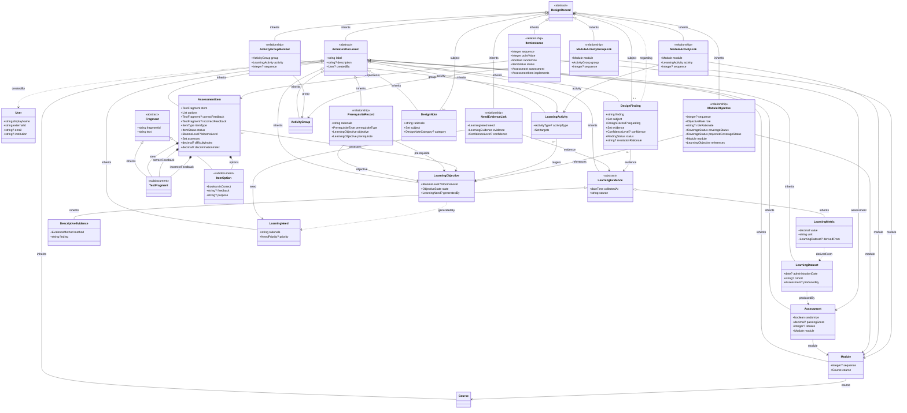

# Armature Schema Reference

_Schema snapshot · Generated 2026-10-08_

---

## Overview

Armature models the full instructional design artifact graph from problem definition through outcome evaluation. The schema is implemented in TerminusDB using its document interface for closed-world assumptions, native version control, and graph traversal.

**Key architectural patterns:**

- **Abstract roots** — `DesignRecord` is the root of every record of design; `ArmatureDocument` adds label, description and createdBy for the primary artifacts; `LearningEvidence` and `Fragment` are abstract within their families. None is directly instantiated.
- **Self-description** — every class declares `@metadata.armature.category` (infrastructure, fragment, artifact, relationship); tools and generators read the taxonomy from the schema, not from a hand-maintained list (ADR-0027).
- **Relationships as documents** — many-to-many relationships are reified as first-class graph nodes that carry data about the relationship itself (rationale, role, sequence, confidence) and can themselves be the subject of a `DesignNote` or `DesignFinding` (ADR-0003, ADR-0017).
- **Fragments** — an item is a tree of embedded subdocuments (stem, options, feedbacks), each with a client-assigned `fragmentId` so a part can be addressed without having document identity (ADR-0022, ADR-0023, ADR-0033).
- **Back-reference pattern** — child documents hold foreign keys to their parents (e.g., `Assessment.module`, `Module.course`), keeping parent documents lean regardless of child count (ADR-0004).
- **API constraints** — TerminusDB checks that a referenced document exists but not its class, and cannot express cross-document or conditional rules. Those constraints (reference class, unique sequences, conditional requirements, coverage recompute) are enforced by the API and are noted inline (ADR-0006).
- **Computed fields** — a class may list fields in `@metadata.armature.computed` that the API computes and a client may not write; today `ModuleObjective.coverageStatus` and `projectedCoverageStatus`, recomputed in the same commit as any write that affects them (ADR-0029).

---

## Class Diagram

```mermaid
classDiagram
  class User {
    +string displayName
    +string externalId
    +string? email
    +string? institution
  }

  class DesignRecord {
    <<abstract>>
  }

  class ArmatureDocument {
    <<abstract>>
    +string label
    +string? description
    +User? createdBy
  }

  class LearningEvidence {
    <<abstract>>
    +dateTime collectedAt
    +string source
  }

  class LearningMetric {
    +decimal value
    +string unit
    +LearningDataset? derivedFrom
  }

  class DescriptiveEvidence {
    +EvidenceMethod method
    +string finding
  }

  class LearningDataset {
    +date? administrationDate
    +string? cohort
    +Assessment? producedBy
  }

  class LearningNeed {
    +string rationale
    +NeedPriority? priority
  }

  class NeedEvidenceLink {
    <<relationship>>
    +LearningNeed need
    +LearningEvidence evidence
    +ConfidenceLevel? confidence
  }

  class LearningObjective {
    +BloomsLevel? bloomsLevel
    +ObjectiveState state
    +LearningNeed? generatedBy
  }

  class PrerequisiteRecord {
    <<relationship>>
    +string rationale
    +PrerequisiteType prerequisiteType
    +LearningObjective objective
    +LearningObjective prerequisite
  }

  class Fragment {
    <<abstract>>
    <<subdocument>>
    +string fragmentId
    +string text
  }

  class TextFragment {
    <<subdocument>>
  }

  class ItemOption {
    <<subdocument>>
    +boolean isCorrect
    +string? feedback
    +string? purpose
  }

  class AssessmentItem {
    +TextFragment stem
    +List<ItemOption> options
    +TextFragment? correctFeedback
    +TextFragment? incorrectFeedback
    +ItemType itemType
    +ItemStatus status
    +BloomsLevel? bloomsLevel
    +Set<LearningObjective> assesses
    +decimal? difficultyIndex
    +decimal? discriminationIndex
  }

  class ItemInstance {
    <<relationship>>
    +integer sequence
    +integer pointValue
    +boolean randomize
    +ItemStatus status
    +Assessment assessment
    +AssessmentItem implements
  }

  class Assessment {
    +boolean randomize
    +decimal? passingScore
    +integer? retakes
    +Module module
  }

  class LearningActivity {
    +ActivityType? activityType
    +Set<LearningObjective> targets
  }

  class ActivityGroup

  class ActivityGroupMember {
    <<relationship>>
    +ActivityGroup group
    +LearningActivity activity
    +integer? sequence
  }

  class ModuleObjective {
    <<relationship>>
    +integer? sequence
    +ObjectiveRole role
    +string? roleRationale
    +CoverageStatus coverageStatus
    +CoverageStatus projectedCoverageStatus
    +Module module
    +LearningObjective references
  }

  class Module {
    +integer? sequence
    +Course course
  }

  class ModuleActivityLink {
    <<relationship>>
    +Module module
    +LearningActivity activity
    +integer? sequence
  }

  class ModuleActivityGroupLink {
    <<relationship>>
    +Module module
    +ActivityGroup group
    +integer? sequence
  }

  class DesignNote {
    +string rationale
    +Set<DesignRecord> subject
    +DesignNoteCategory? category
  }

  class DesignFinding {
    +string finding
    +Set<DesignRecord> subject
    +DesignRecord? regarding
    +Set<LearningEvidence> evidence
    +ConfidenceLevel? confidence
    +FindingStatus status
    +string? resolutionRationale
  }

  class Course

  %% Inheritance
  DesignRecord <|-- ArmatureDocument : inherits
  ArmatureDocument <|-- LearningEvidence : inherits
  LearningEvidence <|-- LearningMetric : inherits
  LearningEvidence <|-- DescriptiveEvidence : inherits
  ArmatureDocument <|-- LearningDataset : inherits
  ArmatureDocument <|-- LearningNeed : inherits
  DesignRecord <|-- NeedEvidenceLink : inherits
  ArmatureDocument <|-- LearningObjective : inherits
  ArmatureDocument <|-- PrerequisiteRecord : inherits
  Fragment <|-- TextFragment : inherits
  Fragment <|-- ItemOption : inherits
  ArmatureDocument <|-- AssessmentItem : inherits
  DesignRecord <|-- ItemInstance : inherits
  ArmatureDocument <|-- Assessment : inherits
  ArmatureDocument <|-- LearningActivity : inherits
  ArmatureDocument <|-- ActivityGroup : inherits
  DesignRecord <|-- ActivityGroupMember : inherits
  DesignRecord <|-- ModuleObjective : inherits
  ArmatureDocument <|-- Module : inherits
  DesignRecord <|-- ModuleActivityLink : inherits
  DesignRecord <|-- ModuleActivityGroupLink : inherits
  ArmatureDocument <|-- DesignNote : inherits
  ArmatureDocument <|-- DesignFinding : inherits
  ArmatureDocument <|-- Course : inherits

  %% Relationships (solid: reference; dotted: optional; diamond: embedded subdocument)
  ArmatureDocument ..> User : createdBy
  LearningMetric ..> LearningDataset : derivedFrom
  LearningDataset ..> Assessment : producedBy
  NeedEvidenceLink --> LearningNeed : need
  NeedEvidenceLink --> LearningEvidence : evidence
  LearningObjective ..> LearningNeed : generatedBy
  PrerequisiteRecord --> LearningObjective : objective
  PrerequisiteRecord --> LearningObjective : prerequisite
  AssessmentItem *-- TextFragment : stem
  AssessmentItem *-- ItemOption : options
  AssessmentItem *-- TextFragment : correctFeedback
  AssessmentItem *-- TextFragment : incorrectFeedback
  AssessmentItem "0..*" --> LearningObjective : assesses
  ItemInstance --> Assessment : assessment
  ItemInstance --> AssessmentItem : implements
  Assessment --> Module : module
  LearningActivity "0..*" --> LearningObjective : targets
  ActivityGroupMember --> ActivityGroup : group
  ActivityGroupMember --> LearningActivity : activity
  ModuleObjective --> Module : module
  ModuleObjective --> LearningObjective : references
  Module --> Course : course
  ModuleActivityLink --> Module : module
  ModuleActivityLink --> LearningActivity : activity
  ModuleActivityGroupLink --> Module : module
  ModuleActivityGroupLink --> ActivityGroup : group
  DesignNote "0..*" --> DesignRecord : subject
  DesignFinding "0..*" --> DesignRecord : subject
  DesignFinding ..> DesignRecord : regarding
  DesignFinding "0..*" --> LearningEvidence : evidence
```

---

## Type Reference

## Infrastructure

_Non-artifact types that underpin the design process: the user, and the abstract roots every record inherits._

### `User`
_category: infrastructure · key: Random_

> A person or system agent who participates in the design process. Intentionally minimal — Armature does not manage authentication or access control. Those concerns belong to the external auth system (identity) and TerminusDB (database access). User is a domain document: it represents who someone is as a design process participant, not whether they are allowed to operate the database. externalId is the stable identifier from the auth system (e.g., OIDC sub claim) — the API uses this to resolve an authenticated identity to a User document at write time. email and institution make the record self-describing in exports and across deployments, where the original auth system may not be available. User does not inherit ArmatureDocument — it is infrastructure for the design process, not an instructional design artifact, and should not be a valid subject of a DesignNote. See ADR-0015.

| Field | Type | Notes |
|-------|------|-------|
| `displayName` | `string` | required |
| `externalId` | `string` | required |
| `email` | `string?` | optional |
| `institution` | `string?` | optional |

### `DesignRecord`
_category: infrastructure · **abstract**_

> Abstract root of every record of design: the artifacts (via ArmatureDocument) and the reified relationships between them (the junction documents). Carries no fields. Its purpose is to be referenceable: DesignNote.subject and DesignFinding.subject are typed to DesignRecord, so any artifact or relationship can carry design rationale, and whether a relationship can be annotated is a deliberate decision rather than a side effect of whether it has a label. User is deliberately outside this hierarchy (ADR-0015). Category (artifact, relationship, fragment, infrastructure) is declared as @metadata.armature.category on every class, not as a class: a category becomes a class only when something must reference it. See ADR-0017, ADR-0027.

_No additional fields._

### `ArmatureDocument`
_category: infrastructure · **abstract** · extends `DesignRecord`_

> Abstract base class for all primary artifact types in the Armature graph. Carries the fields shared by every named artifact: label, description, and createdBy. Junction documents and structural types (ItemInstance, ModuleObjective, NeedEvidenceLink, ActivityGroupMember, ModuleActivityLink, ModuleActivityGroupLink) do not inherit from ArmatureDocument — they are addressed by their relationship fields. createdBy records who or what is responsible for this record existing in the graph: a designer for authored artifacts, a person who entered or imported evidence or dataset records, a system agent for API-generated records. Optional to accommodate the demo context and deployments without a full auth system. See ADR-0014, ADR-0015. Inherits DesignRecord, the abstract root that makes any artifact or relationship a valid subject for rationale (ADR-0017).

| Field | Type | Notes |
|-------|------|-------|
| `label` | `string` | required |
| `description` | `string?` | optional |
| `createdBy` | `User?` | optional |

## Evidence & Needs Analysis

_Evidence of learning gaps and the needs they inform. The upstream entry point into the artifact graph._

### `LearningEvidence`
_category: artifact · **abstract** · extends `ArmatureDocument`_

> Abstract base for all evidence of learning need. Cannot be instantiated directly — tools always create LearningMetric or DescriptiveEvidence instances. Inherits label, description from ArmatureDocument. The NeedEvidenceLink.evidence field references this abstract type, accepting either subtype at runtime via TerminusDB polymorphism. See ADR-0001, ADR-0014.

| Field | Type | Notes |
|-------|------|-------|
| `collectedAt` | `dateTime` | required |
| `source` | `string` | required |

### `LearningMetric`
_category: artifact · extends `LearningEvidence` · key: Random_

> A quantitative measurement of learning performance at a point in time. Inherits label, description, collectedAt, source from LearningEvidence. Typically derived from a LearningDataset produced by an administered Assessment — the derivedFrom link preserves that provenance. Examples: pass rate, average score, completion rate.

| Field | Type | Notes |
|-------|------|-------|
| `value` | `decimal` | required |
| `unit` | `string` | required |
| `derivedFrom` | `LearningDataset?` | optional |

### `DescriptiveEvidence`
_category: artifact · extends `LearningEvidence` · key: Random_

> A qualitative finding from a structured needs analysis activity. Inherits label, description, collectedAt, source from LearningEvidence. method records how the data was gathered; finding records what was observed or reported.

| Field | Type | Notes |
|-------|------|-------|
| `method` | `EvidenceMethod` | required |
| `finding` | `string` | required |

### `LearningDataset`
_category: artifact · extends `ArmatureDocument` · key: Random_

> A named collection of learning performance data, typically produced when an Assessment is administered to a cohort. Inherits label, description from ArmatureDocument. Serves as the source for LearningMetrics derived from that administration. producedBy links back to the Assessment that generated this dataset, closing the provenance chain: Assessment → LearningDataset → LearningMetric. Optional because a dataset may come from an external source or a pre-Armature assessment not yet modeled in the graph. API CONSTRAINT: producedBy is required when a dataset is created by an Armature-administered assessment.

| Field | Type | Notes |
|-------|------|-------|
| `administrationDate` | `date?` | optional |
| `cohort` | `string?` | optional |
| `producedBy` | `Assessment?` | optional |

### `LearningNeed`
_category: artifact · extends `ArmatureDocument` · key: Random_

> A documented gap between current and desired learner performance, grounded in evidence. Inherits label, description from ArmatureDocument. Informed by one or more LearningEvidence instances via NeedEvidenceLink. One need may generate multiple LearningObjectives — objectives reference back to their originating need via LearningObjective.generatedBy (ADR-0004 back-reference pattern). priority captures triage decisions when a needs analysis produces more needs than a course can address.

| Field | Type | Notes |
|-------|------|-------|
| `rationale` | `string` | required |
| `priority` | `NeedPriority?` | optional |

### `NeedEvidenceLink`
_category: relationship · extends `DesignRecord` · key: Hash(need, evidence)_

> Reifies the many-to-many relationship between a LearningNeed and the LearningEvidence that informs it. A first-class graph node — the relationship itself carries data. The evidence field accepts any LearningEvidence subtype (LearningMetric or DescriptiveEvidence) at runtime via TerminusDB polymorphism. confidence records how much weight the designer gave this piece of evidence during analysis. See ADR-0003, ADR-0009.

| Field | Type | Notes |
|-------|------|-------|
| `need` | `LearningNeed` | required |
| `evidence` | `LearningEvidence` | required |
| `confidence` | `ConfidenceLevel?` | optional |

## Objectives

_The central node of the Armature graph. All upstream artifacts trace forward to objectives; all downstream artifacts trace back to them._

### `LearningObjective`
_category: artifact · extends `ArmatureDocument` · key: Random_

> A measurable statement of intended learning outcome. Inherits label, description from ArmatureDocument. The central node in the Armature artifact graph — connected upstream to LearningNeeds (via generatedBy), laterally to prerequisites (via PrerequisiteRecord), and downstream to AssessmentItems (via AssessmentItem.assesses), LearningActivities (via LearningActivity.targets), and Modules (via ModuleObjective). The back-reference pattern (ADR-0004) is used throughout: connection fields live on related documents, not here, except for generatedBy which follows ADR-0004 by placing the foreign key on the child.

| Field | Type | Notes |
|-------|------|-------|
| `bloomsLevel` | `BloomsLevel?` | optional |
| `state` | `ObjectiveState` | required |
| `generatedBy` | `LearningNeed?` | optional |

### `PrerequisiteRecord`
_category: relationship · extends `ArmatureDocument` · key: Hash(objective, prerequisite)_

> Junction document that reifies the prerequisite relationship between two LearningObjectives. Inherits label, description from ArmatureDocument. A first-class graph node — the relationship carries rationale and type, making it a design decision preserved in the graph. 'objective' has the requirement; 'prerequisite' must be met first (or alongside, for Corequisite). prerequisiteType is required — a prerequisite relationship without a type is underspecified. rationale is required — this is the core Armature value proposition: design decisions are explicit, not implicit. prerequisite is required — a PrerequisiteRecord must connect two real objectives. If the specific prerequisite objective hasn't been written yet, create it as a Draft LearningObjective first, then create this record (the 'create prerequisite objective' button workflow). If the prerequisite relationship is suspected but the specific objective is unknown, use a DesignNote with category: PrerequisiteIntent instead. See ADR-0003, ADR-0009, ADR-0011.

| Field | Type | Notes |
|-------|------|-------|
| `rationale` | `string` | required |
| `prerequisiteType` | `PrerequisiteType` | required |
| `objective` | `LearningObjective` | required |
| `prerequisite` | `LearningObjective` | required |

## Assessment

_Reusable items in an item bank, each a tree of addressable fragments, assembled into assessments via instance documents. Produces datasets that close the evidence loop._

### `Fragment`
_category: fragment · **abstract** · **subdocument** · key: Random_

> Abstract subdocument: one addressable part of an artifact. An item is a tree of fragments (the stem, each option, each feedback), and a note, finding or attestation can point at a part through the compound reference { document @id, fragmentId } rather than at the whole document. Fragments have no graph identity of their own: a subdocument IRI nests under its parent, is regenerated on every replace, and cannot be referenced from another document, which is exactly why fragmentId exists. text is required today; when attachment references arrive (ADR-0030) it becomes Optional so an image or audio fragment can carry no inline text, a weakening change that needs no migration. Generic fragment kinds with a validated JSON payload are the next step for item types whose parts are not text or options; they sit beside ItemOption without re-keying anything. See ADR-0022, ADR-0023, ADR-0033.

| Field | Type | Notes |
|-------|------|-------|
| `fragmentId` | `string` | required |
| `text` | `string` | required |

### `TextFragment`
_category: fragment · **subdocument** · extends `Fragment` · key: Random_

> A fragment that is only text: an item stem, a general correct or incorrect feedback. No fields beyond Fragment. Exists as a concrete type so that stem and feedback slots are typed to text rather than to the abstract Fragment, which would also accept an ItemOption. See ADR-0033.

_No additional fields._

### `ItemOption`
_category: fragment · **subdocument** · extends `Fragment` · key: Random_

> One answer option of an AssessmentItem, embedded in the item as a subdocument. Replaces the former standalone Response document: options are never shared across items and an option's meaning depends on its stem and siblings, so independent identity bought nothing and made accidental relocation possible. Per-option change history is unaffected: the store diffs into nested structure, so a diff between two commits of the item reports which option changed. API CONSTRAINTS: text is required (inherited as a Fragment field); option text must be unique within one item; fragmentId must be unique within the item. See ADR-0022, ADR-0023.

| Field | Type | Notes |
|-------|------|-------|
| `isCorrect` | `boolean` | required |
| `feedback` | `string?` | optional |
| `purpose` | `string?` | optional |

### `AssessmentItem`
_category: artifact · extends `ArmatureDocument` · key: Random_

> A single reusable question or task in the item bank. Inherits label, description, createdBy from ArmatureDocument. Exists independently of any specific Assessment; placed into Assessments via ItemInstance. The item is a tree of fragments: stem, options and general feedbacks are embedded subdocuments, each with a client-assigned fragmentId so that notes, findings and attestations can address a part (ADR-0022, ADR-0023, ADR-0033). status is the item's own review lifecycle, distinct from ItemInstance.status, which is placement clearance (ADR-0018). assesses must contain at least one LearningObjective, enforced at schema level via @min_cardinality (ADR-0013). difficultyIndex and discriminationIndex are computed from LearningDataset analysis and written back by the API. API CONSTRAINTS: fragmentId unique across all fragments of the item; option text unique within the item; the number of correct options consistent with itemType. See ADR-0009, ADR-0013, ADR-0018, ADR-0022.

| Field | Type | Notes |
|-------|------|-------|
| `stem` | `TextFragment` | required, embedded subdocument |
| `options` | `List<ItemOption>` | required, embedded subdocument |
| `correctFeedback` | `TextFragment?` | optional, embedded subdocument |
| `incorrectFeedback` | `TextFragment?` | optional, embedded subdocument |
| `itemType` | `ItemType` | required |
| `status` | `ItemStatus` | required |
| `bloomsLevel` | `BloomsLevel?` | optional |
| `assesses` | `Set<LearningObjective>` | required, min 1 |
| `difficultyIndex` | `decimal?` | optional |
| `discriminationIndex` | `decimal?` | optional |

### `ItemInstance`
_category: relationship · extends `DesignRecord` · key: Hash(assessment, implements)_

> Places an AssessmentItem into a specific Assessment with assessment-context configuration. The same AssessmentItem can appear in multiple Assessments (e.g., a pre-test and post-test) as separate ItemInstance documents with different sequence, pointValue, or randomize settings. All fields are required — there is no reasonable default for sequence, point value, or review status when placing an item in a formal assessment.

| Field | Type | Notes |
|-------|------|-------|
| `sequence` | `integer` | required |
| `pointValue` | `integer` | required |
| `randomize` | `boolean` | required |
| `status` | `ItemStatus` | required |
| `assessment` | `Assessment` | required |
| `implements` | `AssessmentItem` | required |

### `Assessment`
_category: artifact · extends `ArmatureDocument` · key: Random_

> A named collection of ItemInstances for a specific instructional purpose within a Module. Inherits label, description from ArmatureDocument. Contained by exactly one Module (back-reference pattern — see ADR-0004). When administered, produces a LearningDataset. LearningDatasets are linked back to this Assessment via LearningDataset.producedBy, enabling outcome-to-design traceability.

| Field | Type | Notes |
|-------|------|-------|
| `randomize` | `boolean` | required |
| `passingScore` | `decimal?` | optional |
| `retakes` | `integer?` | optional |
| `module` | `Module` | required |

## Learning Activities & Course Structure

_Instructional activities and the hierarchical containers that organize them into deliverable courses._

### `LearningActivity`
_category: artifact · extends `ArmatureDocument` · key: Random_

> A reusable instructional activity that targets one or more LearningObjectives. Inherits label, description from ArmatureDocument. Can appear in multiple Modules (via ModuleActivityLink) and ActivityGroups (via ActivityGroupMember) without duplication. targets must contain at least one LearningObjective — enforced at schema level via @min_cardinality (ADR-0013). activityType makes instructional strategy queryable in the graph. See ADR-0009, ADR-0013.

| Field | Type | Notes |
|-------|------|-------|
| `activityType` | `ActivityType?` | optional |
| `targets` | `Set<LearningObjective>` | required, min 1 |

### `ActivityGroup`
_category: artifact · extends `ArmatureDocument` · key: Random_

> A reusable, named collection of LearningActivities with a defined pedagogical sequence. Inherits label, description from ArmatureDocument. Can appear in multiple Modules via ModuleActivityGroupLink. Intentionally flat — ActivityGroups do not contain other ActivityGroups. Membership and sequence are managed through ActivityGroupMember junction documents. See ADR-0003.

_No additional fields._

### `ActivityGroupMember`
_category: relationship · extends `DesignRecord` · key: Hash(group, activity)_

> Places a LearningActivity into an ActivityGroup with a sub-sequence position. sequence is the activity's position within the group only — it is independent of the module-level sequence on ModuleActivityGroupLink and must never be combined with it. See ADR-0005.

| Field | Type | Notes |
|-------|------|-------|
| `group` | `ActivityGroup` | required |
| `activity` | `LearningActivity` | required |
| `sequence` | `integer?` | optional |

### `ModuleObjective`
_category: relationship · extends `DesignRecord` · key: Hash(module, references)_

> Reifies the relationship between a Module and a LearningObjective it declares. A first-class graph node that carries both design intent (role, roleRationale, sequence) and computed graph intelligence (coverageStatus, projectedCoverageStatus). Clients write the design-intent fields through the generic document API; the two computed fields are the API's alone: they are listed in @metadata.armature.computed, a write that carries one is rejected with 400, and the API computes them in the same commit as any write that affects them — a ModuleObjective, an ItemInstance, an AssessmentItem or an Assessment, including the assessment or module a replace leaves. Coverage counts the distinct AssessmentItems placed in the module's assessments whose assesses names the objective; a bank item nobody has placed covers nothing. See ADR-0007, ADR-0019, ADR-0029.

| Field | Type | Notes |
|-------|------|-------|
| `sequence` | `integer?` | optional |
| `role` | `ObjectiveRole` | required |
| `roleRationale` | `string?` | optional |
| `coverageStatus` | `CoverageStatus` | required, computed by the API, rejected on write (ADR-0029) |
| `projectedCoverageStatus` | `CoverageStatus` | required, computed by the API, rejected on write (ADR-0029) |
| `module` | `Module` | required |
| `references` | `LearningObjective` | required |

### `Module`
_category: artifact · extends `ArmatureDocument` · key: Random_

> A named instructional unit within a Course. Inherits label, description from ArmatureDocument. Contains LearningActivities (via ModuleActivityLink), ActivityGroups (via ModuleActivityGroupLink), and Assessments (back-reference on Assessment.module). Declares the LearningObjectives it intends to cover via ModuleObjective. Contained by exactly one Course (back-reference pattern — see ADR-0004).

| Field | Type | Notes |
|-------|------|-------|
| `sequence` | `integer?` | optional |
| `course` | `Course` | required |

### `ModuleActivityLink`
_category: relationship · extends `DesignRecord` · key: Hash(module, activity)_

> Places a standalone LearningActivity into a Module with a module-level sequence position. sequence shares the same integer namespace as ModuleActivityGroupLink.sequence — both are sorted together to produce the module's ordered content list. API CONSTRAINT: sequence values must be unique across both ModuleActivityLink and ModuleActivityGroupLink for a given Module. See ADR-0005.

| Field | Type | Notes |
|-------|------|-------|
| `module` | `Module` | required |
| `activity` | `LearningActivity` | required |
| `sequence` | `integer?` | optional |

### `ModuleActivityGroupLink`
_category: relationship · extends `DesignRecord` · key: Hash(module, group)_

> Places an ActivityGroup into a Module with a module-level sequence position. sequence shares the same integer namespace as ModuleActivityLink.sequence — both are sorted together to produce the module's ordered content list. The activities within the group are sub-sequenced via ActivityGroupMember.sequence, which is independent of this module-level sequence. See ADR-0005.

| Field | Type | Notes |
|-------|------|-------|
| `module` | `Module` | required |
| `group` | `ActivityGroup` | required |
| `sequence` | `integer?` | optional |

### `Course`
_category: artifact · extends `ArmatureDocument` · key: Random_

> Top-level container for a complete instructional design project. Inherits label, description from ArmatureDocument. Contains one or more Modules. Intentionally minimal in the current schema — version, status, dates, and authorship fields are deferred. See ADR-0010.

_No additional fields._

## Design Rationale

_Rationale and review records that attach to any design record: why something was done, and what someone judged to be a problem._

### `DesignNote`
_category: artifact · extends `ArmatureDocument` · key: Random_

> A free-form rationale record attached to any design record in the Armature graph. Inherits label, description, createdBy from ArmatureDocument. Captures design decisions that fall outside the predefined rationale fields on specific document types (PrerequisiteRecord.rationale, ModuleObjective.roleRationale, etc.). subject is typed Set<DesignRecord>: any artifact or any reified relationship (a sequencing decision, an evidence weighting) can carry a note. TerminusDB enforces referential integrity natively. See ADR-0012, ADR-0014, ADR-0017.

| Field | Type | Notes |
|-------|------|-------|
| `rationale` | `string` | required |
| `subject` | `Set<DesignRecord>` | required, min 1 |
| `category` | `DesignNoteCategory?` | optional |

### `DesignFinding`
_category: artifact · extends `ArmatureDocument` · key: Random_

> An evidence-grounded concern about a design record: "this objective is ambiguous", "these two items are redundant", "this prerequisite is unjustified". Where DesignNote records why something was done, DesignFinding records that someone judged something to be a problem, and what became of that judgment. Inherits label, description, createdBy from ArmatureDocument. Evidence is a Set rather than a junction because a finding's confidence is a property of the finding, not of each piece of evidence. Evidence is optional: a finding without it is weaker, and that weakness is visible in the graph, which is more useful than forcing ceremony. API CONSTRAINT: resolutionRationale is required when status is Dismissed. See ADR-0020.

| Field | Type | Notes |
|-------|------|-------|
| `finding` | `string` | required |
| `subject` | `Set<DesignRecord>` | required, min 1 |
| `regarding` | `DesignRecord?` | optional |
| `evidence` | `Set<LearningEvidence>` | required |
| `confidence` | `ConfidenceLevel?` | optional |
| `status` | `FindingStatus` | required |
| `resolutionRationale` | `string?` | optional |

---

## Enumerations

### Objectives

### `BloomsLevel`

> Bloom's Revised Taxonomy cognitive levels. Used on both LearningObjective and AssessmentItem — sharing this enum enables alignment queries between the two types (e.g., find items whose Bloom's level does not match their target objective).

- `Remember`
- `Understand`
- `Apply`
- `Analyze`
- `Evaluate`
- `Create`

### `ObjectiveState`

> Lifecycle state of a LearningObjective. Draft: being authored. Active: in use by one or more Modules. Deprecated: no longer recommended for new Modules but may exist in existing ones. Archived: fully retired.

- `Draft`
- `Active`
- `Deprecated`
- `Archived`

### `ObjectiveRole`

> The role a LearningObjective plays within a specific Module, recorded on ModuleObjective. Primary: a main learning outcome of the module. Supporting: contextual or reinforcing content. Prerequisite: an enabling objective being addressed within this module.

- `Primary`
- `Supporting`
- `Prerequisite`

### `PrerequisiteType`

> The nature and strength of a prerequisite relationship recorded on PrerequisiteRecord. Hard: the learner cannot reasonably succeed without this prerequisite. Soft: recommended but not strictly required. Corequisite: should be learned alongside rather than before. This distinction has direct implications for curriculum sequencing.

- `Hard`
- `Soft`
- `Corequisite`

### Assessment

### `ItemType`

> The question format of an AssessmentItem. Determines the valid Response structure (e.g., MultipleChoice has exactly one correct Response; MultipleSelect has one or more).

- `MultipleChoice`
- `MultipleSelect`
- `TrueFalse`
- `ShortAnswer`
- `Essay`
- `Matching`
- `Ordering`
- `FillInTheBlank`

### `ItemStatus`

> Review lifecycle state of an ItemInstance within a specific Assessment. Draft: not yet reviewed. InReview: under SME or editorial review. Approved: cleared for administration. Retired: removed from active use.

- `Draft`
- `InReview`
- `Approved`
- `Retired`

### Evidence & Needs

### `EvidenceMethod`

> How a DescriptiveEvidence finding was collected. Used to contextualize qualitative findings and enable filtering by collection method during needs analysis.

- `Interview`
- `Survey`
- `Observation`
- `FocusGroup`
- `DocumentReview`
- `ExpertReview`
- `Other`

### `ConfidenceLevel`

> The designer's assessment of a piece of evidence's reliability, recorded on NeedEvidenceLink. Makes the weighting of evidence during needs analysis inspectable in the graph. Preliminary: early or anecdotal data. Low/Medium/High: assessed reliability.

- `High`
- `Medium`
- `Low`
- `Preliminary`

### `NeedPriority`

> Triage priority assigned to a LearningNeed when needs analysis produces more needs than a single course can address. Captures the prioritization decision in the graph rather than leaving it in a spreadsheet or designer's notes.

- `Critical`
- `High`
- `Medium`
- `Low`

### Coverage & Activities

### `CoverageStatus`

> Computed alignment status on ModuleObjective, set by the Armature API and never authored (ADR-0007, ADR-0029). The verdict is by the number of distinct eligible AssessmentItems placed in the module's assessments that assess the declared objective: Uncovered is 0, PartiallyAssessed is 1, FullyAssessed is 2 to 4, OverAssessed is 5 or more. The thresholds are provisional; the upper bound is the hub constant OVER_ASSESSED_ABOVE. Which items are eligible depends on the field: coverageStatus counts Approved items with Approved placements, projectedCoverageStatus counts every item and placement that is not Retired (ADR-0019).

- `Uncovered`
- `PartiallyAssessed`
- `FullyAssessed`
- `OverAssessed`

### `ActivityType`

> The instructional strategy type of a LearningActivity. Makes strategy a queryable graph property — enables questions like 'which objectives have no simulation or practice activity?' Optional on LearningActivity to avoid forcing categorization during early design.

- `Reading`
- `Video`
- `Simulation`
- `WorkedExample`
- `Discussion`
- `Practice`
- `Reflection`
- `Other`

### Design Rationale

### `DesignNoteCategory`

> Categories of design decisions captured by DesignNote. Enables filtering and querying of rationale by decision type. PrerequisiteIntent covers cases where a designer knows a prerequisite relationship exists but hasn't yet identified or created the prerequisite objective — use this category with a DesignNote rather than creating an incomplete PrerequisiteRecord. See ADR-0011, ADR-0012.

- `BloomsLevelChoice`
- `AssessmentStrategyChoice`
- `SequencingDecision`
- `PrioritizationDecision`
- `ScopeDecision`
- `AlignmentDecision`
- `PrerequisiteIntent`
- `Other`

### `FindingStatus`

> Lifecycle of a DesignFinding. Deliberately minimal: a finding that was raised and never addressed is materially different design history from one that was revised, and that difference is what justifies carrying state at all. Richer review lifecycles are plugin concerns and map onto these three at the boundary. API CONSTRAINT: Dismissed requires resolutionRationale. See ADR-0020.

- `Open`
- `Addressed`
- `Dismissed`
