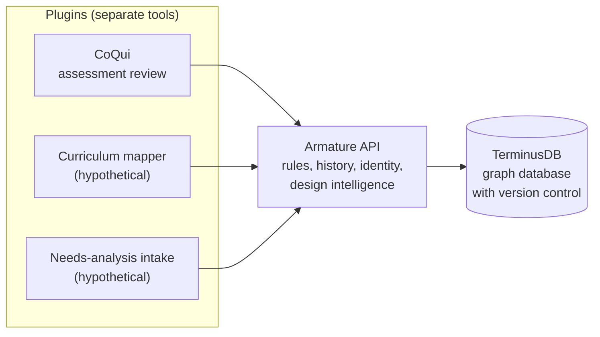
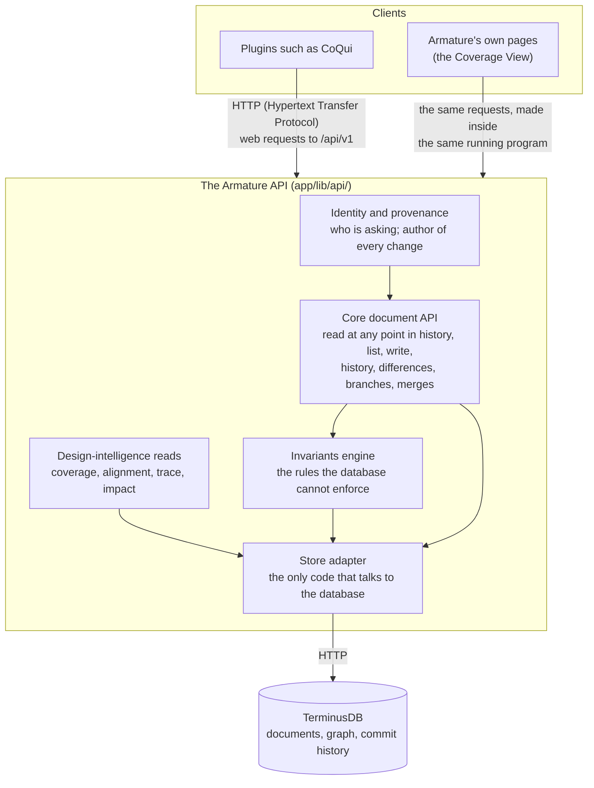
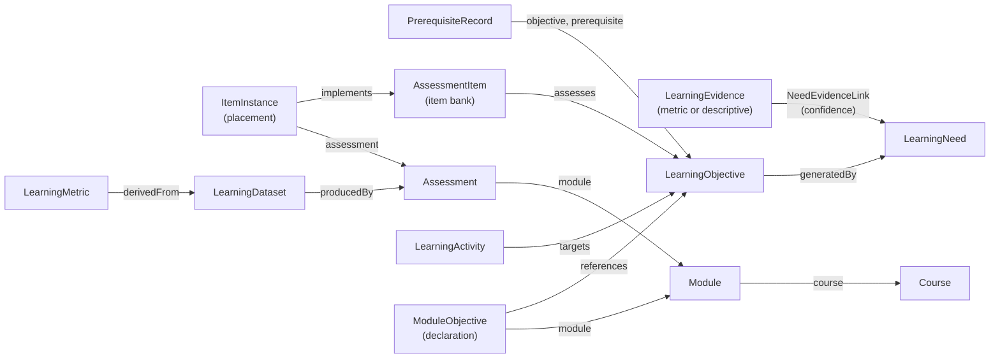

# How Armature Works

**An explainer for learning scientists and other academic readers**

*State described: the repository as of 8 October 2026, when Phase 4 of the development plan was complete. Author voice: third person; "the project" means Armature's design and development work.*

---

## About this document

This document explains what Armature is, how it was built, how each part of it works, and where it is headed. It is written for researchers in the learning sciences and learning engineering who know the basics of software and databases but do not work with them daily. It assumes familiarity with instructional design concepts such as learning objectives, assessment items, alignment and Bloom's taxonomy. It does not assume familiarity with graph databases, version control or web APIs (application programming interfaces); those are explained where they first matter, and the glossary in Appendix A collects every term.

The document is deliberately complete rather than brief. Three kinds of marker help a later editor shorten it:

> **[Brevity candidate]** marks a passage that adds depth but could be cut or moved to an appendix without losing the main line of the explanation.

> **[Interpretive framing]** marks a connection between Armature and a learning-science concept that the project's own documents do not make. These connections are offered to help the reader place Armature, and they should be checked, kept or cut by the project's author.

A dagger (†) after a citation marks a reference added for this document that is not cited elsewhere in the repository. Those references should be verified before the document is published.

Where the document mentions a file, it gives the path within the repository (for example `schema/schema.json`). Where it mentions a recorded decision, it gives the decision record's number (for example ADR-0025, an Architecture Decision Record, explained in Part II). Reading the code is never necessary to follow the argument.

### How the document is organized

- **Part I, Introduction**, explains the problem Armature addresses and what it is.
- **Part II, How Armature has been developed**, tells the story so far and describes the working methods.
- **Part III, How Armature works**, explains each element in turn: the architecture, the database, the schema (the design vocabulary), the rules, version control, identity, the write path, design intelligence, and the supporting tools.
- **Part IV, Decisions and alternatives**, collects the significant choices and the options that were rejected.
- **Part V, The future**, covers the planned phases, open questions, research directions and known limitations.
- **Appendices** hold the glossary, quick-reference tables, the decision record index and the reading list.

---

# Part I. Introduction

## 1. The problem: design data has no system of record

### 1.1 A familiar scenario

The position paper that launched Armature (Glenn, 2026, in `docs/positionpaper/`) opens with a scenario most learning engineers will recognize. A university finds that students consistently struggle with a concept on a biology assessment and asks a learning engineer for help. The engineer's first questions are predictable: Where in the course are students supposed to develop this skill? Are the learning activities for that skill still aligned with the course objectives? Does the assessment still measure what it was designed to measure?

Answering these questions means digging through curriculum committee minutes, syllabi revised by instructors with varying familiarity with the original objectives, answer keys maintained by technologists, and emails that someone remembers but cannot find. The information exists, but in pieces. What is missing is the *connections* between the pieces.

### 1.2 Design data versus learning data

The paper names the missing thing **design data**: "a structured, queryable, versioned record of the instructional design process that produces a learning experience." It contrasts design data with **learning data**, the records of what learners did, which the field already captures well through learning management systems (LMSs), xAPI (the Experience API, a standard for recording learning activity statements) and analytic platforms such as OLI/Torus (the Open Learning Initiative's authoring and delivery platform) and DataShop.

| | Design data | Learning data |
|---|---|---|
| Who records it | Designers | Learners (through their actions) |
| When it is recorded | Accumulated across the design process | A snapshot at the time of learning |
| What it captures | Artifacts and the relations between them | Actions and performance |

*(Adapted from Table 1 of the position paper.)*

### 1.3 Two gaps

The paper identifies two gaps.

- **The internal gap.** Within a design project, the reasoning that connects a learning need to an objective, an objective to an activity, and an activity to an assessment item is scattered across documents and memories. Each tool in the ecosystem manages its own kind of artifact well (survey platforms manage datasets, authoring tools manage content, LMSs manage quizzes), but none was built to model the relationships *between* artifacts across the whole design process.
- **The external gap.** Between design data and learning data there is no bridge. Learning engineering has mature infrastructure for the right-hand side of its process cycle (implementation and investigation) and almost none for the space between investigation and creation, where design decisions are made. The paper illustrates this by mapping existing data frameworks onto the learning engineering process diagram of Kessler et al. (2022): the frameworks cluster around implementation and investigation, and the design side is nearly empty.

Practitioners have noticed. The LEED tracker (Totino & Kessler, 2024; the acronym is usually expanded as Learning Engineering Evidence and Decision, an expansion to verify against the source†) records design decisions and their justifications in tables. It works partly because it is low-overhead, but a table records *that* a decision was made without connecting it to the other artifacts (the internal gap) or to outcome data (the external gap).

Both gaps point to one problem: **the instructional design process has no system of record.** "System of record" is a software term for the authoritative store of some kind of information. Student information systems are the system of record for enrollment; LMSs are the system of record for grades. Nothing plays that role for the reasoning that connects problems to objectives to content to outcomes.

### 1.4 Why this matters for learning engineering as a discipline

Engineering disciplines mature by studying the relationship between process and outcome. Learning engineering can study rigorously *what works* (which learning experiences produce which outcomes). It cannot yet study *which design practices produce things that work*, because the design process is not recorded in a form that can be compared across projects. The paper lists questions that are currently unanswerable at scale:

- Are there design patterns that predict poor learning outcomes?
- Do certain approaches to needs assessment produce more durable learning objectives?
- When an AI (artificial intelligence) system proposes a design artifact and a human accepts it without modification, is it as reliable as a human-authored one?

> **[Interpretive framing]** In learning-science terms, Armature aims to make *constructive alignment* (Biggs, 1996†), the principle that objectives, teaching activities and assessments should be designed to support one another, into an inspectable property of a recorded design rather than an intention. Likewise, the chain the schema records from evidence of need to objectives to assessments mirrors *backward design* (Wiggins & McTighe, 2005†), in which desired results are identified first and evidence of learning is planned before activities. Armature does not prescribe either method; it records the relations either method produces.

## 2. What Armature is

### 2.1 Infrastructure, not a tool

Armature is **infrastructure for instructional design**. The name comes from sculpture: an armature is the internal frame that supports a complex sculpture, keeping it from deforming as it grows. The armature does not replace the artist's tools or vision; it makes more ambitious work possible.

Concretely, Armature is two things:

1. **An open schema.** A schema is a formal definition of the kinds of records a database holds and how they connect. Armature's schema (`schema/schema.json`) defines 27 kinds of record (learning needs, objectives, assessment items, modules, design notes and so on) and 12 controlled vocabularies (such as Bloom's levels). It is the shared vocabulary every tool uses.
2. **An API (application programming interface).** An API is a defined set of requests that other software can make, such as "give me this objective as it stood last Tuesday" or "record this new item, and here is why." Armature's API stores design records, enforces the rules that keep them coherent, keeps their full history, and answers questions about the design ("which objectives in this module have too few assessment items?").

What Armature is **not**, in the paper's words: not a learning management system, not an object repository, not a learning record store, not an adaptive learning engine, not an assessment platform, not a content delivery system, and not a content-authoring app, quiz builder or curriculum-mapping tool. It is designer-facing, not student-facing, and it operates at design time, not delivery time.

### 2.2 The hub and its plugins

Designers will not use an API directly. They use **tools**: an assessment authoring tool, a curriculum mapper, a needs-analysis intake form. In Armature's architecture these tools are **plugins** (sometimes called clients): separate applications that read and write design data through the Armature API. Armature is the **hub** they share.



The first real plugin is **CoQui**, an assessment-item review tool developed in a separate repository by the same author. It addresses the bottleneck of subject-matter-expert (SME) review of assessment items. CoQui is discussed throughout this document because it is the evidence the project has about what tools actually need.

### 2.3 The Git analogy

The project's guiding analogy is Git, the version-control system most software is developed with. Git did not replace text editors. It added a relational layer underneath them that made the history and provenance of every change visible and inspectable. Developers adopted Git because it made collaboration easier; the deeper benefits (auditability, branching, distributed contribution) followed once history had accumulated as a byproduct of ordinary work.

Armature aims to do the same for instructional design tools: to sit underneath them, recording the design and its history as a byproduct of designers using tools that solve problems they already have.

## 3. Three kinds of design data

The position paper divides design data into three parts. Each maps onto a specific mechanism in Armature, and that mapping is the backbone of Part III.

| Kind of design data | What it is | How Armature stores it |
|---|---|---|
| **Design artifacts** | The concrete products of design: needs-assessment findings, objectives, activities, assessment items | Documents in the graph database, one per artifact, each with typed fields (Section 12) |
| **Design relations** | Meaningfully named connections that express a design decision: "this need produced this objective," "this item measures this objective" | Reference fields on documents, and for relations that carry their own data, separate *junction documents* (Section 12.4) |
| **Design process data** | The record of how artifacts and relations changed over time, by whom, and why | The database's commit history: every change is a commit with an author and a stated reason (Section 14) |

The paper argues that relations are "equally important to the design structure as artifacts." In current practice they are implicit: a designer knows which activity targets which objective, but when the designer leaves and the course is revised, the connection evaporates. Armature makes each relation an explicit, queryable record, and for the relations that carry a decision (a prerequisite with its rationale, the weight given to a piece of evidence) a record with its own properties.

## 4. What a design graph makes possible

The paper describes five consequences of recording design data as a graph. Each has since become concrete in the system, and Part III points to where.

1. **Alignment becomes inspectable.** Alignment between needs, objectives and assessments is currently a set of judgment calls, invisible afterward. When relations are explicit, alignment becomes a property of the graph that can be checked before delivery (Section 17: the coverage and alignment reads).
2. **Iteration becomes optimized.** When outcome data reveal a problem, the graph turns a manual audit into a query that traces the outcome back through every relevant decision (Section 17: the trace read).
3. **Design intelligence at design time.** Some analyses that currently require post-delivery data become available while the designer is working. The paper's example is a quiz authoring tool that can show which objectives lack assessment coverage, flag a redundant item, surface the needs-assessment data behind an objective, and catch a Bloom's-level mismatch between an item and its objective. "None of this requires AI [artificial intelligence]. It requires structured data." (Section 17.)
4. **AI becomes a design-aware collaborator.** With the graph as context, a generic prompt ("Write a quiz about epigenetics.") becomes a specific one ("Generate assessment items that measure this specific objective at this Bloom's level, targeting this known misconception, and avoid overlap with existing items in the question bank."). And because AI contributions go through the same structure as human ones, they are reviewable, auditable and reversible (Section 15.4).
5. **From craft to engineering.** Design patterns become comparable across projects and institutions, making the research questions in Section 1.4 answerable.

## 5. Who Armature is for, and how it expects to be adopted

### 5.1 Audiences

The project's context document (`.claude/PROJECT_CONTEXT.md`) names three audiences, in order:

1. **The learning engineering research community**, in particular ICICLE (the IEEE Industry Connections Industry Consortium on Learning Engineering; IEEE is the Institute of Electrical and Electronics Engineers), which will judge Armature on theoretical grounding, technical rigor, novelty and reproducibility.
2. **Potential employers and collaborators**, who will judge the system design and the evidence of thoughtful trade-offs.
3. **Instructional design practitioners**, who will ask whether it solves a real workflow problem and whether they can understand it in plain language.

### 5.2 Two adoption paths

The paper argues that Armature will be adopted only if it gives adopters real value, and it describes two paths that reinforce each other.

- **Tools first (designers).** Designers will not populate a graph by hand. The graph has to fill as a byproduct of using tools that are better than what designers have now. This path also has to cope with the lack of open standards in instructional design: many tools use proprietary, undocumented formats, so Armature cannot count on importing existing work. The path is therefore to build new tools that deliver design intelligence designers can see, and that quietly record their work into the graph. CoQui is the first.
- **Data first (learning scientists).** A specific research question may need only a slice of the graph. A study of whether needs-assessment quality predicts the durability of learning outcomes needs needs, objectives and outcomes, and not activities or assessments. A lightweight collection instrument and a constrained schema could generate comparable design data for a small set of courses. The scientist gets a replicable structure; Armature gets evidence to refine its schema.

The paths reinforce each other: a researcher's schema slice becomes a precedent for tool design, and a tool's accumulated data becomes a population researchers can study.

## 6. A short vocabulary for the rest of this document

Readers comfortable with databases and version control can skip this section. Every term also appears in the glossary (Appendix A).

> **[Brevity candidate]** This primer could be merged into the glossary if the document is shortened.

- **Database.** Software that stores records and answers questions about them. Armature uses one database, TerminusDB, run as a separate program.
- **Graph.** A structure of *nodes* (things) connected by *edges* (relationships). Armature's design graph has artifacts as nodes and design relations as edges.
- **Document.** In Armature's database, one record: an objective, an item, a module. A document has a *type* (its class, such as `LearningObjective`), an *identifier* (`@id`, such as `LearningObjective/distinguish-ai-approaches`), and *fields* (such as `label` and `bloomsLevel`).
- **Reference.** A field whose value is another document's identifier. "This item assesses that objective" is stored as the objective's identifier in the item's `assesses` field.
- **Schema.** The definition of which document types exist, which fields each has, which fields are required, and which values are allowed.
- **Enum (enumeration).** A field whose value must come from a fixed list, such as the six Bloom's levels.
- **Commit.** A saved change to the database, recorded permanently with who made it, when, and a message saying why. The full sequence of commits is the database's history.
- **Branch.** A named line of commits. The shared, authoritative line is called `main`. A designer or a review round can work on a separate branch without affecting `main`, and later *merge* the branch back.
- **Merge.** Combining the changes made on one branch into another. When both branches changed the same thing differently, the merge reports a *conflict* instead of guessing.
- **Ref.** Short for reference to a state of the database: either a branch name (meaning its latest commit) or a specific commit identifier. Every Armature read happens "at a ref."
- **API (application programming interface) route.** One kind of request the API accepts, written as a method and a path, such as `GET /api/v1/documents/LearningObjective/x` (read) or `PUT /api/v1/documents/AssessmentItem/y` (write). `GET` reads, `PUT` and `POST` write, `DELETE` deletes.
- **HTTP status code.** HTTP (Hypertext Transfer Protocol) is the protocol web browsers and servers use to exchange requests and responses. A status code is the number every web response carries: 200 means success, 400 means the request was malformed, 404 means not found, 409 means a conflict, 422 means the request was well-formed but broke a rule, 412 means a precondition (such as "nobody changed this since I read it") failed, 500 means an unexpected server error.
- **Plugin / client.** A separate application that uses the API.

---

# Part II. How Armature has been developed

## 7. A timeline

Armature's development falls into four periods. The dates come from the repository's commit history and its session log (`.claude/SESSION.md`).

### 7.1 Schema design (February 2026)

The project began on 22 February 2026 with a schema translated from an earlier entity-relationship diagram (drawn in Mermaid, a text-based diagramming language) of the design process. The first commit contained the schema, ten Architecture Decision Records (ADRs, explained in Section 8.1) and the project documentation. The first ten ADRs record the foundational modeling choices: an abstract base type for evidence, references rather than ownership, when to use a junction document, where to put the reference in a one-to-many relationship, how to sequence module content, how to enforce minimum cardinality, how module objectives work, enums as top-level types, semantic enrichments beyond the base diagram, and what was intentionally deferred.

On 26 February the schema went through a review (the commit message calls it a "multi-source analysis") that produced ADRs 0011 to 0015: placeholder objectives for incomplete authoring, the `DesignNote` type for free-form rationale, schema-level minimum cardinality, the `ArmatureDocument` base class, and the `User` type with authorship. On 27 February the database was set up in Docker (a tool that runs software in isolated containers), the schema was loaded, and a seed course was written (Section 20).

### 7.2 The first API and the position paper (March 2026)

In early March a web application was set up with Next.js (a framework for building web applications in the TypeScript programming language), and the first API (application programming interface) routes were written: eight read routes, two write routes, and a coverage route. These "demo-era" routes were shaped around imagined demonstration tools (`docs/demo-api.md` describes them). A types generator was written so the program's type definitions are derived from the schema rather than maintained by hand (Section 21.1).

On 31 March the position paper, *Armature: Infrastructure for Design Data*, was published (University of Pittsburgh).

### 7.3 The CoQui fit analysis (August to September 2026)

Over the following months CoQui, the first plugin, was built in its own repository. Building it against Armature's schema exposed gaps, and on 25 August ADRs 0016 to 0021 were added "from CoQui fit analysis": the key strategy for documents, the `DesignRecord` abstract root (so relationships can be annotated), item readiness, coverage that accounts for readiness, `DesignFinding` for evidence-grounded concerns, and the decision that Armature does not model practitioner performance. In September ADRs 0022 and 0023 followed: assessment items embed their options rather than storing them as separate documents, and each part of an item gets a client-assigned `fragmentId`.

On 5 October CoQui's lessons were consolidated into a handoff document, `docs/armature-asks-from-Coqui.md`: six concrete requests ("asks") and a list of what building CoQui taught.

### 7.4 The development plan and Phases 0 to 4 (October 2026)

On 5 October a phased development plan was written (`docs/development-plan.md`). It is grounded in nine principles taken from the position paper (Section 9) and in a test against overfitting to CoQui (Section 8.4). It divides the remaining work into eight phases, 0 to 7. Between 5 and 7 October the plan was extended for rich artifacts (simulations, media) and two external systems were evaluated as possible stores for large files; a parallel research effort surveyed precedents from learning-data standards (`docs/research/`).

Phases 0 to 4 were then completed between 7 and 8 October 2026, each on its own branch and merged through a reviewed pull request (PR, a proposed set of changes reviewed before it joins the main line; PRs #1 to #10):

| Phase | Name | What it delivered |
|---|---|---|
| 0 | Ground truth | Defects fixed, documents reconciled with the code, automated checks (CI, continuous integration) added, database version pinned, ADR-0026 (where the API runs) |
| (spike) | ADR-0054 | A one-session experiment confirming the API could be written in a host-neutral framework (Hono, which does not depend on the program that hosts it), then adopted |
| 1 | Schema catch-up | Every accepted decision applied to the schema; items as trees of fragments; `DesignRecord` root; `DesignFinding`; readiness on items; generators rewritten; seed rewritten |
| 2 | Version control | The API exposes commits, branches, history, diffs and merges (ADR-0025); the API reaches the database through one adapter, a single module that translates between the two (ADR-0055) |
| 3 | Generic writes and the invariants engine | Identity resolution (ADR-0032); one write path for every type; every rule enforced on every write by the invariants engine (the code that checks the rules, Section 13); demo-era routes retired |
| 4 | Design intelligence | Coverage algorithm (ADR-0029); coverage, alignment, trace and impact reads; the decision that coverage is computed, never stored (ADR-0056); a first read-only Coverage View page |

As of 8 October 2026 the repository holds 106 commits, 34 decision records, and 95 automated tests that run against the live database.

## 8. Working methods

The way Armature has been built is itself an expression of its thesis: design decisions are recorded with their rationale, made inspectable, and revised in the open.

### 8.1 Architecture Decision Records

Every significant decision is written up as an **Architecture Decision Record (ADR)**, a short document in `schema/docs/adr/` following a format proposed by Michael Nygard (2011): *Status* (proposed, accepted, superseded), *Context* (the situation that forced a decision), *Decision* (what was decided), and *Consequences* (what follows, good and bad). Most also record **alternatives considered** and why they were rejected.

ADRs are never deleted. When a decision is overturned, the old ADR is marked "Superseded by ADR-XXXX" and the new ADR explains what changed and why. This produces a readable history of the project's reasoning, including its mistakes. The repository calls this "Armature practicing what it preaches: design rationale preserved as structured, inspectable artifacts." The research survey in `docs/research/` notes that ADRs are one of the few rationale-capture practices that have survived in software engineering, where heavier argumentation tools did not, because they are short, live beside the work, and are superseded rather than edited.

**Numbering.** ADR numbers are mostly sequential, with deliberate gaps. Numbers 0028, 0030, 0031 and 0034 are reserved by the development plan for decisions not yet written (attestations, external references and attachments, export profiles, interaction types). Numbers 0035 to 0053 are provisional candidates from the research survey. ADR-0054 onward are decisions made after those blocks were reserved. Appendix D lists all of them.

### 8.2 Verify the platform before relying on it

A recurring discipline is that no decision relies on a database behavior until that behavior has been demonstrated. The script `scripts/platform_checks.js` creates a temporary scratch database, runs a lettered series of probes (A to Z), prints PASS, FAIL or INFO with the evidence, and deletes the scratch database. When an ADR depends on a behavior, it cites the check letter.

This discipline has paid off repeatedly. Check L, run in October 2026, found that TerminusDB checks that a referenced document *exists* but not that it is of the declared *type*: a field meant to hold an objective would accept a user record. Several earlier ADRs had assumed otherwise. The finding led to the first rule in the invariants engine (Section 13). Checks P and Q found that the TerminusDB documentation copied into the repository (the "vendored" documentation) described the merge conflict report and the direction of the rebase operation (which replays commits onto another branch) incorrectly. Check X found that one write mode merged old and new values instead of replacing them, so Armature never uses it.

The project also keeps a copy of the TerminusDB documentation in the repository (`docs/vendor/terminusdb/`), pinned to a known version by a sync script, with a written order of trust: the source code of the installed client library (the official code package for talking to TerminusDB) first, then the running database, then the vendored documentation, then the live website.

### 8.3 One source of truth, with generated derivatives

The schema file is the single source of truth. Everything else that describes the types is generated from it: the program's type definitions (`app/lib/types.ts`), the request-validation rules (`app/lib/schemas.ts`), and the human-readable schema appendix (`docs/SCHEMA_APPENDIX.md`). An automated check in CI (continuous integration, the automated checks run on every proposed change; Section 8.7) fails if the generated type definitions and validation rules drift from the schema (the readable appendix is not checked). Section 21.1 explains this in more detail.

### 8.4 Reference clients and the two-client test

The development plan names a "governing tension": CoQui is the only real client and was built partly to discover what clients need, so its requests are the best evidence available; but a hub shaped to fit one client is a backend for that client, not infrastructure.

To resolve this, the plan lists nine **reference clients**: one real (CoQui) and eight plausible tools implied by the position paper (an objective and curriculum mapper, a needs-analysis intake tool, an activity and strategy designer, an outcomes importer, a research exporter, an AI (artificial intelligence) design assistant, a rich item authoring tool, and a distant complex-learning-object designer). They are a checklist, not a commitment to build anything.

The **two-client test** follows: *a capability enters the hub only when at least two reference clients would need it, and only in the generic form they share.* CoQui's request to read an item by identifier became the generic capability to read any document by identifier at any point in history. CoQui's request for review "rounds" did not enter the hub at all: a round maps onto a branch. Section 26 lists the CoQui concepts that failed the test.

> **[Interpretive framing]** The two-client test is a form of the generalization discipline familiar from design-based research: a design principle earns its place by holding across more than one context, not by fitting the first one.

### 8.5 Progressive formalization

The schema does not pre-design structure that real usage has not yet revealed (ADR-0010). Fields that hold rationale (`PrerequisiteRecord.rationale`, `DesignNote.rationale`, `LearningNeed.rationale`) are free text on purpose. When usage shows recurring structure, the field can be formalized step by step: first an optional category beside the text, then a structured type, then a reified relationship. The project calls this "a deliberate epistemological position: collect first, structure when you understand." Section 12.13 returns to it.

The supporting literature, gathered in `docs/research/further-reading.md`, includes Shipman and Marshall's (1999) "Formality Considered Harmful," which documents why people resist structure required up front.

### 8.6 Reassessing settled decisions on evidence

The project treats "settled" as "do not reopen without a strong reason," and it counts the cost a decision reveals once built as a strong reason. The clearest example is coverage. For more than seven months (from February to October 2026) the schema stored a coverage verdict on each module objective. On 8 October the algorithm was defined (ADR-0029), and the machinery to keep the stored verdict correct was built: a recomputation inside every write, then a recomputation after every merge, then a way to resolve merge conflicts on the computed value. Weighing that machinery showed the stored value was the mistake. The same day the decision was reversed (ADR-0056): coverage is computed when it is read and never stored. Most of that day's machinery was removed, and the one real need the stored value had been standing in for was recorded as a new proposal (ADR-0057). Section 17.6 tells this story in full.

### 8.7 Branches, reviews and automated checks

Each unit of work happens on its own branch named for it (`phase-2/version-control`, `spike/adr-0054-hono`). Before anything is committed, the proposed sequence of commits is shown for approval, one logical change per commit, with messages following the Conventional Commits format (a widely used convention for commit messages; `.claude/prompts/commit-message-guide.md`). The branch is then opened as a pull request (PR), reviewed, and merged in a way that keeps every individual commit visible in the history. Continuous integration (CI), an automated service that runs on every pull request, checks that the code passes its style rules (lint) and that the generated type and validation files match the schema. The 95 integration tests (tests that exercise the API, or application programming interface, against a real database) run locally against the database; they join CI in Phase 7.

### 8.8 AI-assisted development

Armature has been developed with substantial assistance from an AI coding assistant (Anthropic's Claude, through the Claude Code tool). The arrangement deserves a plain description because it bears on how the repository's documents should be read.

- **Sessions and handoffs.** Work proceeds in sessions. Each session begins by reading the project's context files (`.claude/CLAUDE.md`, `.claude/PROJECT_CONTEXT.md`) and the session log (`.claude/SESSION.md`), and ends by updating the session log with what was done, what was decided and what comes next (`.claude/prompts/update-session.md`). The session log is therefore a detailed record of the development process, written as it happened.
- **Human direction and approval.** The project's author sets direction, decides open questions and approves each commit and merge. Decision records are proposed, discussed and accepted before they land. Several of the most consequential decisions (for example ADR-0056) came from the author questioning work the assistant had built.
- **What the assistant did.** Drafting code, tests, decision records and documentation; running the platform checks; reading the database client's source code to answer questions; and, in a parallel session, the standards-precedents research survey, which is labeled as a dated snapshot exported from a living document.
- **Safeguards.** The verification discipline (Section 8.2), the test suite, CI, the requirement that every decision be written down, and the review of every commit before it lands.

This is consistent with the position paper's claim that AI contributions should be "subject to the same structural review as human contributions."

## 9. The principles the plan is built on

The development plan restates the position paper as nine principles, labeled P1 to P9, each a constraint on the hub. Later sections cite them.

| Label | Principle | What it constrains |
|---|---|---|
| P1 | Design data is artifacts, named relations, and process data | Every phase must leave history more inspectable, and nothing may assume an artifact is a single document or file |
| P2 | Armature is infrastructure, not a tool | The hub provides storage, identity, history, constraints and intelligence; workflow, user interface and import/export formats stay in plugins |
| P3 | Version control modeled on Git | Commits, branches and history are first-class in the API (application programming interface) |
| P4 | Design intelligence comes from structure, not AI (artificial intelligence) | The hub owns analyses like coverage and exposes them as reads; plugins do not each reimplement them |
| P5 | AI is a collaborator subject to the same review | Provenance must distinguish an AI agent from a person without a later schema change |
| P6 | Complement standards by reference | Artifacts need a way to reference external identifiers (CASE, the Competencies and Academic Standards Exchange; QTI, the Question and Test Interoperability specification; xAPI, the Experience API) without duplicating those standards |
| P7 | Two adoption paths, one graph | The schema must be sliceable and exports comparable across institutions |
| P8 | From craft to engineering, without surveillance | No route exposes a per-person aggregate (ADR-0021, an Architecture Decision Record) |
| P9 | Progressive formalization | Free text stays free text until usage shows what structure is warranted |

(CASE, QTI and xAPI are explained in Section 24.)

---

# Part III. How Armature works

## 10. The architecture in one picture

Armature has three layers, and one rule governs them: **plugins talk only to the API (application programming interface), never to the database.**



The rule matters for three reasons.

1. **The API is where the rules live.** The database enforces some constraints (field types, required fields, allowed values) but cannot enforce others (Section 13). If a plugin wrote directly to the database, it could bypass them.
2. **The API is where identity and history are attached.** Every change is recorded with the person (or AI, artificial intelligence, agent) responsible and a reason. A direct write would lose that.
3. **The boundary is the demonstration.** Armature's claim is that it is shared infrastructure underneath many tools. A visible, enforced boundary is what makes the hub-and-plugin model real rather than a diagram.

### 10.1 Where the code runs

The API is written with **Hono**, a small web framework built on the standard web request and response types that every modern JavaScript environment supports (ADR-0054, an Architecture Decision Record). It currently runs inside a **Next.js** web application (Next.js is a framework for building websites), which serves it under the address prefix `/api/v1/`. Only one file in the repository (`app/app/api/[[...route]]/route.ts`) knows that Next.js is the host; nothing in the API code imports anything from Next.js. Moving the API to a separate server later is therefore a deployment change, not a rewrite (ADR-0026 records the triggers for that move).

The same Next.js application also serves Armature's own pages (Section 18). Those pages call the API in exactly the way a plugin would, so they cannot do anything a plugin could not.

The database, TerminusDB, runs in a Docker container (Docker is software that runs programs in isolated, reproducible environments called containers) defined in `docker/docker-compose.yml`, pinned to version 12.0.7.

### 10.2 Why a versioned address prefix

Every route lives under `/api/v1/`. The `v1` is part of the contract a plugin depends on; the host serving it is not. A future change that would break existing plugins can be introduced as `/api/v2/` while `v1` keeps working. The routes written in March 2026, before this rule existed, were unversioned; they were kept working until Phase 3 replaced them and then retired (ADR-0026).

## 11. The database: TerminusDB

### 11.1 What TerminusDB is

**TerminusDB** is an open-source database that combines three things Armature needs:

- **A document model.** Data is stored as JSON documents (JSON, JavaScript Object Notation, is a common text format for structured data), each with a type and an identifier. This is a natural fit for design artifacts, each of which is a self-contained record.
- **A graph underneath.** References between documents are edges in a graph, so the database can follow relationships in any direction.
- **Version control built in.** Every change is a commit with an author, a timestamp and a message. Branches, differences between commits, history per document, and a three-way merge (Section 14.6) are features of the database, not something Armature has to build.

It also enforces a schema: a document that does not match its declared type is rejected. And it operates under a **closed-world assumption**: only what is stated in the database is true, and every query has a deterministic answer. (The alternative, the open-world assumption of some semantic-web systems (systems built on linked-data standards for the web), treats missing information as unknown rather than false, which makes "which objectives have no items?" hard to answer.)

### 11.2 Why a graph, and why this graph database

The project separates two arguments that are easy to conflate (ADR-0017, an Architecture Decision Record).

**The argument for a graph.** Three capabilities make a graph earn its place:

1. **Heterogeneous references.** A design note can be about *any* design record: an objective, an item, a prerequisite relationship, a module's declaration of an objective. In a graph this is a single field typed to a common supertype. In a relational database (tables and rows, the model behind most learning management systems, or LMSs) it means either a "type" column plus an "id" column with no integrity checking, or one table per possible subject type.
2. **Multi-hop traversal without predeclared joins** (a join is how a relational database combines tables). "Find the learning need that generated the objective this item assesses" is a walk along edges.
3. **Recursive reachability.** "Is objective A a transitive prerequisite of objective B?" is a graph question.

ADR-0017 adds an important caveat: if Armature did *not* make relationships into records with their own properties, a relational database would serve it well. It is the attributed relationships and the ability to annotate anything that make the graph worth having.

**The argument for TerminusDB specifically** is different: its closed-world semantics, its document model, and above all its built-in commit history, branches and merge. The position paper's version-control model (Section 14) would otherwise have to be built from scratch.

**Alternatives considered.**

- *A property graph database such as Neo4j.* Property graphs can put properties on an edge, but an edge cannot be the subject of anything else. The moment a design note must annotate "the alignment between this item and that objective," a property graph must turn the alignment into a node, exactly as TerminusDB does. Any database would converge on this. Neo4j also has no built-in branching or commit history.
- *A relational database (such as PostgreSQL).* Strong integrity and querying, but polymorphic references ("a note about anything") are awkward, and history would have to be built by hand. CoQui itself uses PostgreSQL for its own operational data, which is appropriate there because CoQui needs per-table constraints, triggers and sequences (database features that enforce rules and number records automatically) that TerminusDB lacks.
- *A plain document store.* Would hold the documents but not the graph or the history.

### 11.3 What TerminusDB does and does not enforce

This distinction drives much of Part III.

| Enforced by TerminusDB | Not enforced by TerminusDB (Armature enforces it) |
|---|---|
| Field types (text, number, date, true/false) | That a referenced document is of the *declared* type (Section 13, constraint 0) |
| Required fields are present | Rules that span documents ("no two items in one assessment at the same position") |
| Enum values are from the allowed list | Conditional rules ("a dismissed finding needs a reason") |
| Minimum counts on sets (`@min_cardinality`) | Who is allowed to do what (not yet enforced by Armature either; Section 15.2) |
| A referenced document exists | Anything about meaning (left to people) |
| Identifiers are unique | |

## 12. The schema: Armature's vocabulary for design

The schema (`schema/schema.json`) defines every kind of record Armature holds. It is written in TerminusDB's schema language and documented inline: every type and nearly every field carries a description, and those descriptions are authoritative. A generated, human-readable version is in `docs/SCHEMA_APPENDIX.md`.

This section explains the schema conceptually. It follows the design lifecycle from evidence of need to outcomes, then explains the cross-cutting patterns.

### 12.1 Basic building blocks

- **Classes (types).** Each kind of document is a class, such as `LearningObjective`. There are 27 classes.
- **Fields.** Each class has fields. A field is either a plain value (text, number, date, true/false), a reference to another document, an enum value, or an embedded part (Section 12.7).
- **Required, optional, sets and lists.** A field is required unless marked `Optional`. A `Set` holds any number of unordered values; a `List` holds ordered values. A set can declare a minimum count (`@min_cardinality`).
- **Enums.** Twelve controlled vocabularies, such as `BloomsLevel` and `ItemStatus`. Using an enum rather than free text means "MultipleChoice," "multiple_choice" and "MC" cannot all appear, so queries are reliable (ADR-0008; ADR stands for Architecture Decision Record).
- **Inheritance.** A class can inherit fields from another. Abstract classes define shared fields and cannot be created directly.

### 12.2 The design lifecycle, as the schema sees it



*Arrows point from the document that holds the reference to the document it names. Labels on arrows are field names; labels in parentheses are data carried on a junction document.*

Read left to right, this is the instructional design process: **evidence** grounds a **need**; the need generates **objectives**, which may require other objectives as **prerequisites**; **items** assess objectives and **activities** target them; items are placed into **assessments**, which belong to **modules**, which belong to a **course**; modules **declare** the objectives they intend to address; when an assessment is administered it produces a **dataset**, from which **metrics** are derived; and a metric can in turn serve as evidence for a new need, closing the loop.

### 12.3 The document types, one by one

**Evidence and needs (needs analysis).**

- **`LearningEvidence`** (abstract) is evidence of a learning need, with a collection date and a source. It has two concrete forms (ADR-0001):
  - **`LearningMetric`**: a quantitative measurement at a point in time (a pass rate, an average score), with a value and a unit, optionally derived from a `LearningDataset`.
  - **`DescriptiveEvidence`**: a qualitative finding from a needs-analysis activity, with the method used (`Interview`, `Survey`, `Observation`, `FocusGroup`, `DocumentReview`, `ExpertReview`, `Other`) and what was found.
- **`LearningNeed`**: a documented gap between current and desired learner performance, with a required rationale and an optional triage priority (`Critical`, `High`, `Medium`, `Low`). A need is connected to its evidence through `NeedEvidenceLink` (Section 12.4).

> **[Interpretive framing]** `LearningNeed` corresponds to the needs-assessment tradition in instructional design, in which a need is defined as a gap between current and desired results (Kaufman, 1972†). The split between quantitative and qualitative evidence mirrors the mixed-methods data a needs analysis typically gathers.

**Objectives.**

- **`LearningObjective`**: a measurable statement of an intended learning outcome. It is the central node of the graph: needs generate it, prerequisites connect it to other objectives, items assess it, activities target it, and modules declare it. Fields: a lifecycle state (`Draft`, `Active`, `Deprecated`, `Archived`), an optional Bloom's level, and an optional reference to the need that generated it (`generatedBy`).
- **`PrerequisiteRecord`**: a relationship between two objectives, saying one must be met before (or alongside) the other. It carries a required **type** (`Hard`: the learner cannot reasonably succeed without it; `Soft`: recommended; `Corequisite`: learned alongside) and a required **rationale**. The rationale is required because, in the schema's words, "this is the core Armature value proposition: design decisions are explicit, not implicit."

> **[Interpretive framing]** The `BloomsLevel` enum uses the six levels of the revised taxonomy (Remember, Understand, Apply, Analyze, Evaluate, Create; Anderson & Krathwohl, 2001†). Because objectives and items share the same enum, the alignment read can compare them directly (Section 17.3).

**Assessment.**

- **`AssessmentItem`**: a single reusable question in the **item bank**. It exists independently of any test. It has a stem (the question), an ordered list of options, optional general feedback for correct and incorrect responses, an item type (eight formats: `MultipleChoice`, `MultipleSelect`, `TrueFalse`, `ShortAnswer`, `Essay`, `Matching`, `Ordering`, `FillInTheBlank`), a review status, an optional Bloom's level, and the set of objectives it **assesses** (at least one; an item that assesses nothing "has no place in the artifact graph"). It also has two optional item-analysis statistics, `difficultyIndex` and `discriminationIndex` (Section 12.14).
- **`Assessment`**: a named collection of placed items for a purpose within one module, with settings such as whether to randomize order, a passing score and the number of retakes allowed.
- **`ItemInstance`**: the placement of a bank item into one assessment, with its position (`sequence`), point value, whether its options are randomized, and its placement status (Section 12.8).

> **[Interpretive framing]** The `difficultyIndex` (proportion answering correctly) and `discriminationIndex` (how well the item separates higher from lower performers) are the two classic item statistics of classical test theory.

**Instruction.**

- **`LearningActivity`**: a reusable instructional activity that targets at least one objective, with an optional activity type (`Reading`, `Video`, `Simulation`, `WorkedExample`, `Discussion`, `Practice`, `Reflection`, `Other`). The type makes instructional strategy queryable: "which objectives have no practice activity?"
- **`ActivityGroup`**: a reusable, named collection of activities with a defined order (for example, a worked example followed by two practice problems). Groups are deliberately flat: a group cannot contain another group.

**Structure.**

- **`Course`**: the top-level container for a design project. Deliberately minimal.
- **`Module`**: an instructional unit within a course, optionally sequenced. It contains activities and groups (through junction documents), contains assessments (each assessment names its module), and declares the objectives it intends to address (through `ModuleObjective`).

**Outcomes.**

- **`LearningDataset`**: a named collection of performance data, typically produced when an assessment is administered to a cohort, with an optional administration date, cohort label, and a reference to the assessment that produced it (`producedBy`).
- `LearningMetric` (above) derives from a dataset.

**Rationale and review.**

- **`DesignNote`**: free-form rationale about one or more design records (Section 12.9).
- **`DesignFinding`**: an evidence-grounded concern about one or more design records, with a status (Section 12.9).

**People.**

- **`User`**: a person or AI (artificial intelligence) agent who participates in the design process (Section 15).

**Parts of items (fragments).**

- **`Fragment`** (abstract), **`TextFragment`** and **`ItemOption`**: the embedded parts of an assessment item (Section 12.7).

**Abstract roots.**

- **`DesignRecord`** and **`ArmatureDocument`**: shared supertypes (Section 12.11).

### 12.4 Relationships as first-class records

A central pattern in Armature is that some relationships are not just references; they are documents in their own right, called **junction documents** (also called reified relationships). The rule for when to do this is ADR-0003's: **if a relationship needs to carry data, it gets a junction document; otherwise it is a plain reference.**

| Relationship | How it is stored | Why |
|---|---|---|
| Item assesses objective | `AssessmentItem.assesses`, a set of references | The link carries no data of its own |
| Activity targets objective | `LearningActivity.targets`, a set of references | Same |
| Need is informed by evidence | `NeedEvidenceLink` junction, with `confidence` (`High`, `Medium`, `Low`, `Preliminary`) | The designer's weighting of each piece of evidence is a decision worth recording |
| Objective requires objective | `PrerequisiteRecord` junction, with `prerequisiteType` and `rationale` | The kind and reason for a prerequisite are the decision |
| Module declares objective | `ModuleObjective` junction, with `role` (`Primary`, `Supporting`, `Prerequisite`), optional `roleRationale`, and `sequence` | The role an objective plays in a module is a decision |
| Activity placed in module | `ModuleActivityLink` junction, with `sequence` | Order matters |
| Group placed in module | `ModuleActivityGroupLink` junction, with `sequence` | Order matters |
| Activity placed in group | `ActivityGroupMember` junction, with `sequence` | Order matters |
| Item placed in assessment | `ItemInstance` junction, with `sequence`, `pointValue`, `randomize`, `status` | Placement has its own settings and its own clearance |

These seven junction types are tagged with the category `relationship` in the schema (Section 12.11).

**How declarations are written.** ADR-0007 (February 2026) said a `ModuleObjective` would be "created programmatically by the API" (the application programming interface) when a designer assigned an objective to a module, and not edited directly through a user interface. That is not what was built: clients write `ModuleObjective` documents through the same generic write route as everything else, and the seed writes seven. Its stored coverage field, the other half of ADR-0007, was removed by ADR-0056 (Section 17.6). Because they are documents, they can themselves be annotated: a design note can explain why an activity is third in a module, or why a piece of evidence carries only preliminary confidence (ADR-0017).

ADR-0017 records a caution against overdoing this: naming a "relationship" category invites turning every connection into a document for tidiness. Plain references remain the default and carry most of the traversal; a relationship earns a junction document only by carrying data.

**Back-references on children (ADR-0004).** For one-to-many relationships, the reference lives on the child, not the parent. An assessment names its module (`Assessment.module`); the module holds no list of assessments. A placement names its assessment; the assessment holds no list of placements. This keeps parent documents small however many children they have, and adding a child never requires rewriting the parent. Finding "all assessments in this module" is a query on the child's field.

> **[Interpretive framing]** The junction-document pattern is how Armature realizes the position paper's "meaningfully named relations." In argumentation terms, a `PrerequisiteRecord` is a claim (A requires B) with a warrant (its rationale) and a qualifier (Hard, Soft or Corequisite).

### 12.5 Reuse: the item bank and placements

Reuse is a first-class design capability (ADR-0002: all relationships use references, not ownership). An activity can appear in several modules and groups; an item can appear in a pre-test and a post-test. This is why `AssessmentItem` (the reusable item) and `ItemInstance` (its placement in one assessment) are separate.

**One placement per item per assessment.** An `ItemInstance`'s identity is derived from the pair (assessment, item), so the same item can be placed in an assessment at most once. Writing the same pair again replaces the placement, which keeps its position and point value freely editable. Two forms of the same test are modeled as two assessments. This was decided on 8 October 2026 as a timing decision rather than a permanent one: it will be revisited if the schema gains a section or form *inside* an assessment, or if an importer meets a source (such as QTI, the Question and Test Interoperability specification, which permits it) that references one item twice in one test.

### 12.6 Sequencing module content (ADR-0005)

A module's content mixes standalone activities and activity groups in a pedagogical order, and each group has its own internal order. Armature uses two independent integer sequences:

```
Module
  ModuleActivityLink       sequence 1  → a standalone activity
  ModuleActivityGroupLink  sequence 2  → an activity group
    ActivityGroupMember    sequence 1  → first activity in the group
    ActivityGroupMember    sequence 2  → second activity in the group
  ModuleActivityLink       sequence 3  → another standalone activity
```

The two kinds of module link share one numbering space (no activity and group may both be at position 2), and group membership has its own numbering. Gaps are allowed (1, 2, 10) so a designer can insert without renumbering. The API enforces the uniqueness rules (Section 13, rules 3 and 4). ADR-0005 also assigned the API the job of merging the two kinds of link into one ordered view of a module's content; that view has not been built, so a client currently sorts the link documents itself.

**Alternative rejected:** a composite value such as "2.1" (group 2, activity 1). It is compact but ambiguous: as a decimal, "2.10" equals "2.1."

### 12.7 Items as trees of fragments

An assessment item is not a flat record. Its stem, each option and each piece of feedback is an embedded **fragment**, and each fragment carries a **`fragmentId`**.

```
AssessmentItem
  stem               TextFragment   { fragmentId, text }
  options            List of ItemOption
                       { fragmentId, text, isCorrect, feedback?, purpose? }
  correctFeedback    TextFragment   (optional)
  incorrectFeedback  TextFragment   (optional)
```

An `ItemOption` can carry a `purpose`: free text saying what the option is for, such as the misconception a distractor targets. This is design rationale at the level of a single option. An option's own `feedback` is plain text rather than a fragment, so it cannot be addressed separately; CoQui's handoff had proposed giving it a `fragmentId`, and that difference is recorded but undecided.

**Why parts need their own identity.** A reviewer needs to say "option B is ambiguous," not just "this item has a problem." That requires a stable address for each part. The address must survive editing the option's text and reordering the options.

**The story of how this was decided** (ADRs 0016, 0022, 0023, 0033):

1. Originally, options were separate documents (`Response`), each pointing back to its item. Their identity was derived from the item plus the option's label, so the seed data labeled options "A," "B," "C," "D" rather than storing the answer text, and editing an option's label changed its identity (ADR-0016 diagnosed this).
2. CoQui's development asked whether an option ever needs identity independent of its item. The answer was no: options are never shared across items, and moving an option to another item would silently change its meaning. The `Response` document was removed and options were embedded in the item (ADR-0022). The database's history still reports which option changed between two versions, because it compares nested structure.
3. Embedded parts have no identity of their own in the database. A platform check (J4) confirmed that every time an item is replaced, the database regenerates the internal identifiers of its parts. So part identity has to come from somewhere else: the **`fragmentId`**, assigned once by the authoring tool when the part is created, never derived from position or display order, and never reused (ADR-0023). Armature checks only that fragment identifiers are unique within an item.
4. To avoid making multiple-choice options the only possible kind of part, options were modeled as one specialization of an abstract `Fragment` (ADR-0033). Future item types (drag-and-drop, hotspot, media) can add new fragment kinds beside them without re-identifying anything. A tool that has never seen a particular item type can still list its fragments, read their text, and attach a comment to one.

The `fragmentId` is modeled on the fragment part of a web address (the `#section` in `page.html#section`): a stable resource plus an address within it. A comment about a part is addressed to the pair (item identifier, fragment identifier).

The plan's evaluation of two external file stores (Section 25) found that both separate a part's stable identity from its changing content, as Armature does: three independent content-addressed designs (storage designs that identify a file by a fingerprint of its contents) arriving at the same separation. The research survey found several learning platforms that suffered when they did not separate the two (one regenerated identifiers on import; another derived step identifiers from position and overflowed). The plan records this as evidence the separation is right.

### 12.8 Readiness: the item's status and the placement's status (ADR-0018)

`ItemStatus` has four values: `Draft` (not yet reviewed), `InReview` (under subject-matter-expert or editorial review), `Approved` (cleared), and `Retired` (removed from use).

Originally only the *placement* had a status. CoQui's fit analysis showed why that fails: an item that has never been placed in a test cannot record that it was reviewed and approved; an item reused in three tests has three independent review states and nothing says which answers "is this question correct?"; and two different questions were collapsed into one field.

The fix records both:

- **`AssessmentItem.status`**, the item's own review lifecycle: *is this question correct and properly aligned?* It travels with the item everywhere.
- **`ItemInstance.status`**, placement clearance: *is this item cleared for use in this particular assessment?* An item can be sound but inappropriate in one test, or embargoed because it is in use on a pre-test.

One rule connects them (constraint 10): a placement may not be `Approved` while its item is `Draft` or `InReview`. Placement clearance never runs ahead of the item's own review.

A plugin with a richer review workflow (CoQui has states like "sent back" and "blocked") maps its states onto these four at its boundary. The hub carries only the vocabulary every tool would need.

### 12.9 Recording rationale and concerns

Armature has three ways to record *why*, and they serve different purposes.

1. **Inline rationale fields** on records where the reason is intrinsic to the relationship: `PrerequisiteRecord.rationale` (required), `LearningNeed.rationale` (required), `ModuleObjective.roleRationale` (optional), `ItemOption.purpose` (optional).
2. **The commit message.** Every change carries a required reason (Section 14). This is the primary record of why something changed.
3. **Separate rationale documents**, for reasons that do not fit a slot:
   - **`DesignNote`** (ADR-0012) records a decision someone made and why. It has a required rationale, at least one subject (any design record), and an optional category (`BloomsLevelChoice`, `AssessmentStrategyChoice`, `SequencingDecision`, `PrioritizationDecision`, `ScopeDecision`, `AlignmentDecision`, `PrerequisiteIntent`, `Other`).
   - **`DesignFinding`** (ADR-0020) records that someone judged something to be a *problem*, and what became of that judgment.

**Notes and findings are different speech acts.** A note asserts a settled decision: the author explaining themselves. A finding is unsettled by definition: it awaits judgment, may be rejected, and its value lies partly in whether anyone acted on it. Collapsing the two would lose the difference between "we decided this" and "someone thinks this is wrong."

A `DesignFinding` has: what the concern is (`finding`); one or more subjects; an optional second record it is `regarding` (for concerns about a relationship, such as an item and the objective it claims to assess); optional supporting evidence (typically `DescriptiveEvidence` with method `ExpertReview`); an optional confidence; a status (`Open`, `Addressed`, `Dismissed`); and a resolution rationale, **required** when the status is `Dismissed`, because "a concern waved away without explanation launders a judgment as a fact."

The originating requirement for findings came from CoQui: a tool working at one layer (reviewing items) often discovers evidence about another (three items drawing the same expert objection is evidence that the *objective* is ambiguous). A finding lets a plugin flag a problem with an artifact it is not permitted to edit, because the finding is a new document pointing at the artifact, never a change to it.

**Placeholder objectives and `PrerequisiteIntent` (ADR-0011).** Designers sometimes know an objective has a prerequisite before they have written it. A `PrerequisiteRecord` must connect two real objectives, so the workflow is to create the prerequisite objective as a `Draft` first (for example, "TBD: prerequisite for objective X"), then the record. If the prerequisite is only suspected and cannot even be stubbed, the designer records a `DesignNote` with category `PrerequisiteIntent`. This keeps every prerequisite record a complete edge in the graph. **Alternative rejected:** a "draft" flag on the prerequisite record itself, which would duplicate what the objective's own `Draft` state already says.

### 12.10 People and authorship

Every artifact (everything inheriting `ArmatureDocument`) has an optional `createdBy`, a reference to the `User` responsible for the record entering the graph: the designer who authored it, the person who imported evidence, or an AI agent. It is set by the API from the resolved identity of the request, never from the request body, and never changed after creation (ADR-0015, ADR-0032). There is deliberately no `updatedBy`: it would record only the most recent editor and obscure the original author, while the commit history already records every editor. Section 15 explains how identities are resolved.

### 12.11 The abstract roots and the categories

Two abstract classes sit at the top of the hierarchy.

- **`ArmatureDocument`** (ADR-0014) carries the fields every named artifact shares: `label` (required), `description` (optional) and `createdBy`. Thirteen types inherit it directly (fourteen concrete types, counting the two kinds of evidence).
- **`DesignRecord`** (ADR-0017) carries no fields at all. Its purpose is to be *referenceable*: the `subject` of a note or finding is typed to `DesignRecord`, so a note can be about any artifact *or* any relationship. `ArmatureDocument` inherits it, and so do the junction documents.

`User` is deliberately outside `DesignRecord`, so a design note cannot be "about" a person. That is part of the project's commitment not to model practitioner performance (Section 12.13).

**Why `DesignRecord` exists.** Before it, being annotatable was tied to having a name: only types inheriting `ArmatureDocument` could be the subject of a note, so six of the seven relationship types could not carry a note. Whether a relationship could carry rationale was decided by whether it happened to have a label, which ADR-0017 called "an accident, not a decision."

**Categories as metadata (ADR-0017, ADR-0027).** Every class declares one of four categories in its schema metadata (descriptive tags attached to the class): `infrastructure` (`User` and the two abstract roots), `fragment` (the parts of an item), `artifact` (the primary documents, notes and findings) or `relationship` (the junction documents). The rule: *a category becomes a class only when something must reference it; otherwise it is metadata.* `DesignRecord` is a class because notes reference it; "relationship" is metadata because nothing needs to hold "any relationship." `PrerequisiteRecord` shows why: it is both a named artifact and a relationship, which as classes would need multiple inheritance (one class with two parents), but as metadata is simply a tag.

The categories mean the schema describes itself. The generators (the scripts that derive code from the schema; Section 21.1) read them (a class without a category fails the build), and any tool can read them to treat relationships differently from artifacts. CoQui's notes called this "the single highest-leverage change" for a second plugin.

### 12.12 Identity: identifiers and keys

Every document has an identifier of the form `Type/local-part`, such as `LearningObjective/distinguish-ai-approaches`.

- **Primary artifacts** use **random keys** and accept a **client-supplied identifier** on first write (ADR-0024). A plugin can choose an item's permanent identifier before the item ever reaches Armature, which CoQui needs so reviewers can comment on an item before it is first synchronized. A later write under the same identifier *replaces* the document, so retrying a write is harmless. A write whose identifier already belongs to a document of a *different* type is refused (constraint 12, a 409 conflict). Identifiers are opaque: the hub never parses them, derives them from a label, or regenerates them.
- **Junction documents** use **hash keys**: their identifier is computed from the references that define them. A module's declaration of an objective is identified by the (module, objective) pair, so two declarations of the same objective in the same module cannot exist. A client never names a junction's identifier; it supplies the two ends.
- **A rule that applies everywhere: keys never include a field that can be edited** (ADR-0016). If an option's identity depended on its text, editing the text would create a different option.

**Alternative rejected (ADR-0016 decision 5, later reversed by ADR-0024):** store-assigned opaque identifiers everywhere, with readable names as a display concern only. It was recorded at the time as "the weakest part" of its ADR, "driven by consistency rather than by a demonstrated failure." The demonstrated failure then came from CoQui's offline authoring and from the outcomes-importer reference client, which needs repeated imports to land on the same documents.

### 12.13 What the schema deliberately leaves out

**Deferred until evidence arrives (ADR-0010).** The schema "should not pre-design structure that real usage hasn't yet revealed." Deferred items include: a structured `DesignDecision` type (alternatives considered, trade-offs, affected artifacts), to be shaped by how `DesignNote.category` is actually used; a reified need-to-objective derivation; knowledge components; per-format answer structures for item types beyond multiple choice; and interoperability fields for external standards (now planned as Phase 6).

**Decided never to add (ADR-0025).** No `version`, `createdAt`, `updatedAt`, `updatedBy`, or "new version of" field on any type. The commit history is the record of versions (Section 14).

**A permanent non-goal: practitioner performance (ADR-0021).** Because every artifact records who created it, the graph could answer questions about people: how many of this designer's items were flagged in review, how often their Bloom's-level judgments were disputed. Armature commits never to model this. No field, computed value or API route characterizes an individual's work across artifacts.

The reasoning is partly ethical (practitioners have a legitimate interest in their design process not becoming a productivity dashboard), but ADR-0021 makes a sharper argument specific to Armature's purpose: **the instrument would perturb what it measures.** The rationale Armature exists to capture is produced when people are candid: a designer declining an expert's suggestion and saying why, a reviewer saying plainly that an item is wrong. A designer who knows declines are counted declines less often; a reviewer who knows comments are tallied writes fewer and softer ones. "A graph whose participants are performing for it records performances."

The ADR admits the boundary cannot be enforced structurally (anyone with bulk access can aggregate) and that it is fuzzy: "How often do subject experts dispute designers' cognitive-level judgments?" is a question about the field and is in scope; the same query narrowed to one person is not. It states the norm so that crossing it requires a deliberate decision. Phase 5 will add one concrete guard: the generic list route will refuse to filter by `createdBy`. For research exports, the ADR sketches options (pseudonymization, institution-only attribution, minimum group sizes) and notes that small design teams defeat pseudonymization.

### 12.14 A tension to note: item statistics

> **[Brevity candidate]** This subsection documents an unresolved inconsistency; it could move to Part V.

`AssessmentItem.difficultyIndex` and `discriminationIndex` were added in February 2026 (ADR-0009) as item-analysis values "computed from LearningDataset results" and "written back to the item by the Armature API after analysis." In October 2026 ADR-0056 established that "the graph stores decisions and observations," and named "difficulty summaries" among the derived quantities that should be computed when read rather than stored. The two fields remain in the schema, unused by any code. Whether they are observations imported from an external analysis (and so legitimately stored) or derived values (and so better computed from datasets) has not been decided. The outcomes importer planned for Phase 6 is where the question will have to be answered.

## 13. The rules: the invariants engine

### 13.1 Two kinds of check

Every write passes two kinds of check before anything is saved.

1. **Shape** (answered with HTTP, or Hypertext Transfer Protocol, status 400, "invalid document"): does each document have the right fields, of the right kinds, with allowed enum values, at least the minimum number of entries in a set, and no unknown fields? These checks are generated automatically from the schema, so they can never disagree with it.
2. **Rules** (answered with HTTP 422, "invariant violation"): does the write respect the rules that span documents or depend on conditions, which the database cannot express? These are the **invariants**, and the code that checks them is the **invariants engine** (`app/lib/api/invariants/`).

"Invariant" is a software term for a condition that must always hold. The engine checks every rule on every write, whatever route the write came through, and reports **every** violation at once rather than stopping at the first, so a tool can show a designer everything that needs fixing.

### 13.2 The rules in plain language

The project numbers the rules 0 to 12 (the numbering is used across the documentation and tests).

| # | Rule | Why |
|---|---|---|
| 0 | Every reference must point to a document of the declared type (or a subtype) | The database checks only that the target exists. Without this rule, a module's `course` could name an assessment item, or a design note's subject could be a person |
| 1 | An assessment item assesses at least one objective | An item that assesses nothing has no place in the design graph |
| 2 | An activity targets at least one objective | Same, for activities |
| 3 | Within a module, activity links and group links never share a position number | They share one sequence (Section 12.6) |
| 4 | Within an activity group, members never share a position number | Order must be unambiguous |
| 5 | Within an assessment, placed items never share a position number | Same |
| 6 | An activity group never contains another group | Groups are deliberately flat; this follows from rule 0, because a group member must be a `LearningActivity` |
| 7 | Coverage is never stored | Coverage is computed when read (Section 17). There is nothing to check, because the schema has no coverage field |
| 8 | Every fragment of an item has a unique `fragmentId` | Part addresses must be unambiguous |
| 9 | Option text is present and unique within an item, and the number of correct options suits the item type | Multiple choice and true/false need exactly one correct option (true/false exactly two options); multiple select needs at least one |
| 10 | A placement cannot be approved while its item is still draft or in review, and an item cannot drop back to draft or review while a placement of it is approved | Placement clearance never runs ahead of the item's own review (Section 12.8) |
| 11 | A dismissed finding must give a reason | Dismissals must be inspectable |
| 12 | A write cannot reuse an identifier that belongs to a document of another type | Identifiers belong to one type for the life of the database (answered with 409, conflict) |

Rules 1 and 2 are enforced both by the database (as minimum counts) and by the shape check. Rule 6 is a consequence of rule 0. The rest are code in the invariants engine.

### 13.3 How rules see the world

A rule is checked against the branch being written to, as it *will* look after the write, including every other document in the same request. This matters because a single request can create several related documents at once: a new assessment, its placements and a module declaration, for example. A rule about "no duplicate positions" must consider the placements already on the branch, minus any being replaced, plus the ones in the request.

### 13.4 How rule 0 was discovered

Several early decision records assumed that typing a reference field (for instance, declaring that a note's subject must be a `DesignRecord`) meant the database would reject a reference to a document of the wrong type. Platform check L, run on 7 October 2026, showed otherwise: TerminusDB accepted a `User` as the subject of a design note, and an assessment item as a module's course. It checks only that the referenced document exists.

The finding was recorded in the plan's list of platform facts, three ADRs (Architecture Decision Records) were amended, and "reference class" became rule 0, implemented once for every type by walking each document's reference fields (including those inside embedded parts) and checking each target's type against the schema. The episode is a good example of the verification discipline (Section 8.2): a widely repeated assumption was wrong, and only an experiment found it.

## 14. Version control: design process data lives in the commit graph

The position paper promises "distributed version control modeled on Git": immutable history, branches for parallel work, and merges "inscribed with its author, the time, and the reason for the change." This is principle P3, and the plan calls it "the paper's largest promise and the repository's largest gap." Phase 2 closed the gap (ADR-0025, an Architecture Decision Record).

### 14.1 Every change is a commit with an author and a reason

Every write to Armature creates exactly one **commit** in the database. A commit records:

- **the author**: the identifier of the Armature `User` the request resolved to (Section 15), set by the hub and never taken from the request;
- **the message**: the reason for the change, **required** on every write (a write without one is refused);
- **the time**;
- **the change itself**, which the database can later show as a structured difference.

Write requests carry the reason in an "envelope": `{ "message": "...", "document": {...} }` for one document, or `{ "message": "...", "documents": [...] }` for several in one commit.

This makes the commit message the primary record of *why* something changed. A `DesignNote` remains available for longer elaboration, but it is optional. The research survey supports this choice: decision records and commit messages have survived where heavier rationale-capture tools did not, partly because they are cheap and captured as part of the work.

### 14.2 Reconciling the paper with the database

The position paper describes editing as adding a new artifact with a "new version of" relation to the old one. TerminusDB works differently: it keeps one document per identifier and records each version inside its commit history. ADR-0025 resolves this by treating the commit graph *as* the "new version of" relation: a document's previous version is the same identifier read at the previous commit that touched it. No version fields and no "new version of" edges are added to the schema.

**Alternatives rejected:** `version`, `createdAt` and `updatedAt` fields on every document (ADR-0010 had deferred them; ADR-0025 decided against them permanently), and an explicit "new version of" relation between copies. Both would duplicate what the commit graph already records, and could disagree with it.

### 14.3 Reading the design as it was at any point

Every read in Armature happens at a **ref**: either a branch name (`?branch=main`, meaning its latest commit, the default) or a specific commit (`?ref=<commit id>`). Reading at a commit shows the design exactly as it stood then, and is read-only. Every response carries the commit it was served from (in a standard web header called `ETag`, short for entity tag), so a client always knows exactly which state of the design it saw.

This is what makes it possible to ask, for example, what a module's assessment coverage was before an item was retired: the same coverage read at an earlier ref (Section 17).

### 14.4 History and differences

- **Document history**: every commit that touched one document, newest first, each with author, message, time and the structured difference it made.
- **Document difference**: the structured difference in one document between any two commits. Because embedded parts are compared field by field, the difference shows which option of an item changed.
- **Branch changes**: the documents inserted, deleted or updated on a branch since a given commit, so a plugin can catch up on what changed while it was away.

One limitation is inherited from the database: ordered lists are compared by position, so reordering an item's options reads as many changes. Comparing options by `fragmentId` instead is left to plugins (CoQui has its own function for it).

### 14.5 Branches

A **branch** is a named line of work starting from a branch's latest commit or from any specific commit. `main` is the shared branch. Branch names are the plugin's choice and carry no meaning for the hub.

CoQui's use shows why branches matter: each review **round** (a set of items, reviewers and a facilitator, opened and closed) is a branch created from `main` when the round opens. Every revision during the round is a commit on that branch, and the round ends with one merge, if it is merged at all. Nobody but CoQui writes to a round's branch.

### 14.6 Merging

A **merge** brings the changes from one branch into another. TerminusDB performs a **three-way merge**: it compares both branches against their common ancestor (the *base*), applies changes that do not overlap, and refuses the merge if both sides changed the same field differently. It never resolves a conflict silently.

The hub adds three things the database does not provide (ADR-0025 decision 5):

1. **Finding the base.** The database's merge operation needs to be told the common ancestor. The hub finds it by walking both branches' histories.
2. **Remembering what was merged.** A merge commit in TerminusDB has a single parent, so the database does not record which commit was merged in. The hub writes it into the merge commit's metadata, the extra data a commit can carry (`armature.mergeSource`). Without it, merging the same branch a second time would replay changes already merged (this was found by testing).
3. **A readable conflict report.** On conflict the hub answers 409 with, for each conflicting field, the document, the field, and three values: the base value, the target branch's value, and the source branch's value (the database's report omits the last, so the hub reads it).

**Not yet decided:** merge *policy*. Who may merge a branch, whether some kinds of document (findings, for instance) should merge without approval, and where a fragment-by-fragment conflict view lives are open questions, waiting for a second writer on a shared branch (Section 25).

### 14.7 History is never rewritten

Git and TerminusDB both offer operations that rewrite history: *reset* (move a branch back), *squash* (combine commits), *rebase* (replay commits elsewhere, giving them new identifiers). Armature exposes none of them and calls none of them (ADR-0025 decision 6). Records will store commit identifiers as evidence (an attestation "as of" a commit, a dataset produced from a commit), and a rewrite would make those identifiers point at states no branch contains. A mistake is undone the Git way: by a new commit that restores the earlier state, with its own author and reason.

**Branch deletion** gets a careful rule because deleting a branch is the one change the database records nowhere: it is not a commit, so it has no author and no reason. A branch can be deleted only if another branch already holds its latest commit (because it was merged, or because the other branch contains it). Otherwise the request is refused with "unmerged branch." `main` can never be deleted, and there is no "force" option. An abandoned exploration is design process data too; a plugin that wants it out of the way should give it a name that marks it as abandoned, not erase the record.

### 14.8 Concurrent edits (optimistic concurrency)

Two people may edit the same branch at once. Armature uses **optimistic concurrency**, a standard technique: a client that read the design at commit X can say "only apply my write if the branch is still at commit X" by sending the commit identifier in a standard web header (`If-Match`). If someone else has committed since, the write is refused with 412 ("precondition failed") and the current commit, and the client re-reads and tries again. Without the header, writes are unconditional.

The token (the commit identifier the client sends) is the branch's latest commit, not a fingerprint of one document, so "the branch moved" may mean someone changed a different document. This is a deliberate simplification. The database's own token format never appears in Armature's API (application programming interface); the hub translates (ADR-0025 decision 7).

## 15. Identity: who did what

### 15.1 The three-system boundary (ADR-0015)

Three systems have distinct responsibilities, as ADR-0015 (an Architecture Decision Record) divides them:

- **An external authentication system** (such as a university's single sign-on, one login shared across its systems) proves who someone is. Armature manages no passwords or sessions.
- **The database's own access control** decides which software accounts may read or write the database. This is infrastructure configuration, not design data.
- **Armature's `User` documents** represent people and agents *as participants in the design process*. They are design data and travel with the graph when it is exported.

A `User` has a display name, an external identifier (the stable identifier from the authentication system), and optionally an email and an institution. The email and institution exist so an exported graph remains interpretable where the original authentication system is unavailable.

### 15.2 How a request is resolved to a person (ADR-0032)

Every request that changes anything must say who is making it. A pluggable **resolver** turns the request into a set of claims, statements about who is asking (at minimum the external identifier); the hub then finds the matching `User`.

- The current resolver, `header`, reads the external identifier from a request header (`Armature-User: <externalId>`) and **trusts the caller**. It is for local use and demonstration only: anyone who can reach the API (application programming interface) can claim to be anyone. While it is configured, the routes that change data must not be exposed beyond the local machine.
- A future resolver, `oidc` (OpenID Connect, the common single-sign-on protocol), will read a signed token (a tamper-proof credential issued by the login system). It is named but not built; the claims shape is fixed now so adding it changes no route.

### 15.3 Where `User` documents live

`main` is the **registry** of record for users: every lookup checks `main`, and `User` documents are created only on `main`. A user can be registered explicitly (`POST /api/v1/users`), or automatically on first encounter when the resolver supplies a display name (the header resolver does not, so under it every user is registered explicitly).

A subtlety arises with branches. A design document's `createdBy` must refer to a `User` that exists on the same branch. A user registered on `main` after a branch was created does not exist on that branch. The hub solves this by carrying a copy of `main`'s `User` document into the branch in the same commit as the write that first needs it. Because the copy is identical, merging the branch back adds nothing and conflicts with nothing (platform check W).

**Alternative rejected:** letting users be created on any branch. One person would then become two documents, or a merge conflict, when branches merged.

### 15.4 AI agents

An AI (artificial intelligence) agent is an ordinary `User` whose external identifier begins with `agent:` (for example `agent:coqui/item-drafter`), registered by a person. An agent writes through the same routes, under the same rules, and its commits carry its identifier as author. This satisfies principle P5: AI contributions are distinguishable and subject to the same structural review. "Acting on someone's behalf" (an agent drafting for a particular designer) is not yet modeled; it waits for an AI design assistant to become a real client.

## 16. The life of a write, step by step

> **[Brevity candidate]** This section repeats material from Sections 13 to 15 as a single walkthrough. It is useful for readers who want to see the pieces in order.

Suppose a designer using a plugin approves an assessment item on a review branch. The plugin sends:

```
PUT /api/v1/documents/AssessmentItem/hallucination-mc?branch=round-3
Armature-User: reviewer@example.edu
If-Match: "<the commit the plugin last read>"

{ "message": "Approved after subject-matter expert review; distractor C reworded",
  "document": { ...the full item, with status "Approved"... } }
```

The hub then:

1. **Checks shape** against the generated rules for `AssessmentItem`: every required field present, the stem and options well-formed, `status` one of the four allowed values, at least one objective in `assesses`, no unknown fields. Failure is a 400 listing each problem and where it is.
2. **Resolves identity.** It finds the `User` on `main` whose external identifier is `reviewer@example.edu`, or refuses with 401 (unknown user).
3. **Checks identity of the document.** If the identifier already belongs to a document of another type, it refuses with 409. If a document with this identifier exists, this write is a *replace*.
4. **Sets provenance.** On a new document it sets `createdBy` to the resolved user; on a replace it preserves whatever `createdBy` was stored, ignoring any value in the request. If the user does not yet exist on this branch, it prepares a copy from `main`.
5. **Checks every rule** (Section 13) against the branch as it will be after the write. Here, rule 10 matters in the other direction: approving the item is always allowed, but if the plugin had tried to set it back to `Draft` while one of its placements was approved, the write would fail with 422.
6. **Writes once.** The item (and the user copy, if needed) are written in a single commit, authored by the resolved user, with the plugin's message, and only if the branch is still at the commit in `If-Match` (otherwise 412).
7. **Responds** with the new commit identifier in the `ETag` (entity tag) header.

Nothing else is written. In particular, no coverage figure is recomputed: approving this item changes the coverage of every module that places it, but that change is visible the next time anyone *reads* coverage (Section 17).

## 17. Design intelligence: what the graph can tell you

Design intelligence is principle P4: analyses that come "from structure, not AI [artificial intelligence]," owned by the hub and exposed as **reads** any tool can call, so plugins do not each reimplement them. Phase 4 delivered four, all under `/api/v1/intelligence/`, all available at any ref (so any of them can be asked of the design as it was at a past commit).

### 17.1 Coverage: are a module's declared objectives adequately assessed?

**The question.** A module declares the objectives it intends to address (through `ModuleObjective`). Does the module's assessment actually measure each one, and how thoroughly?

**The algorithm (ADR-0029, an Architecture Decision Record, decisions 1 to 3).**

1. **Count only what is placed in the module.** An item contributes to a module's coverage of an objective only if an `ItemInstance` places it in one of that module's assessments *and* the item's `assesses` includes the objective. An item sitting in the bank covers nothing.
2. **Count distinct items.** The same item placed in two of the module's assessments (two forms of a quiz, say) counts once.
3. **Count twice, over two populations** (from ADR-0019):
   - **Coverage (delivered):** items that are `Approved`, in placements that are `Approved`. Where the module actually stands.
   - **Projected coverage:** every item and placement that is not `Retired`. Where the module is heading once the items in progress are reviewed.
4. **Turn each count into a verdict** with the default thresholds:

| Distinct eligible items | Verdict |
|---|---|
| 0 | `Uncovered` |
| 1 | `PartiallyAssessed` |
| 2 to 4 | `FullyAssessed` |
| 5 or more | `OverAssessed` |

**Why two figures.** ADR-0019 began from a defect: as first specified, coverage counted every item regardless of review status, so a course could report full coverage "on the strength of questions no subject expert has ever seen." Coverage is the headline output, and that failure mode is false confidence. But counting only approved items would show a module mid-authoring as almost entirely uncovered, hiding real progress from the designer. Two figures serve both: a reviewer sees where coverage stands, a designer sees where it is heading, and **the gap between them is the review backlog, expressed as coverage.**

**Alternative rejected:** a single verdict with an extra value such as `ProvisionallyAssessed`. It would collapse two independent dimensions (how much coverage, how ready) into one list whose combinations multiply with every refinement.

**Alternative rejected:** counting every item in the bank that assesses the objective. Every module declaring the same objective would then report the same coverage, and what a module actually places in its assessments would be irrelevant.

**The thresholds are provisional.** ADR-0029 is candid: `FullyAssessed` at two items follows the common practice of wanting more than one observation per objective; `OverAssessed` above four "has no evidence behind it." The coverage read therefore takes the thresholds as optional parameters (`fullyAssessedAt`, `overAssessedAbove`) and returns the **counts** beside the verdicts, so a researcher can apply a different cut or a different formula entirely. Item statistics from imported outcome data (Phase 6) are named as the first evidence that could set them.

**What the read returns.** For each declared objective: its role, both counts and verdicts, and every item behind them with how it counts ("counts now," "counts once approved," or "retired"). It also reports **undeclared assessment**: objectives the module's items assess that the module never declared. That is a signal for the designer to either declare the objective or move the item. A course-wide form (`/coverage?course=`) returns every module at once.

> **[Interpretive framing]** The research survey points out that coverage verdicts inherit the reliability of the alignments they count. Raters aligning items to standards agreed at kappa (a statistic of agreement between raters beyond chance) ≈ .56 on fine-grained topics and ≈ .72 on broad categories (Herman, Webb & Zuniga, 2005). A coverage count is only as good as the `assesses` links it rests on. A candidate decision (ADR-0043) proposes treating alignments as competing, scored hypotheses, as DataShop does with knowledge-component models; nothing in it is adopted yet.

#### A worked example from the seed course

> **[Brevity candidate]** The example could move to an appendix.

In the seed course (Section 20), the module "How AI Systems Work" declares the objective "Identify AI Limitations." Exactly one item assesses it, `hallucination-mc`, which is placed in the module's assessment, and both the item and its placement are `Draft` (a design finding is open against it). The coverage read reports:

- **Coverage:** 0 eligible items → `Uncovered` (nothing approved).
- **Projected:** 1 eligible item → `PartiallyAssessed` (one item in progress).

Until 8 October the seed hand-wrote `FullyAssessed` for this declaration in a stored field. That stored value was simply wrong for months, which is part of why coverage is no longer stored (Section 17.6).

### 17.2 Coverage as the module's own question, not the bank's

The coverage read answers a question about a *module's declaration*. This is a modeling decision with consequences. Two modules can declare the same objective and have different coverage; moving an assessment from one module to another moves its items' coverage with it; and reading coverage at the commit before the move shows the earlier picture. An automated test walks one declaration through every verdict by writes and reads, including that last case.

### 17.3 Alignment: do the cognitive levels match?

The alignment read (`/intelligence/alignment`, optionally for one module) uses Bloom's levels, which objectives and items share (Section 12.3). It reports:

- **Items below their objective's level**: an item assessing an *Analyze* objective at the *Remember* level, with the gap in levels.
- **Objectives no item reaches at or above their level.**
- **Objectives no activity targets.** (Activities have no Bloom's level in the schema, so "an activity at the objective's level" is read as "any activity targets it" until the schema says otherwise.)
- **The unleveled**: objectives and items with no Bloom's level, which cannot be judged.

This is the paper's fourth quiz-tool example ("identify when the Bloom's level of a proposed item is inconsistent with the level specified for the objective it measures"). The schema's documentation states the rule the read applies, that "items should assess at the same or higher cognitive level as the objective they target"; the project treats it as a heuristic, not a law.

### 17.4 Trace: follow the chain from evidence to outcomes

The trace read (`/intelligence/trace/<type>/<id>`) walks the design lifecycle in both directions from any document on it:

```
evidence ← need-evidence link → need ← objective ← item ← placement → assessment ← dataset ← metric
```

- **Upstream** answers *why does this exist?* From an item: the objectives it assesses, the needs that generated them, and the evidence behind those needs (with the confidence the designer gave each piece).
- **Downstream** answers *what came of it?* From an objective: the items that assess it and the activities that target it, the assessments the items are placed in, the datasets those assessments produced, and the metrics derived from them. (Narrative 1 reads the same chain from the other end: from a metric, the upstream walk reaches the dataset, the assessment, the items and the objectives.)
- **Modules are context**, not a stage: every objective reached is shown with the modules that declare it (and the declaration's role), every assessment with its module.
- **Annotations**: every design note and design finding about anything the walk reached.

Each hop names the field it followed and, when it passed through a junction document, the junction and its data (a link's confidence, a placement's status, a declaration's role).

This is **Narrative 1** of the project's demonstration goals (Section 19): from a cohort's poor result back to the module that declared the objective.

### 17.5 Impact: what depends on this?

The impact read (`/intelligence/impact/<type>/<id>`) lists every document that references a given document, with the field that does so and, for a junction, what it sits in (the assessment a placement belongs to, the module a declaration is for). For an objective: the items assessing it, the activities targeting it, the modules declaring it, the prerequisites naming it, and the notes and findings about it. This is the paper's "if an objective changes, you can immediately see what activities and assessments need to be reviewed."

The impact read needs no list of relationships: it reads every reference field from the schema itself (it is rule 0, Section 13, run in reverse). A new type added to the schema is covered automatically.

**Deferred: redundancy detection.** The paper's second quiz-tool example, "flag when a new item is redundant in a question bank," needs comparison of item *text*, which is not a structural question. It is deferred (principle P4: intelligence from structure).

### 17.6 Why coverage is computed on read and never stored (ADR-0056)

This is one of the most instructive decisions in the project's history, and it produced a general principle.

**What was originally decided.** In February 2026, ADR-0007 made coverage a stored field on `ModuleObjective`, recomputed by the API (application programming interface) "after any change that affects the coverage calculation," so it would be "always fresh" and queryable. ADR-0019 added a second stored field for the projected figure.

**What building it revealed.** On 8 October 2026 the algorithm was defined (ADR-0029) and the machinery to keep the stored fields true was built:

- the fields had to be marked "computed" in the schema metadata so clients could not write them, even though the schema required them;
- every write that could affect coverage (items, placements, assessments, declarations) had to recompute every declaration of every affected module inside the same commit, writing documents the caller never named into the caller's commit under the caller's name;
- every **merge** became a problem. If two branches each recomputed the same declaration differently, the merge reported a conflict, although nothing anyone *decided* conflicted. Resolving it took extra commits, the first two carrying values known to be wrong.

**The question that settled it.** The project's author asked whether a computed field belongs in the graph at all. Three questions decided it:

1. *Is coverage inherent in the structure?* Its inputs are (placements, assessments, modules, `assesses`, statuses), and all are in the graph at every commit. The verdict is a *reading* of the structure, not part of it.
2. *Does the reading depend on who reads?* Yes: "fully assessed at two items" is a judgment, and a psychometrician, a program manager and an authoring hint want different cuts. One stored value cannot serve them.
3. *Must the hub still compute it?* Yes (principle P4). But P4 says the hub *exposes* computations as reads. It does not say it stores them.

**The decision.** "The graph stores decisions and observations; coverage is derived at read time." The stored fields, the `CoverageStatus` vocabulary, the computed-field mechanism, the recompute step and the merge recompute were all removed the same day. Alignment had always been computed on read; coverage now works the same way.

**The general principle** applies to every future derived quantity (alignment scores, redundancy, difficulty summaries): the hub stores what people decided and what was observed, and computes scores when they are read. A test the project now applies to any proposed stored value: *could this value appear in a commit under a person's name and be true as a record of what they did?* If not, it is derived and belongs in a read. A judgment that someone wants on record is recorded as a `DesignFinding`, or (once Phase 5 lands) an attestation, with a person's name and reason on it.

**What was lost, and recovered as a new proposal.** One thing the stored verdict had seemed to answer was "was coverage adequate *when this cohort took the assessment*?" Answering that needs the commit the assessment was taken from. ADR-0057 (proposed, not yet decided) adds an optional `asOf` field (a commit identifier) to datasets, metrics and findings; coverage at delivery is then simply the coverage read at `ref=<asOf>`.

> **[Interpretive framing]** The distinction ADR-0056 draws, between recorded observations and the indicators computed from them, parallels the measurement distinction between data and the scoring model applied to it. Storing the counts and letting the cut vary is analogous to reporting raw scores alongside a provisional cut score.

## 18. Armature's own pages: the Coverage View

The Next.js application (the web framework that currently hosts the API, or application programming interface) includes two read-only pages, Armature's first visual interface:

- **The index** (`/`) lists the modules on a branch, each linking to its Coverage View.
- **The Coverage View** (`/coverage/<module>`) shows the coverage read for one module: each declared objective with its role, both verdicts with their counts, the items behind each and how they count, the objectives the module assesses without declaring, the thresholds in force, and the commit the data came from. Query parameters switch the branch (`?branch=`) or change the thresholds.

Both pages call the API in-process, that is, inside the same running program rather than over the network, using the same application object the API routes are served from. They never read the database directly, so they are a client of the API like any plugin. This is the "Coverage View" the March 2026 demo plan called "the demo payoff."

## 19. The two demonstration narratives

The project's context document defines two narratives the system must be able to demonstrate. Both were walked through by automated tests at the end of Phase 4 (`app/lib/api/intelligence.test.ts`), using only the intelligence reads.

### 19.1 Narrative 1: from outcomes back to design

*"Here's a cohort that performed poorly. Here are the items they struggled with. Here are the objectives those items assess. Here's the module that declared those objectives. Here's whether the module's assessment coverage was adequate."*

The path: metric → dataset → assessment → items → objectives → module declarations → module. The trace read walks it; the coverage read answers the last question. One part is not yet exact: "adequate *when*?" requires the commit the cohort's assessment was taken from, which is the proposal of ADR-0057 (an Architecture Decision Record). Today the coverage read can be asked at any commit, but nothing records *which* commit the administration used.

This narrative demonstrates Armature as post-delivery intelligence infrastructure.

### 19.2 Narrative 2: graph-informed authoring

*A designer creates or edits an assessment item; the authoring tool asks Armature for objective coverage; the interface surfaces which objectives are under-assessed.*

The coverage read (both figures) and the alignment read answer this. The projected figure exists for exactly this case: it shows progress while items are still in review.

This narrative demonstrates Armature as design-time intelligence.

## 20. The seed course

> **[Brevity candidate]** Details of the demonstration data could move to an appendix.

The repository includes a demonstration graph (`scripts/seed_data.js`), a realistic but fictional course about artificial intelligence (AI): **"Introduction to AI for Instructional Designers."** It holds 48 documents (plus their embedded parts):

- 1 course, 3 modules, 3 assessments;
- 2 learning needs, each grounded in descriptive evidence through a need-evidence link;
- 7 learning objectives, with 4 prerequisite records;
- 6 assessment items, each with a stem and four options carrying real answer text and fragment identifiers (one item with general incorrect feedback, two options with a stated `purpose`), placed 7 times (one item is reused in two assessments);
- item statuses deliberately varied: 4 `Approved`, 1 `InReview`, 1 `Draft`, with matching placement statuses;
- 7 module-objective declarations;
- 2 design notes (one about an item, one about a module's declaration of an objective, demonstrating that relationships can be annotated);
- 1 design finding, open, on the draft item;
- 1 user, the demo designer.

The seed currently has **no learning activities, activity groups, datasets or metrics**. The alignment read therefore reports every objective as lacking an activity, and Narrative 1 is demonstrated in tests that add a dataset and metric on a scratch branch (a temporary branch the test creates and deletes). Seeding an outcome dataset is planned for Phase 6, and the session log notes that no declaration in the seed is currently `FullyAssessed`, which a second approved item would fix.

## 21. Supporting tools

> **[Brevity candidate]** This section is mainly of interest to readers who will work with the repository.

### 21.1 Generated types and validation rules

The script `scripts/generate-types.js` reads the schema and writes two files:

- `app/lib/types.ts`: the program's type definitions for every class, plus the schema itself as data the code can consult at run time: each class's category, its ancestors, its key, and every field with its kind and target type. The invariants engine, the impact read and the trace read all use this rather than hand-maintained lists.
- `app/lib/schemas.ts`: strict validation rules (written with Zod, a validation library for TypeScript, the language the code is written in) for every class that can be written. These are the shape checks of Section 13.1.

A second script, `scripts/generate-schema-appendix.js`, writes `docs/SCHEMA_APPENDIX.md`, a readable reference to every type and field.

Adding a new type is therefore one edit to the schema (with its category and key, and an ADR, or Architecture Decision Record) followed by regeneration. A class without a category fails generation, and CI (continuous integration, the automated checks run on every pull request) fails if the committed type and validation files drift from the schema.

### 21.2 Loading the schema and the seed

`scripts/load_schema.js` replaces the database's schema in one operation (with an option to clear all data first, for breaking schema changes, ones that existing data no longer fits). `scripts/seed_data.js` loads the seed course. At demonstration scale, a breaking schema change is handled by clearing and reloading; a deployment with real data would use TerminusDB's schema migration feature instead (ADR-0022).

### 21.3 Platform checks

`scripts/platform_checks.js` runs the lettered probes (A to Z) described in Section 8.2 against a scratch database it creates and deletes. It never touches the Armature database.

### 21.4 Tests and continuous integration

The tests (`app/lib/api/*.test.ts`, run with the Vitest test runner) call the API (application programming interface) in-process, inside the test program rather than over the network, against the running database: 38 for reads, version control and identity; 31 for the write path, including a failing and a passing test for every rule in Section 13; and 26 for the intelligence reads, including both narratives. Tests work on scratch branches they create and delete; the shared `main` branch and the seed are never modified (with one documented exception: tests of user registration write test users to `main`, because that is where users live, and remove them afterward).

CI runs on every pull request and checks style (lint) and drift in the generated type and validation files. The database-backed tests are not yet in CI; Phase 7 will add a database container to the CI service so they can run there.

### 21.5 Vendored database documentation

`scripts/sync-terminusdb-docs.js` copies ("vendors") the TerminusDB documentation from its public source repository at a pinned commit into `docs/vendor/terminusdb/` (50 curated pages, with an index and a version stamp). A project-specific guide (`.claude/skills/terminusdb/SKILL.md`) says which page answers which question, and in what order to trust the client's source code, the running database, the vendored pages and the live website. Platform checks have corrected the vendored pages in several places, and those corrections are recorded in the development plan's list of platform facts (§9).

---

# Part IV. Decisions and the alternatives considered

Most decisions are explained where they matter in Part III. This part collects the significant ones in one place, with the options that were weighed and why they lost. ADR numbers point to the full record in `schema/docs/adr/`.

## 22. Decisions about the data model

| Decision | Chosen | Alternatives rejected, and why |
|---|---|---|
| How to model two kinds of evidence (ADR-0001; ADR stands for Architecture Decision Record) | An abstract `LearningEvidence` with two concrete subtypes | Two independent types duplicate fields and drift apart; one flat type with optional fields would allow a metric with no value or a qualitative finding with no method |
| Ownership or references (ADR-0002) | Every relationship is a reference; every document has its own lifecycle | Owned parts are simpler to read but prevent reuse: an activity owned by one module could not appear in another. (Item parts were later embedded as an exception, for reasons in ADR-0022) |
| When to make a relationship a document (ADR-0003) | A junction document only when the relationship carries data | Making every connection a document adds an extra lookup everywhere; plain sets cannot carry order, rationale or confidence |
| Where the reference goes in one-to-many (ADR-0004) | On the child | Lists on the parent grow without bound and force rewriting the parent for every child added |
| Module content order (ADR-0005) | Two independent integer sequences | A composite "2.1" value is ambiguous ("2.10" equals "2.1" as a decimal) |
| Controlled vocabularies (ADR-0008) | Named, top-level enums | Free text makes queries unreliable; enums defined inline cannot be shared (objectives and items must share Bloom's levels) |
| Minimum counts (ADR-0006, superseded by ADR-0013) | First enforced by the API (application programming interface), then by the schema once the database version supported it (verified first) | Schema-only would give poor error messages; API-only lets direct writes bypass it. Both are now used |
| Common fields (ADR-0014) | An abstract `ArmatureDocument` | Each type declaring `label` and `description` separately; a stopgap "subject is any web address" for notes, which bypassed the type system |
| What notes can be about (ADR-0017) | A field-less abstract root, `DesignRecord`, that relationships inherit too | Leaving annotatability tied to having a name, which excluded six of seven relationship types by accident |
| Category of each type (ADR-0017, ADR-0027) | Schema metadata, read by the generators (the scripts that derive code from the schema) and by tools | Hand-maintained lists in build scripts, which every new tool would have to reconstruct |
| Item readiness (ADR-0018) | Status on the item *and* on each placement, with a rule linking them | Status on placements only, which left unplaced items without a review state and fragmented the record of reused items |
| Concerns about artifacts (ADR-0020) | A distinct `DesignFinding`, with evidence as an optional set and a reason required for dismissal | Reusing `DesignNote` (it would collapse "we decided" and "someone thinks this is wrong"); requiring evidence (it would turn a cheap signal into ceremony); a shared base with `LearningNeed` (a coincidence of shape, not an abstraction) |
| Item parts (ADR-0022, ADR-0023, ADR-0033) | Embedded fragments with client-assigned `fragmentId`, as a tree with an abstract `Fragment` | Options as separate documents (no reuse justified it, and they could be moved to the wrong item); the database's internal part identifiers (regenerated on every replace); identifiers derived from position (break on reordering) |
| Who assigns identifiers (ADR-0024) | The client may supply one on first write; later writes replace | Store-assigned identifiers only (impossible for offline authoring and repeatable imports) |
| Prerequisites not yet known (ADR-0011) | Create the prerequisite as a draft objective first, or record a `PrerequisiteIntent` note | A one-ended prerequisite record, or a "draft" flag on the record, which would duplicate the objective's own state |
| Coverage (ADR-0007, ADR-0019, ADR-0029, ADR-0056) | Computed on read, two figures, counts returned, thresholds as parameters | A stored field kept current by recomputation (built and reversed; Section 17.6); a single verdict with a "provisional" value; counting the whole bank |
| Practitioner performance (ADR-0021) | A permanent non-goal, stated as policy | Dropping attribution (it is needed for provenance); opt-in attribution (consent is not free in a workplace, and patchy attribution damages the record) |

## 23. Decisions about the system

| Decision | Chosen | Alternatives rejected, and why |
|---|---|---|
| The database (Project context; the discussion in ADR-0017, an Architecture Decision Record) | TerminusDB | A property graph such as Neo4j (no branches or history; edges cannot be annotated); a relational database (awkward polymorphic references; history built by hand) |
| Where the API (application programming interface) runs (ADR-0026) | Inside the Next.js application for now, under `/api/v1`; a separate service later | Standing up a separate Express or Fastify service (two common server frameworks) immediately (two separately deployed programs before anything needed them) |
| How the API is written (ADR-0054) | Hono, a host-neutral framework (one that does not depend on the program hosting it), attached by one Next.js file | Next.js's own request handlers with discipline enforced by review (the existing code already lacked it); Elysia (built first for Bun, a less common JavaScript environment); tRPC (not plain web routes, which every client needs); NestJS (far more structure than needed); exposing TerminusDB's own API to plugins (would bypass rules, identity and the non-aggregation policy) |
| How the API reaches the database (ADR-0055) | One small adapter (a translation module) over plain HTTP (Hypertext Transfer Protocol) web requests | The official JavaScript client, which, on reading its source, fixes the commit author to the database account, keeps a stale concurrency token (the marker used to detect concurrent edits) across calls, flattens errors into text, and lags the server's features. Also rejected: one database account per Armature user (makes the database the identity provider) and maintaining a modified copy (a fork) of the client |
| Version history (ADR-0025) | The database's commit graph; author and reason on every commit; no version fields | Version and timestamp fields; a "new version of" relation; exposing history rewriting |
| Merge (ADR-0025) | The database's three-way merge, wrapped: the hub finds the base, records what was merged, and reports conflicts with all three values | Building a merge in the hub (the database already does it correctly and never resolves silently) |
| Branch deletion (ADR-0025, amended) | Only when another branch holds the head; never `main`; no force | Free deletion (the one change the database records nowhere would erase design history without a trace) |
| Identity (ADR-0032) | A pluggable resolver; `main` as the user registry; copies carried to branches | Users created on any branch (one person becomes two documents, or a conflict, on merge) |
| A placement per item per assessment (plan §6) | At most one, identity derived from the pair | Allowing repeats (no current need; revisit if sections inside assessments appear) |

---

# Part V. The future

## 24. The road ahead: Phases 5 to 7

### 24.1 Immediately next: deciding ADR-0057 (`asOf`)

ADR-0057 (an Architecture Decision Record) is **proposed, not accepted**. It would add an optional `asOf` field, a commit identifier, to `LearningDataset`, `LearningMetric`, `DesignFinding`, and the future attestation type: records that describe or judge a *state* of the design. When a write omits it, the hub would fill it with the branch's latest commit (the way it fills `createdBy`); when a write supplies it, the hub would check that the commit exists and that the record's subject existed at that commit (a new rule 13). With it, "coverage at delivery" is the coverage read at `ref=<asOf>`, and a finding stays interpretable after its subject changes.

The session log also lists a small fix (a race condition in the branch routes when a branch is deleted between two reads) and a seed improvement (an objective that reaches `FullyAssessed`).

### 24.2 Phase 5: findings and attestations, the review vocabulary

**Goal:** a minimal, tool-neutral way to record that someone judged an artifact, so the paper's "how those alignments were established and whether they have since changed" becomes answerable.

- **Attestation (ADR-0028, reserved).** A `User` affirms or declines a claim about a target (a document, optionally one fragment of it), as of a commit. Planned fields: subject, optional `fragmentId`, the claim text, an optional plugin-scoped claim reference (where CoQui would put its own vocabulary), a verdict (`Affirmed` or `Declined`), an optional reason, `asOf`, and who attested. Its identity would be derived from (subject, fragment, claim, attester), so "the latest attestation per claim per reviewer" is guaranteed by the database. Whether an attestation is **stale** would be derived from commits to its subject since `asOf`, never stored.
- **Part-level notes and findings.** `DesignNote` and `DesignFinding` gain an optional `fragmentId`, so "this drop zone is ambiguous" can point at a part.
- **The non-aggregation guard (ADR-0021).** The generic list route refuses `createdBy` and `attestedBy` as filters.
- **Exit criterion:** an attestation made on a branch at one commit is reported stale after a later commit changes the same fragment, without the plugin computing anything.

> **[Interpretive framing]** The research survey suggests giving attestations the claim–evidence–warrant structure of evidence-centered design (Mislevy, Steinberg & Almond, 2003), and reading each attestation as a *nanopublication* (an assertion, its provenance, and its publication information). Neither is adopted yet.

### 24.3 Phase 6: the ecosystem and the research path

**Goal:** reference external standards without duplicating them (P6), and make data-first adoption by researchers possible (P7, P8).

- **External references and attachments (ADR-0030, reserved).** Two optional sets on every artifact. *External references* point to identifiers in other systems, with the system named: CASE (Competencies and Academic Standards Exchange), QTI (Question and Test Interoperability), xAPI (Experience API), LTI (Learning Tools Interoperability) or other. *Attachments* reference files, or a specific revision of a tree of files, in a store the hub may or may not operate, always with a content hash (a fingerprint that detects a missing or altered file), and with revision and path when the store is versioned. The graph never holds the files themselves.
- **Externally versioned artifacts (ADR-0025 amendment).** For an artifact whose files live in an asset store, the graph records the commits that move its reference, each with author and reason; the asset store keeps its own fine-grained history, reachable through the reference. "A projection, not a replay."
- **Export profiles and schema slices (ADR-0031, reserved).** Export the whole graph or a declared slice at a commit, as JSON-LD (JSON for Linked Data, a variant of JavaScript Object Notation that carries the meaning of fields), under a profile: `full`, `pseudonymous` (stable tokens instead of user identities) or `institutional` (institution only). A slice, such as needs → objectives → outcomes, is a configuration file, not code.
- **An outcomes import path.** Datasets, metrics and item statistics written through the ordinary write route; one dataset seeded so Narrative 1 is live end to end.
- **A guide for researchers** (`docs/research-path.md`): how to stand up a constrained Armature for one study.
- **Exit criterion:** an export at a commit, re-imported into an empty database, reproduces the graph; the pseudonymous profile contains no names or emails.

**Standards named in this plan.** CASE for competency frameworks; QTI for assessment items; xAPI and Caliper (another learning-activity standard) for learning activity records; LTI for launching tools from a learning management system (LMS); SCORM (Sharable Content Object Reference Model) and cmi5 (a profile of xAPI for launching and tracking packaged content) for packaged content. The principle (P6) is to reference them by identifier, never to translate between them; the plan's list of things it declines to do includes any import or export *format* beyond JSON-LD, which are plugin work.

### 24.4 Phase 7: toolkit and deployment

**Goal:** make the boundary real for a second plugin, and put a hub where stakeholders can reach it.

- Generated types moved into a package other tools can install.
- A small client library: ready-made code other tools can use to call the API (application programming interface).
- An Armature-owned **contract test**: CI (continuous integration, the automated checks run on every pull request) starts a database, loads the schema and seed, and exercises every route and every rule. The database-backed tests join CI here.
- The API served as its own program in a container (an isolated, packaged environment), with the Next.js pages as a separate demo interface; one hosted instance for public demonstration.
- A schema guide written from a tool author's perspective.
- **Exit criterion:** a developer with the repository, Docker (the container software) and the client package can write a new plugin without reading TerminusDB documentation.

## 25. Rich artifacts: beyond multiple choice

The project's standing scope, stated by its author, is the position paper's full vision, including complex learning objects such as simulations, which the development plan describes as "trees of large binaries, edited in place by several people over many revisions." Near-term simplifications are recorded as matters of timing, never of scope. The development plan's "four layers" model shows how richer artifacts fit without a redesign:

1. **Structure lives in the graph, always.** For a drag-and-drop item: the instructions, the draggable parts, the drop zones, the correct mapping, the objectives assessed. For a simulation: the manifest of scenarios, parameters and what each measures. Structure is what design intelligence reads.
2. **Content lives in a store, referenced from a fragment.** The `fragmentId` names the slot; an attachment reference names what fills it. Replacing an image is an ordinary graph write with an author and a reason.
3. **Behavior belongs to the item *type*, versioned as an artifact of its own (ADR-0034, a reserved Architecture Decision Record).** Drag-and-drop logic is shared by every drag-and-drop item; what varies per item is data. An item would declare "an instance of interaction type X at version N," and the type's renderer (the code that displays and runs it) is a versioned asset. This follows H5P (an open framework for interactive web content, which pairs content data with a versioned library) and the Portable Custom Interactions of QTI (Question and Test Interoperability). A renderer change becomes an impact-analysis question across every item of that type. **The hub never serves executable content from a graph document.**
4. **Rationale stays where it is:** commits, notes, findings, attestations.

A simulation then "differs in scale, not in kind." The development plan also records evaluations of two systems as possible stores for developed assets: Epic Games' Lore, judged the leading candidate but deferred on timing (its interface was still changing and it is heavy to operate), and a smaller project, bitchain, judged not a candidate but noted as independent evidence for separating a part's stable identity from its content.

> **[Interpretive framing]** The research survey's strongest strategic lesson is that *descriptive* learning-design representations survived while *executable* ones (IMS Learning Design, a specification from the IMS Global Learning Consortium, and the sequencing rules of SCORM 2004, the Sharable Content Object Reference Model) faded, and that the reasons were missing runtimes (software to play them), packages that could not be revised and no immediate payoff, rather than conceptual complexity (Derntl et al., 2012; Griffiths et al., 2009). Armature's stance (record intent, structure and rationale; never orchestrate delivery; reference behavior, never run it) is a direct response to that history, and it answers the objection a learning-design reviewer is most likely to raise: "isn't this IMS Learning Design again?"

## 26. CoQui: the first plugin, and what it taught

CoQui is an assessment-item review tool built in a separate repository. It structures review by subject-matter experts in **rounds** and records findings and expert judgments (attestations) on items and their parts. Its relationship to Armature is governed by a membership test: *would a researcher studying design process, or a designer inheriting this course in three years, need it?* Review **outcomes** pass and cross into Armature; review **discourse** (the comment threads, blind answers, assignments) fails and stays in CoQui, consistent with ADR-0021 (an Architecture Decision Record).

**What CoQui asked for** (`docs/armature-asks-from-Coqui.md`), and where each ended up:

| CoQui's ask | Generic form adopted | Status |
|---|---|---|
| Read items by identifier, with the commit | Read any document at any ref, with the commit in the `ETag` (entity tag) header | Done (Phase 2) |
| Create a branch from `main` at a commit | Branch creation from a branch or a commit | Done (Phase 2) |
| Write an item by its identifier, replacing it | Client-supplied identifiers and replace semantics for every artifact (ADR-0024) | Done (Phase 3) |
| Create or replace notes and findings on a branch | The generic write path | Done (Phase 3) |
| Read users and create one | `/api/v1/users` (ADR-0032) | Done (Phase 3) |
| Item history and changes since a commit | History, differences and branch changes for any type | Done (Phase 2) |
| An `Attestation` type | ADR-0028, in tool-neutral form | Planned (Phase 5) |
| A merge with a conflict report | The wrapped three-way merge | Done (Phase 2); merge policy still open |

**What failed the two-client test and stays in CoQui:** the review *round* (a branch at the boundary), the *craft grid* and *claim version* (they travel inside an attestation's plugin-scoped claim reference), and CoQui's review *workflow states* (mapped onto the four `ItemStatus` values).

**What CoQui taught** (selected): positional labels cannot be identity; item versions must stay readable forever because attestations point at them; differences must be computed by `fragmentId`, not position; plugin workflow belongs in the plugin, because CoQui's review model changed weekly and each change would have been an ADR in the hub; and "exhaust without its derivation is not readable data," so the hub should hold a *projection* of outcomes, not a replay of events.

## 27. Open questions

The development plan (§6) lists questions to be decided deliberately, each with the evidence that would settle it.

- **Merge policy.** Who may merge; whether findings and attestations reach `main` without approval (which would need a merge filtered by document type, which the database does not offer); where a fragment-level conflict view lives. *Evidence:* a second writer on a shared branch, or CoQui's first real conflict.
- **Project boundaries.** One database per course, program or institution? The database cannot query across databases, and the research path wants comparability across courses. *Evidence:* a second course in a deployment, or the first research slice.
- **AI (artificial intelligence) provenance beyond `createdBy`.** Does an AI-proposed, human-accepted artifact need `proposedBy` and `acceptedBy`, or does an attestation by a person already cover it? *Evidence:* a real AI design assistant, or a research question that needs the distinction.
- **Fragment identifiers beyond items.** Activities with steps, objectives with components, rubrics with criteria. *Evidence:* a tool that needs it.
- **A structured `DesignDecision` type.** *Evidence:* recurring structure in how `DesignNote.category` is used.
- **A fourth finding status** for a reviewer withdrawing their own concern. *Evidence:* a second tool needing the distinction.
- **One placement per item per assessment.** *Evidence:* sections inside assessments, or an import source that repeats an item.
- **A separate API (application programming interface) service.** *Evidence:* a plugin that should not depend on a Next.js deployment, or independent scaling needs.
- **Which file store the hub operates, and when.** *Evidence:* the first tool that develops multi-file assets on Armature.
- **Item statistics** (Section 12.14): stored observations or computed reads?

The research survey adds its own open questions: whether alignment models belong in the demonstration; whether a change of an objective's *meaning* should create a new objective linked by `replacedBy` (as CASE, the Competencies and Academic Standards Exchange, does) rather than editing in place; whether to tag seed activities with coarse activity types so published learning-design analytics studies could be rerun on Armature data; and which export target a pilot partner would actually use.

## 28. Research directions and precedents

> **[Brevity candidate]** This section summarizes `docs/research/`, which can be read directly.

In October 2026 a survey of about forty precedents was conducted (`docs/research/learning-data-standards-precedents.md`, with a list of candidate ADRs, or Architecture Decision Records, and an 85-source reading list). Its ten main lessons for Armature:

1. A client built against an older schema must not erase fields it does not know about when it replaces a document. *(Not yet addressed; candidate ADR-0035, "lossless writes," was marked high priority for Phase 3 and remains open.)*
2. Pins to past states must survive history operations, so never rewrite shared history. *(Adopted: ADR-0025 decision 6.)*
3. Every item should name its interaction type and version; upgrades should be forward-only migrations run as commits. *(Planned with ADR-0034.)*
4. Keep design identity separate from delivery placement (a learning management system's, or LMS's, identifier for an activity is not Armature's). *(Phase 6 candidate.)*
5. Alignments are claims with an asserter, method and confidence; competing alignment models can coexist and be scored against data. *(Candidates ADR-0028 amendment and ADR-0043.)*
6. Relation types need a registry with declared behavior. *(A natural extension of ADR-0027, deferred.)*
7. Record schema changes as named operations and check compatibility automatically. *(Candidate ADR-0038.)*
8. Offer an incremental change feed. *(Partly met by the branch-changes route; candidate ADR-0046.)*
9. Export by profile, including citable research packages. *(ADR-0031, reserved.)*
10. Stay descriptive, capture as a byproduct of work, start coarse. *(Armature's strategy.)*

The survey also maps where Armature sits: upstream of delivery and outcome records, joined to them by identifiers rather than by a shared data model, and referencing competency frameworks rather than containing them. Its literature table addresses the claims a reviewer is most likely to test; several of its sources are listed in Appendix E.

## 29. Limitations and risks

> **[Brevity candidate]** Some of these repeat earlier sections; they are gathered here for a reviewer's convenience.

- **Identity is trusted, not authenticated.** The current resolver believes whatever identity a request claims. Routes that change data must stay on the local machine until an authenticating resolver exists.
- **Not yet tested at scale.** The intelligence reads and the merge-base search (finding the common starting point of two branches) make many small requests. This is negligible for the seed course but will need database queries written in WOQL (Web Object Query Language, TerminusDB's query language) for large courses. History walks are capped at 5,000 commits per branch.
- **Database-backed tests are not in CI (continuous integration) yet.** They run locally against a live database (Phase 7).
- **The coverage thresholds are unevidenced**, and coverage inherits the reliability of the alignments it counts (Section 17.1).
- **Capture burden is the historical killer of rationale tools.** Armature's answer (capture as a byproduct of useful tools; the commit message as the primary rationale) is a strategy, not yet a demonstrated result.
- **One real client.** Every generalization so far rests on CoQui plus imagined reference clients.
- **The seed lacks activities and outcome data**, so some reads are demonstrated only in tests.
- **A gap in the list route.** Filtering a list by an optional or multi-valued reference field (for example, all objectives generated by a given need) returns a server error, because the database cannot answer that form of query (platform check Y). The intelligence reads work around it internally; the general list route does not yet (`docs/api.md`).
- **Some decided capabilities are unbuilt.** The schema-discovery route promised by ADR-0027 (an Architecture Decision Record) and the ordered module-content view assigned by ADR-0005 do not exist yet; neither is currently assigned to a phase.
- **Lossless writes are unsolved.** A tool built against an older schema can erase newer fields by replacing a document (research lesson 1).
- **Item statistics and ADR-0056 are in tension** (Section 12.14).
- **The non-aggregation commitment is policy, not structure.** Anyone with bulk access can compute what ADR-0021 forbids; the hub only declines to make it easy.
- **Pedagogical assumptions are built in.** The schema makes the learning objective the central node and uses Bloom's taxonomy. The research survey recommends stating such assumptions explicitly, framed as pedagogical pluralism rather than neutrality (candidate ADR-0050), which has not yet been done.

---

# Appendices

## Appendix A. Glossary

| Term | Meaning |
|---|---|
| **ADR (Architecture Decision Record)** | A short document recording one decision: its context, the decision, its consequences, and usually the alternatives rejected. Armature's are in `schema/docs/adr/` |
| **API (application programming interface)** | The set of requests other software can make of Armature. Armature's routes live under `/api/v1/` |
| **Artifact** | A primary design product: an objective, item, activity, module, note, finding. A schema category |
| **Assessment item** | A reusable question in the item bank (`AssessmentItem`) |
| **Attestation** | A planned record (ADR-0028) that a person affirmed or declined a claim about an artifact, as of a commit |
| **Branch** | A named line of commits; `main` is the shared one |
| **CI (continuous integration)** | An automated service that checks every proposed change. Armature's runs lint (automated style checks) and the generated-types check |
| **Client / plugin** | A separate application that uses the Armature API, such as CoQui |
| **Closed-world assumption** | The database treats what it does not contain as false, so queries have definite answers |
| **Commit** | A permanent, attributed, explained change to the database |
| **Constraint / invariant / rule** | A condition every write must satisfy. Armature's are numbered 0 to 12 (Section 13) |
| **CoQui** | The first Armature plugin, an assessment-item review tool in a separate repository |
| **Coverage** | How many distinct eligible items placed in a module's assessments assess each objective the module declares (Section 17.1) |
| **`createdBy`** | The `User` responsible for a record entering the graph, set by the hub |
| **Design data** | A structured, queryable, versioned record of the instructional design process: artifacts, relations and process data |
| **Design intelligence** | Analyses computed from the structure of the design graph (coverage, alignment, trace, impact) |
| **Design process data** | The history of how artifacts and relations changed, by whom and why |
| **Design relation** | A meaningfully named connection between artifacts that expresses a design decision |
| **`DesignRecord`** | The abstract supertype of every artifact and relationship; what notes and findings can be about |
| **Diff** | A structured description of what changed between two states |
| **Docker** | Software that runs programs in isolated containers; Armature runs its database in one |
| **Document** | One record in the database, with a type, an identifier and fields |
| **Enum (enumeration)** | A field restricted to a fixed list of values |
| **ETag (entity tag) / If-Match** | Standard web headers. Armature puts the commit a response came from in `ETag`; a client sends a commit in `If-Match` to say "only write if nothing changed since" |
| **Fragment / `fragmentId`** | An embedded part of an item (stem, option, feedback) and its stable, client-assigned identifier |
| **Graph** | Nodes connected by edges; Armature's nodes are documents and its edges are references |
| **Hash key / random key** | Two ways the database assigns identifiers: computed from defining references (junctions), or opaque (artifacts, which may also accept a client-supplied identifier) |
| **Hono** | The web framework the API is written in |
| **HTTP (Hypertext Transfer Protocol) status codes** | 200 success; 201 created; 400 malformed; 401 identity missing or unknown; 404 not found; 409 conflict; 412 precondition failed; 422 rule violated; 500 server error |
| **Hub** | Armature itself, shared by plugins |
| **ICICLE** | The IEEE (Institute of Electrical and Electronics Engineers) Industry Connections Industry Consortium on Learning Engineering |
| **Junction document** | A relationship stored as its own document so it can carry data (sequence, rationale, confidence, role) |
| **JSON / JSON-LD** | JavaScript Object Notation, a text format for structured data; JSON for Linked Data, a variant that carries the meaning of fields |
| **LMS (learning management system)** | Delivery software such as Canvas or Moodle |
| **Merge (three-way)** | Combining one branch's changes into another by comparing both with their common ancestor; conflicts are reported, never guessed |
| **Next.js** | The web application framework that currently hosts the API and Armature's pages |
| **OIDC (OpenID Connect)** | A common single-sign-on protocol; a planned identity resolver |
| **Optimistic concurrency** | Letting writes proceed and refusing one only if the data changed since the writer read it |
| **Placement** | An `ItemInstance`: a bank item placed into one assessment |
| **Platform check** | A lettered experiment in `scripts/platform_checks.js` that demonstrates a database behavior before a decision relies on it |
| **Progressive formalization** | Keeping a field as free text until usage shows what structure it needs |
| **PR (pull request)** | A proposed set of commits, reviewed before it is merged into `main` |
| **Ref** | A branch name or commit identifier naming a state of the design to read |
| **Reference** | A field holding another document's identifier |
| **Reference clients** | The real and hypothetical tools the hub's capabilities are tested against (Section 8.4) |
| **Reified relationship** | A relationship turned into a document; same as junction document |
| **Resolver** | The pluggable component that turns a request into an identity |
| **Schema** | The definition of document types, fields and allowed values (`schema/schema.json`) |
| **Seed** | The demonstration course loaded by `scripts/seed_data.js` |
| **SME (subject-matter expert)** | A content expert who reviews items |
| **TerminusDB** | The open-source graph and document database with built-in version control that Armature uses |
| **Two-client test** | A capability enters the hub only if at least two reference clients would need it, in the generic form they share |
| **TypeScript** | The programming language the API is written in |
| **WOQL (Web Object Query Language)** | TerminusDB's query language, not yet used by the API |
| **Zod** | The validation library the generated shape checks use |

## Appendix B. Document types at a glance

| Type | Category | Key fields | Identity |
|---|---|---|---|
| `User` | infrastructure | displayName, externalId, email?, institution? | random |
| `DesignRecord` | infrastructure (abstract) | none | — |
| `ArmatureDocument` | infrastructure (abstract) | label, description?, createdBy? | — |
| `LearningEvidence` | artifact (abstract) | collectedAt, source | — |
| `LearningMetric` | artifact | value, unit, derivedFrom? | random |
| `DescriptiveEvidence` | artifact | method, finding | random |
| `LearningNeed` | artifact | rationale, priority? | random |
| `NeedEvidenceLink` | relationship | need, evidence, confidence? | hash (need, evidence) |
| `LearningObjective` | artifact | state, bloomsLevel?, generatedBy? | random |
| `PrerequisiteRecord` | relationship (also named, so inherits `ArmatureDocument`) | objective, prerequisite, prerequisiteType, rationale | hash (objective, prerequisite) |
| `AssessmentItem` | artifact | stem, options, correctFeedback?, incorrectFeedback?, itemType, status, bloomsLevel?, assesses (≥1), difficultyIndex?, discriminationIndex? | random |
| `Fragment` | fragment (abstract) | fragmentId, text | embedded |
| `TextFragment` | fragment | (as Fragment) | embedded |
| `ItemOption` | fragment | isCorrect, feedback?, purpose? | embedded |
| `ItemInstance` | relationship | assessment, implements, sequence, pointValue, randomize, status | hash (assessment, implements) |
| `Assessment` | artifact | module, randomize, passingScore?, retakes? | random |
| `LearningActivity` | artifact | targets (≥1), activityType? | random |
| `ActivityGroup` | artifact | (label, description) | random |
| `ActivityGroupMember` | relationship | group, activity, sequence? | hash (group, activity) |
| `ModuleObjective` | relationship | module, references, role, roleRationale?, sequence? | hash (module, references) |
| `Module` | artifact | course, sequence? | random |
| `ModuleActivityLink` | relationship | module, activity, sequence? | hash (module, activity) |
| `ModuleActivityGroupLink` | relationship | module, group, sequence? | hash (module, group) |
| `DesignNote` | artifact | rationale, subject (≥1), category? | random |
| `DesignFinding` | artifact | finding, subject (≥1), regarding?, evidence (a set, may be empty), confidence?, status, resolutionRationale? | random |
| `Course` | artifact | (label, description) | random |
| `LearningDataset` | artifact | administrationDate?, cohort?, producedBy? | random |

*A question mark marks an optional field; "≥1" marks a set that must have at least one member. Every artifact also has `label`, `description?` and `createdBy?`.*

**The twelve controlled vocabularies:** `BloomsLevel`, `ObjectiveState`, `ItemType`, `ItemStatus`, `EvidenceMethod`, `ObjectiveRole`, `ActivityType`, `PrerequisiteType`, `ConfidenceLevel`, `NeedPriority`, `DesignNoteCategory`, `FindingStatus`.

## Appendix C. The API routes

All API (application programming interface) routes are under `/api/v1`. Reads accept `?branch=<name>` (default `main`) or `?ref=<commit>`, and return the commit in the `ETag` (entity tag) header. Writes take a JSON (JavaScript Object Notation) body with a required `message`, accept `If-Match`, and need the `Armature-User` header (creating a branch needs neither a message nor the header). `docs/api.md` documents each route in detail.

| Route | What it does |
|---|---|
| `GET /documents/:type?field=value&count=&skip=` | List documents of a type, filtered by field values (filters on optional or multi-valued references currently fail; see `docs/api.md`) |
| `GET /documents/:type/:id` | Read one document at a ref |
| `PUT /documents/:type/:id` | Create or replace one document (`{ message, document }`) |
| `POST /documents` | Write up to 500 documents in one commit (`{ message, documents }`) |
| `GET /documents/:type/:id/history` | The commits that touched a document, with differences |
| `GET /documents/:type/:id/diff?from=&to=` | A document's difference between two commits |
| `GET /branches` | Every branch with its latest commit |
| `POST /branches` | Create a branch from a branch or commit (`{ name, from }`) |
| `GET /branches/:name` | A branch's latest commit |
| `POST /branches/:name/merge` | Merge another branch into this one (`{ message, from }`) |
| `GET /branches/:name/changes?since=` | Documents changed on a branch since a commit |
| `DELETE /branches/:name` | Delete a branch whose latest commit another branch holds |
| `GET /users` | Every user at a ref |
| `GET /users/me` | The user this request resolves to |
| `POST /users` | Register a user on `main` (`{ message, user }`) |
| `GET /intelligence/coverage/:moduleId` | A module's coverage (both figures, counts, items, undeclared objectives) |
| `GET /intelligence/coverage?course=` | Coverage for every module of a course |
| `GET /intelligence/alignment?module=` | Bloom's-level mismatches and objectives without activities |
| `GET /intelligence/trace/:type/:id` | The design lifecycle walked both ways from a document |
| `GET /intelligence/impact/:type/:id` | Every document that references a document |

## Appendix D. Decision record index

See `schema/docs/adr/README.md` for the full index with one-line summaries. In brief:

| Range | Theme |
|---|---|
| 0001–0010 | Foundational modeling (February 2026): evidence types, references, junctions, back-references, sequencing, cardinality, module objectives, enums, enrichments, deferrals |
| 0011–0015 | Schema review (February 2026): placeholder objectives, design notes, schema-level cardinality, the common base class, users and authorship |
| 0016–0023 | The CoQui fit analysis (August–September 2026): keys, the `DesignRecord` abstract root, readiness, coverage and readiness, findings, the non-goal on practitioner performance, embedded item parts, fragment identifiers |
| 0024–0034 | The development plan's reserved block (October 2026): client-supplied identifiers, version control, API (application programming interface) host, self-description, coverage algorithm, identity, fragments. 0028, 0030, 0031 and 0034 are reserved and unwritten |
| 0035–0053 | Research candidates, not decisions (`docs/research/adr-candidates.md`) |
| 0054–0057 | Decisions made after the reserved blocks: Hono, the HTTP (Hypertext Transfer Protocol) adapter through which the API reaches the database, coverage computed on read, `asOf` (proposed) |

## Appendix E. References

**Cited by the position paper**

- Jonassen, D. H. (2008). Instructional design as design problem solving: An iterative process. *Educational Technology, 48*(3), 21–26.
- Kessler, A., Craig, S. D., Goodell, J., Kurzweil, D., & Greenwald, S. W. (2022). Learning engineering is a process. In J. Goodell & J. Kolodner (Eds.), *Learning engineering toolkit: Evidence-based practices from the learning sciences, instructional design, and beyond* (1st ed., pp. 29–44). Routledge. https://doi.org/10.4324/9781003276579
- Totino, L., & Kessler, A. (2024). "Why did we do that?" A systematic approach to tracking decisions in the design and iteration of learning experiences. *The Journal of Applied Instructional Design.* https://doi.org/10.59668/1269.15630

**Cited by the repository's research documents** (see `docs/research/` for full entries and links)

- Derntl, M., et al. (2012). *IEEE Transactions on Learning Technologies.* https://doi.org/10.1109/TLT.2011.25
- Griffiths, D., et al. (2009). https://doi.org/10.1080/01587910903023199
- Herman, J. L., Webb, N. M., & Zuniga, S. A. (2005). Measurement issues in the alignment of standards and assessments. CSE Report. https://files.eric.ed.gov/fulltext/ED488723.pdf
- Mislevy, R. J., Steinberg, L. S., & Almond, R. G. (2003). On the structure of educational assessments. *Measurement: Interdisciplinary Research and Perspectives.*
- Nygard, M. (2011). Documenting architecture decisions. https://cognitect.com/blog/2011/11/15/documenting-architecture-decisions
- Shipman, F. M., & Marshall, C. C. (1999). Formality considered harmful. *Computer Supported Cooperative Work.*
- Totino, L., & Kessler, A. (2025). https://dspace.mit.edu/handle/1721.1/162173

**Added for this document (†, verify before publication)**

- Anderson, L. W., & Krathwohl, D. R. (Eds.). (2001). *A taxonomy for learning, teaching, and assessing: A revision of Bloom's taxonomy of educational objectives.* Longman.
- Biggs, J. (1996). Enhancing teaching through constructive alignment. *Higher Education, 32*(3), 347–364.
- Kaufman, R. (1972). *Educational system planning.* Prentice-Hall.
- Wiggins, G., & McTighe, J. (2005). *Understanding by design* (2nd ed.). ASCD.
