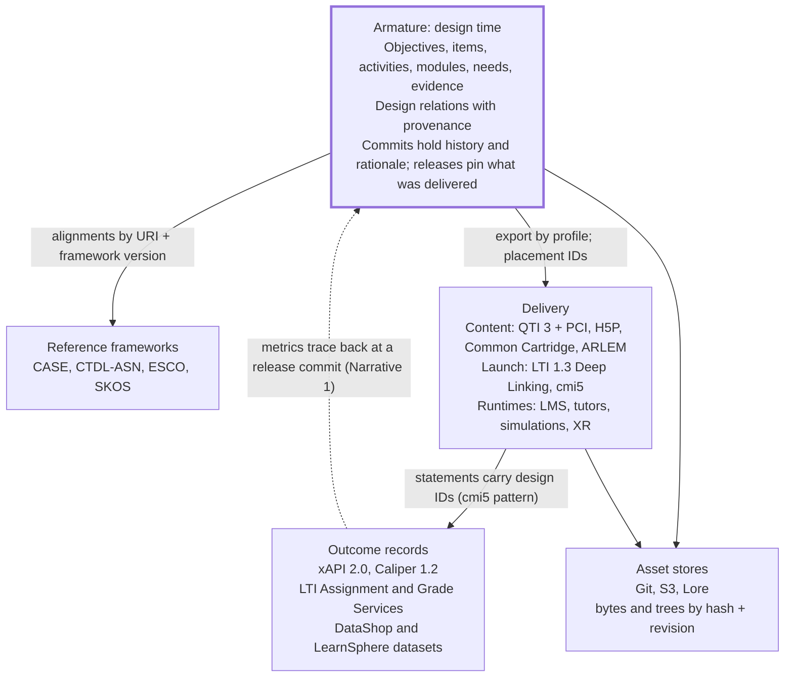
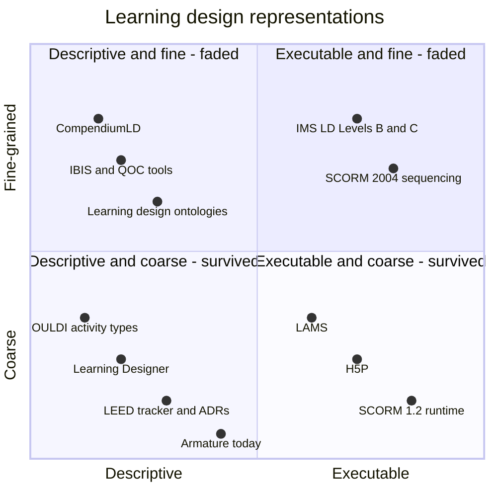

# What Armature Can Learn from Learning-Data Standards

Oct 6, 2026 · Amos Glenn

> **Status since this snapshot (2026-10-08).** This document is a dated research snapshot and is kept as written. Since it was produced: Phases 0 to 4 of `docs/development-plan.md` are done; ADR-0024, 0025, 0027, 0029 and 0033 were written and accepted (ADR-0029 partly superseded by ADR-0056, coverage computed on read); candidate 0036's no-rewrite rule was adopted as ADR-0025 decision 6; candidates 0037 (release pointers) and 0046 (change feed) were deferred by ADR-0025, though a branch-changes route (`GET /api/v1/branches/:name/changes?since=`) covers part of 0046; the `typeVersion` on items was deferred to ADR-0034 (ADR-0033 decision 6); candidate 0043 (alignment models) was noted but not adopted by ADR-0029. **Lesson 1 / candidate 0035 (lossless writes) was not implemented in Phase 3** and is now an open question in plan §6. The seed has no learning activities, so recommendations that tag seed activities do not yet apply.

> Exported from the Claude Doc *What Armature Can Learn from Learning-Data Standards* (https://claude.ai/code/artifact/3a94cd74-0da0-4dc8-9d0f-72c6f44a8f3d) on 2026-10-06. The doc is the living version; this copy is a snapshot for citation from ADRs. Diagrams are re-drawn here in Mermaid. The Decision column in the recommendations table is blank in this copy; triage happens in the doc or in ADRs.

Nearly every problem on Armature's roadmap has been solved, or failed, somewhere before. The closest precedents are Open edX Learning Core, OLI Torus and Moodle for versioned content; H5P, QTI PCI, Twine and PhET-iO for data plus versioned behaviour; xAPI, Ed-Fi and DataShop for records; CASE, CaSS and SKOS for alignment; and FHIR, Stripe and Kubernetes for evolution. The learning-design literature adds the strategic lesson: descriptive design data captured as a byproduct of work survived, while executable, hand-entered design languages did not. That is Armature's bet, and the evidence supports it.

## The ten lessons that matter most

Two of these are near-term risks in the current plan (rows 1 and 2); the rest are designs others paid to learn. "When" uses the phases in `docs/development-plan.md`.

| # | Lesson | Precedents | Where it lands in Armature | When |
| --- | --- | --- | --- | --- |
| 1 | An old client must not erase fields it doesn't know about when it replaces a document | Kubernetes lossless round-trips; Protobuf unknown-field preservation | ADR-0024 replace semantics; the generated SDK | Now (Phase 3) |
| 2 | Pins to past states must survive history operations, so never rewrite history on `main` | Torus publications; Moodle `question_references`; CoQui's own warning about rebase | ADR-0025; `Attestation.asOf`; dataset provenance | Now (Phase 2) |
| 3 | Every item names its interaction type *and version*; upgrades are forward-only migrations, run server-side as commits | H5P `upgrades.js`; Adapt migrations; Twine major-version pinning; Torus's missing version field | ADR-0033, ADR-0034 | Shape in Phase 1 |
| 4 | Keep design identity separate from delivery placement | cmi5 publisher ID vs LMS activity ID; LTI `resource_link.id` | Outcomes importer; Narrative 1 | Phase 6 |
| 5 | Alignments are claims with an asserter, method and confidence; competing alignment models coexist and are scored against data | CaSS assertions; DataShop KC models; Wikidata ranks; alignment kappa ≈ .56 at fine grain | ADR-0028; a new `AlignmentModel` | Phases 4–5 |
| 6 | Relation types need a registry with declared behaviour, maturity levels and a safe fallback | CASE `ext:` → `isRelatedTo`; CaSS's inert types; OpenTelemetry stability levels | ADR-0027 schema self-description | Phase 1 |
| 7 | Record schema changes as named operators and check compatibility in CI | PRISM schema modification operators; Avro/Protobuf rules; Stripe version-change modules | ADR-0027; Phase 0 CI | Phases 0–1 |
| 8 | Offer an incremental change feed with a cursor, tombstones and identity changes | Ed-Fi change queries, `/deletes`, `/keyChanges`; Memento | Phase 2 history routes | Phase 2 |
| 9 | Export by profile: thin links, full-fidelity packages, citable research crates | Thin Common Cartridge; LTI Deep Linking; RO-Crate; content negotiation by profile; PROV-O | ADR-0031 | Phase 6 |
| 10 | Stay descriptive, capture as a byproduct, start coarse | IMS LD vs Larnaca; Open University's 151-module study; MIT LEED tracker; IEEE LOM | Strategy and the position paper | Ongoing |

## Where Armature sits

Armature sits upstream of delivery and outcomes and joins them by identifier. Every precedent below that tried to own a neighbouring layer (IMS LD owning delivery, xAPI–Caliper translation owning records) paid for it.

## Precedents studied

About forty precedents in thirty rows, grouped by family and chosen for different approaches rather than market share. The rest of this doc is organised by problem, so each precedent appears wherever it teaches something.

| Precedent | Family | What it stores as data | The idea worth taking |
| --- | --- | --- | --- |
| [H5P](https://h5p.org/documentation/developers/content-upgrade) | Content | Content JSON plus versioned JS libraries | Data and behaviour versioned separately; forward-only upgrade hooks |
| [QTI 3.0 + PCI](https://www.imsglobal.org/spec/qti/v3p0/impl) | Content | Items, response declarations, shared stimuli | Semantic identifiers on every part; a JS contract for custom interactions |
| [Common Cartridge / Thin CC](https://www.imsglobal.org/cc/ccv1p3/imscc_Implementation-v1p3.html) | Packaging | Manifest plus typed resources in a zip | Link-only packages are what actually travel |
| [SCORM 2004](https://scorm.com/scorm-explained/business-of-scorm/scorm-versions/) | Packaging | Manifest, activity tree, sequencing rules | Warning: executable sequencing nobody could author |
| [cmi5](https://github.com/AICC/CMI-5_Spec_Current/blob/quartz/cmi5_spec.md) | Runtime | Course-structure XML; tracking via xAPI | Publisher ID (design) kept separate from activity ID (runtime) |
| [LTI 1.3 Deep Linking](https://www.imsglobal.org/spec/lti-dl/v2p0) | Integration | Links to tool-owned content | The platform holds a placement; the tool owns the content |
| [Open edX Learning Core](https://github.com/openedx/openedx-core) | Platform | Entities, immutable versions, draft/published pointers, hashed media | Three kinds of ID; export without running plugin code; no version cascade |
| [OLI Torus](https://github.com/Simon-Initiative/oli-torus/blob/master/docs/design-docs/publication-model.md) | Platform | Resources, revisions, publications, activity manifests | Publications pin a set of revisions; objectives attach per part |
| [Moodle question bank](https://docs.moodle.org/dev/Question_bank_improvements_for_Moodle_4.0) | Platform | Bank entries, full-copy versions, references | `version = null` means latest non-draft; identity hash on restore |
| [Adapt](https://github.com/adaptlearning/adapt-migrations) | Authoring | Flat JSON hierarchy with parent pointers | Declarative, guarded, tested content migrations |
| [VR Builder (MindPort)](https://github.com/MindPort-GmbH/VR-Builder-Core-Runtime) | Authoring, XR | Process JSON: chapters, steps, behaviours | GUID scene references; warning: .NET type names stored in data |
| [Open eLearning](https://github.com/open-elearning/core) | Authoring | Zipped JSON plus plugin folders | Counter-example: one app-version marker, no plugin version in content |
| [Twine](https://github.com/iftechfoundation/twine-specs/blob/master/twine-2-storyformats-spec.md) | Authoring | Passages in HTML plus a story-format runtime | A story pinned to a major version of its renderer |
| [CTAT](https://link.springer.com/article/10.1007/s40593-015-0088-2) / [OATutor](https://dl.acm.org/doi/10.1145/3544548.3581574) | Tutors | Behaviour graphs; JSON content in git | Templates plus data tables; skill labels per step |
| [PhET-iO](https://phet-io.colorado.edu/devguide/api_overview.html) | Simulation | Sim state keyed by `phetioID`; a versioned API file | CI checks every build against the published address API |
| [IEEE 1589 ARLEM](https://standards.ieee.org/ieee/1589/6073/) | XR | Activity and workplace models, JSON and XML | Procedure separated from environment |
| [xAPI 2.0 + Profiles](https://adlnet.github.io/xapi-profiles/xapi-profiles-structure.html) | Records | Immutable statements; JSON-LD profiles | Void, never edit; profiles as constraint layers |
| [Caliper 1.2](https://www.imsglobal.org/spec/caliper/v1p2) | Records | Events in a closed vocabulary | Profiles constrain a closed core |
| [Ed-Fi](https://docs.ed-fi.org/reference/data-exchange/data-standard/5/) | Records | K-12 operational entities | Namespaced descriptors; change queries; a break-rest release cadence |
| [CEDS](https://ceds.ed.gov/datamodel.aspx) | Records | A shared vocabulary and three data models | Vocabulary kept separate from implementation; annual alignment releases |
| [Open Badges 3.0 / CLR 2.0](https://www.imsglobal.org/spec/ob/v3p0) | Credentials | Achievement definitions and signed awards | The definition is copied into each signed award |
| [DataShop](https://pslcdatashop.web.cmu.edu/help?page=kcm) | Research data | Transactions, steps, many KC models | Competing skill mappings coexist and are scored against data |
| [I2IDL](https://www.i2idl.org/faq) | Governance | A linked-data glossary; steward of xAPI and TLA | Dereferenceable concept URIs |
| [CASE / OpenSALT](https://www.imsglobal.org/spec/CASE/v1p1/impl) | Competency | Frameworks, items, typed associations | New GUID plus `replacedBy` when meaning changes |
| [CaSS](https://docs.cassproject.org/v1.3/guide/overview/) / [IEEE SCD](https://ieeexplore.ieee.org/document/10194521) | Competency | Frameworks, relations, assertions | Relations as separate objects; assertions with confidence |
| [SKOS](https://www.w3.org/TR/skos-reference/), [ESCO](https://esco.ec.europa.eu/en/about-esco/faq), [CTDL-ASN](https://credreg.net/ctdlasn/terms/majorAlignment) | Vocabulary | Concepts, hierarchies, mappings | Hierarchy kept apart from mapping; graded match strength |
| IMS LD, LAMS, OULDI, Learning Designer, ILDE | Learning design | Designs, sequences, activity profiles | Descriptive representations outlived executable ones |
| [MIT LEED tracker](https://dspace.mit.edu/handle/1721.1/162173) | Learning engineering | Decisions, justifications, revisions, data links | Seven influence codes; tracking fades without a payoff |
| FHIR, Stripe, Kubernetes | Outside education | Clinical resources; API objects | Extensions with URLs; versioned projections over one stored form |
| PROV-O, nanopublications, RO-Crate, SWHID, Wikidata | Outside education | Provenance, claims, packages, identifiers | Agents acting for people; assertion vs provenance; citable crates; intrinsic IDs; ranked claims |

A correction worth knowing: **I2IDL** is the Institute for Infrastructure and Interoperable Data in Learning, a non-profit founded in late 2025 to steward xAPI, the xAPI Profiles spec and other Total Learning Architecture work after ADL. It publishes no authoring data model; its value to Armature is stable concept URIs and stewardship of the outcome-data side.

## Identity: documents, parts, placements and external things

Armature needs four distinct identities: the design document, its parts, its delivery placements, and the external things it references. Most failures in the precedents came from merging two of them, or from deriving an ID from something that changes.

### How others solved it

- **Documents.** Open edX Learning Core uses three IDs per entity: an integer key that never leaves the process, an immutable UUID for outside systems, and a scoped human key that may change ([ADR 0003](https://github.com/openedx/openedx-core/blob/main/docs/openedx_content/decisions/0003-identifier-conventions.rst)). CASE forbids changing identifiers once a framework is published ([CASE 1.1 guide](https://www.imsglobal.org/spec/CASE/v1p1/impl)).
- **Parts.** QTI separates a semantic `identifier`, unique across the exchange, from the XML `id`, unique in one file; scoring and results name choices by identifier. H5P gives every embedded sub-content a UUID `subContentId` and drops any that are not UUID-shaped.
- **Placements.** cmi5 requires the LMS to mint an activity ID that "MUST NOT match" the course author's publisher ID, then carries the publisher ID in every statement's context ([cmi5](https://github.com/AICC/CMI-5_Spec_Current/blob/quartz/cmi5_spec.md)). LTI's `resource_link.id` must change when a link is copied, with lineage kept in `id.history` ([LTI 1.3](https://www.imsglobal.org/spec/lti/v1p3)).
- **Import.** Moodle hashes each question's content, excluding IDs and audit fields, to decide on restore whether it already exists; each question type declares its excluded fields ([restore code](https://github.com/moodle/moodle/blob/MOODLE_405_STABLE/backup/moodle2/restore_qtype_plugin.class.php)). Torus remaps IDs on ingest through an explicit mapping.

### What went wrong

- **Torus** had to backfill unique IDs into all existing page and activity content, with an `ids_added` flag and a bulk job ([unique\_ids.ex](https://github.com/Simon-Initiative/oli-torus/blob/master/lib/oli/publishing/unique_ids.ex)).
- **OATutor** derived step IDs from the problem ID plus a letter suffix; long problems overflowed into control characters ([content repo](https://github.com/CAHLR/OATutor-Content)).
- **Twine** passage IDs change during editing, so links fall back to passage names.
- **Adapt** regenerates every ID on import; hard-coded references must be fixed by hand.
- **VR Builder 4.0** rebuilt its reference system, and old processes held null references until an updater ran with the right scene open ([changelog](https://github.com/MindPort-GmbH/VR-Builder/blob/HEAD/CHANGELOG.md)).

### For Armature

- **Now.** ADR-0023 and ADR-0024 already avoid every failure above. Write three rules into them: client-supplied IDs are opaque (UUID or ULID), never derived from position or sequence; import never regenerates IDs silently, and any remapping is a mapping document recorded in the commit; keys never include mutable fields (ADR-0016, restated).
- **Next.** Define a canonical identity hash per type: content minus IDs and audit fields. It gives idempotent re-import of research slices and duplicate detection across instances, the way Moodle restore works.
- **Phase 6.** Model delivery placements as their own documents: a design artifact *realized as* an LMS activity, an LTI resource link, a QTI identifier or an xAPI activity IRI, at a published commit. Never reuse the Armature ID as the runtime ID; one item is delivered in many offerings, which is exactly why cmi5 forbids it.

## Versions, pins and "latest"

TerminusDB gives Armature history for free, but a reference into history needs explicit pin semantics. The precedents converge on one shape: a stable entity, immutable versions, named pointers, and references that say whether they are pinned or floating.

### How others solved it

- **Moodle 4.0** splits a question into a stable bank entry, full-copy versions (status ready, hidden or draft), and references that either name a version or leave it null, meaning "latest non-draft" ([schema](https://github.com/moodle/moodle/blob/MOODLE_405_STABLE/lib/db/install.xml)). Random selections cannot pin at all.
- **Open edX Learning Core** keeps immutable versions with separate Draft and Published pointer tables. A container version freezes its child list, each child pinned or unpinned, and a child edit does *not* create a new parent version ([ADR 0007](https://github.com/openedx/openedx-core/blob/main/docs/openedx_content/decisions/0007-generalized-containers.rst)).
- **OLI Torus** freezes a set of revisions as a Publication; each course section points at one publication and opts in to newer ones. Its design beliefs include "Published learner-facing content must be stable" ([core beliefs](https://github.com/Simon-Initiative/oli-torus/blob/master/docs/design-docs/core-beliefs.md)).
- **CASE and xAPI** draw the same line on meaning. Minor edits keep the ID; a change of meaning gets a new ID, and the old one is retired with a `replacedBy` link, never deleted ([CASE 1.1](https://www.imsglobal.org/spec/CASE/v1p1/impl); [xAPI](https://github.com/adlnet/xAPI-Spec/blob/master/xAPI-Data.md)).
- **Open Badges 3.0** copies the achievement definition into each signed award, so the award stays verifiable whatever happens to the definition ([OB 3.0](https://www.imsglobal.org/spec/ob/v3p0)).

### What went wrong

- Moodle users report version proliferation, and draft versions once starved random question pools ([MDL-81114 discussion](https://moodle.org/mod/forum/discuss.php?d=455845)).
- Open edX's older split modulestore wrote a whole new structure document on every edit, so storage grew quickly.
- CoQui already found that a branch operation can give commits new IDs. Any stored commit coordinate breaks if history is rewritten.

### For Armature

- **Now (ADR-0025).** Add an invariant: no squash, rebase or reset on `main`, or on any branch whose commits others have stored. `Attestation.asOf`, findings and dataset provenance all depend on it. As a second line of defence, store the document's content hash beside the commit ID, as CoQui stores its version row.
- **Now.** Make the default explicit: design relations float (they describe the current design); evidence pins (attestations, findings, datasets, exports name the commit they rest on).
- **Phase 2.** Add a named, immutable pointer to a commit for "what was delivered", the Torus Publication. Check whether TerminusDB offers tags; if not, a small `Release` document holding a commit ID does the job. Placements and datasets reference releases, not branch heads.
- **Phase 4.** Never cascade versions upward. An item edit should not version its module; the impact route answers "what changed underneath you" by query.
- **Decision to make.** Adopt the CASE rule for objectives: wording fixes in place, a change of meaning becomes a new objective plus a `replacedBy` link, with the old one retired. It costs extra documents, but a silent meaning change under one ID corrupts every attestation and every Narrative 1 trace that points at it. This is supersession between artifacts, not the "new version of" relation ADR-0025 rejects.
- **Later.** Commits record *transaction time*, when the database learned something. "This objective was in force for the Fall 2025 offering" is *valid time* ([Snodgrass](https://www2.cs.arizona.edu/~rts/tdbbook.pdf)). Carry it on releases and placements rather than adding date fields to every artifact.

## Schema evolution without breaking client tools

The healthy ecosystems combine a canonical stored form, versioned projections at the edge, and feature-level capability negotiation. The unhealthy ones stored implementation details in content, or forced every consumer to upgrade at once.

| Approach | Who | Mechanism | What it cost them |
| --- | --- | --- | --- |
| Forward-only upgrade hooks per type | [H5P](https://h5p.org/documentation/developers/content-upgrade) | Content pins `major.minor`; each new minor ships `upgrades.js`; old hooks are never removed; patches drop in | Upgrades run in the browser when someone edits, so content strands on old versions for years ([Tacke 2024](https://www.olivertacke.de/labs/2024/01/13/h5p-and-not-upgrading-existing-content/)) |
| Declarative, tested migration tasks | [Adapt](https://github.com/adaptlearning/adapt-migrations) | Version guards, a content predicate, a mutation, a frozen post-check, inline test fixtures; every course migrated on framework update | Content doesn't record its plugin version, so a separate "capture" step is needed; rewrites in place lose history |
| Lazy migration on read | [Torus](https://github.com/Simon-Initiative/oli-torus/blob/master/lib/oli/resources/content_migrator.ex) | Page JSON upgraded to the current schema version when read | Activity migration is still a TODO |
| Serializer version plus converters | [VR Builder](https://github.com/MindPort-GmbH/VR-Builder/blob/HEAD/CHANGELOG.md) | `$serializerVersion`; reflective updaters | .NET type names stored in data; v4 → v5 shipped with no upgrade path |
| Break-rest release cadence | [Ed-Fi](https://docs.ed-fi.org/reference/roadmap/cadence/), [CEDS](https://github.com/CEDStandards/CEDS-Elements) | Breaking majors in alternate years, four years of support; CEDS syncs everything in one annual release | Code generated per version left districts stuck; Ed-Fi is moving to a runtime-schema API |
| Versioned projections | [Stripe](https://stripe.com/blog/api-versioning), [Kubernetes](https://kubernetes.io/docs/tasks/extend-kubernetes/custom-resources/custom-resource-definition-versioning/) | One stored form; per-change transform modules walk responses back to the client's version; conversion must round-trip losslessly | Every breaking change needs a transform, forever |
| Capability negotiation | [LSP](https://microsoft.github.io/language-server-protocol/specifications/lsp/3.17/specification/), [GraphQL](https://graphql.org/learn/best-practices/#versioning) | Client and server exchange nested capability objects; fields are deprecated, not versioned | Needs usage telemetry to know when a field can go |
| Compatibility rules | [Protobuf](https://protobuf.dev/programming-guides/proto3/#updating), [Avro](https://avro.apache.org/docs/1.11.1/specification/#schema-resolution) | Defaults for new fields; removed names are `reserved`, never reused; unknown fields preserved | Machine-checkable, so cheap |
| Named schema operators | [PRISM](https://dl.acm.org/doi/abs/10.14778/1453856.1453939) | A small set of change operators generates both the data migration and the rewrite of old queries | Restricts how schemas may change |
| Transforms abandoned | [OpenTelemetry](https://opentelemetry.io/docs/specs/otel/versioning-and-stability/) | Rename files were meant to translate between vocabulary versions; now under a moratorium | They fell back to keeping stable names stable |

### For Armature

- **Phase 3, and the most urgent item in this doc.** ADR-0024's replace semantics plus schema growth equals silent data loss. An older client that doesn't know a new field reads the item, changes the stem, and PUTs it back without the field. Kubernetes and Protobuf both treat this as a hard requirement. Two defences, both worth having:
  - The hub is the backstop: a write declares the schema version or capabilities it was built against, and the hub carries forward any field that version could not see.
  - The generated SDK preserves unknown fields and unknown enum values on round trip.
- **Phases 0–1.** Keep a schema change log of named operators: add optional field, rename with alias, decompose scalar into class, retire. Each operator generates the TerminusDB migration (its endpoint already offers `CreateClassProperty`, `ChangeKey`, `DeleteClass`), the backward projection, and the SDK changelog. Keep retired property names in a `reserved` list in `@metadata` and fail CI on reuse.
- **Both, not either.** Use capabilities for *features* (`coverage.read`, `attestation.write`, `fragments.generic`) and projections for *shapes*, kept for the few unavoidable breaks. OpenTelemetry's experience says the main tool is restraint: stable names stay stable.
- **Run content migrations as commits.** Server-side, eagerly, on a migration branch with a migration author and the operator as the reason, then merged. That avoids H5P's stranded content and Adapt's lost history in one move.
- **Release cadence.** Batch breaking changes into rare, announced releases with a long overlap, as Ed-Fi and CEDS do. Avoid code generated per schema version: the SDK should read the schema at runtime or tolerate newer ones.

## Extensions and profiles: growing the vocabulary without forking it

Every durable standard has a small core, namespaced extensions that consumers may safely ignore, a way to flag the ones they must not ignore, and a path for promoting popular extensions into core. Profiles survive only where something enforces them at write time.

### How others solved it

- **FHIR** is the best model. Every extension is `{url, value}` and the URL resolves to its definition. Ordinary extensions may be ignored, and anything not safe to ignore must be a `modifierExtension`. Profiles add cardinality, bindings and `mustSupport`, bundled into Implementation Guides. The core follows an "80% rule": only what most implementations need ([extensibility](https://www.hl7.org/fhir/extensibility.html)).
- **xAPI** keys extensions by IRI wherever they appear. Its Profiles add concepts, statement templates and patterns, and a template's ID must change when its rules change ([profiles spec](https://adlnet.github.io/xapi-profiles/xapi-profiles-structure.html)).
- **CASE 1.1** lets frameworks add association types prefixed `ext:`; consumers that don't understand one treat it as `isRelatedTo` ([CASE 1.1](https://www.imsglobal.org/spec/CASE/v1p1/impl)).
- **Ed-Fi** writes controlled vocabularies as `uri://namespace/Descriptor#code`; only the `ed-fi.org` namespace is standard. Its advice on extensions is blunt: "If possible, avoid extensions," store discrete data rather than aggregates, and plan to upstream ([extensions](https://docs.ed-fi.org/reference/data-exchange/extensions-framework/); [descriptors](https://docs.ed-fi.org/reference/data-exchange/api-guidelines/design-and-implementation-guidelines/api-design-guidelines/ed-fi-descriptors/)).
- **Open edX Learning Core** has plugins add related models instead of subclassing, and requires that core data export *without running plugin code*. They learned it when uninstalling an XBlock broke course export ([ADR 0002](https://github.com/openedx/openedx-core/blob/main/docs/openedx_content/decisions/0002-content-extensibility.rst)).
- **Adapt** namespaces each extension's settings under its `targetAttribute`, such as `_mcq`.

### What went wrong

- xAPI recipes and profiles saw "slow (or low) adoption", and no systems used profiles to reject statements ([Rustici](https://xapi.com/blog/profile-recipes-vs-xapi-profiles/)). The ADL Profile Server was archived in March 2026.
- QTI 2.x and SCORM 2004 shipped without conformance testing, so tools implemented "only a small part" of QTI ([Lazarinis et al. 2009](https://www.academia.edu/24202212/Measuring_the_conformance_of_hypermedia_assessment_tools_to_QTI)).
- Generic slots kill meaning. xAPI developers reached technical but not semantic interoperability; one said of a context slot, "Grouping… I don't really know what that means" ([Samuelsen et al. 2021](https://doi.org/10.1186/s41039-021-00150-2)).

### For Armature

- **ADR-0033.** Give plugin-owned data one shape: an optional set of `{uri, value}` extensions on any document, where the URI resolves to an `ExtensionDefinition` with an owner, a JSON Schema, a maturity level and a `modifier` flag. This is progressive formalization at ecosystem level: an extension used by two reference clients meets the plan's two-client test and becomes a promotion candidate.
- **Promote with an alias.** When an extension becomes a core field, keep accepting the extension form for one release, through the same projection machinery as other schema changes.
- **Profiles as documents, enforced at write.** A profile lists required classes and fields, allowed relation types and cardinalities. Writes declare their profile and the invariants engine checks it. CoQui's needs and ADR-0031's research slices are both profiles.
- **Export without plugins.** Extension values are plain JSON with a definition URI, so a full export never needs plugin code.
- **Plain JSON first.** Keep the JSON-LD context as an overlay; don't require consumers to run a JSON-LD processor to interoperate. ActivityPub's experience is that many won't.
- **Namespaced codes.** Statuses, relation types and activity types become `namespace#code` values: the core namespace is normative, plugin namespaces are local, and crosswalks map local codes onto core ones.

## Rich and diverse activities: content data plus versioned behaviour

Every system that handles rich content splits stored data from versioned behaviour, which validates ADR-0034. They differ on three things: whether content records the behaviour version, who runs upgrades, and how references into an externally owned object are checked.

| Precedent | Content names its behaviour by | Version recorded in content? | Upgrade path |
| --- | --- | --- | --- |
| [H5P](https://h5p.org/library-definition) | Library machine name plus `major.minor` | Yes | `upgrades.js` per minor; patches drop in |
| [QTI 3 PCI](https://www.imsglobal.org/spec/qti/v3p0/impl) | Interaction type identifier plus module path | Module path only | None in the spec |
| [Twine](https://github.com/iftechfoundation/twine-specs/blob/master/twine-2-storyformats-spec.md) | Story format name plus version | Yes | Minors replace; old majors kept side by side |
| [PhET-iO](https://phet-io.colorado.edu/devguide/api_overview.html) | Sim version plus a committed API file | Yes | API locked down; CI checks each build; majors opt-in; five-year stability promise |
| [Torus](https://github.com/Simon-Initiative/oli-torus/blob/master/lib/oli/activities/activity_registration.ex) | Activity type ID | **No**: the registration has no version field | None yet |
| [Adapt](https://github.com/adaptlearning/adapt_framework/wiki/Core-model-attributes) | `_component: "mcq"` | **No** | Migrations after a separate "capture" snapshot |
| [VR Builder](https://github.com/MindPort-GmbH/VR-Builder-Core-Runtime/blob/HEAD/Source/Serialization/NewtonsoftJsonProcessSerializer.cs) | .NET type names | Implicitly, and fragile | Serializer upgrades; none from v4 to v5 |

Three precedents speak to Armature's hardest future cases, simulations and XR:

- **PhET-iO** publishes, per simulation version, an API file listing every addressable element by `phetioID`. Static elements may never disappear, dynamic ones must follow a declared archetype, and CI compares each build with the reference ([API validation](https://github.com/phetsims/tandem/blob/main/js/phetioAPIValidation.ts)). That is the missing piece for safely linking an objective to "the friction slider in simulation X, revision R".
- **IEEE 1589 ARLEM** splits an XR activity (steps, triggers, what to show) from its workplace (things, places, people, anchors), joined by ID ([Wild et al. 2020](https://doi.org/10.1109/TALE48869.2020.9368405)). VR Builder does the same inside Unity with GUID-based scene references resolved through a registry; its v4 rebuild left those references null.
- **CTAT and OATutor** show the template pattern: authors work in spreadsheets, and a template expands each row into an instance ([CTAT mass production](https://github.com/CMUCTAT/CTAT/wiki/Mass-Production)).

### For Armature

- **Phase 1, one field.** Put `{interactionType, typeVersion}` on every item now, before the registry exists. Torus and Adapt show the cost of leaving it out: without it you cannot query "which items need this migration".
- **ADR-0034.** Pin items to a renderer *major* version; minors and patches apply automatically; keep several majors installed side by side, as Twine and PhET do.
- **Migrations ship with the type.** Each new renderer version carries Adapt-style declarative migrations with test fixtures, run by the hub as migration commits.
- **No implementation names in data.** Reference behaviour by registry IRI plus version, never by class or module name (VR Builder's lesson).
- **ADR-0030, an addition.** Let an `Attachment` revision carry an *address manifest*, PhET-style, and let design relations point inside an asset as `{attachment, revision, addressId}`. When a revision moves, the hub reports which design links would break before anyone merges.
- **XR.** Hold the procedure (steps, triggers, objectives) as fragments in the graph and the workplace as a referenced asset, following ARLEM. ARLEM's JSON binding is a ready import and export format.
- **Templates.** Make `ItemTemplate` plus a binding table first-class, so "generated from template T, row 12" is a queryable relation and expanded items stay traceable.

## Stay descriptive: why executable design languages failed

Executable learning design languages failed and descriptive representations survived. The evidence says conceptual complexity was *not* the main reason; missing runtimes, unrevisable packages and no immediate payoff were.

*Armature's path runs upward from "Armature today": coarse first, structure added on evidence.*

Placements are qualitative judgments from the sources below. The pattern matters more than any one dot: nothing in the top row lasted. Armature's upward path leads toward the top-left, where capture cost killed earlier tools, so byproduct capture is what has to keep that path affordable.

- **IMS Learning Design (2003)** described whole units of learning as runnable plays, acts, roles and conditions, packaged as XML ([information model](https://www.imsglobal.org/learningdesign/ldv1p0/imsld_infov1p0.html)). Its editors stalled by 2010; LAMS dropped its IMS LD support, and Moodle never built it.
- **Derntl et al. (2012)** tested the usual explanation. Teachers with no IMS LD training authored correct designs using every Level A and B element, on paper as well as in software. Conceptual complexity did not impede authoring, so "the barriers to adoption appear to lie elsewhere" ([IEEE TLT, doi:10.1109/TLT.2011.25](https://eric.ed.gov/?id=EJ993154)).
- **The likelier causes:** no runtime in the LMSs people used; packages that could not be revised ("life cycle management" was an open problem at the 2008 expert workshop, [Neumann et al. 2010](https://online-journals.org/index.php/i-jet/article/view/1045)); no payoff for the teacher; too costly for vendors ([Griffiths et al. 2009](https://www.tandfonline.com/doi/abs/10.1080/01587910903023199)).
- **SCORM 2004 sequencing** repeated the pattern; its first edition "wasn't fully implementable", and SCORM 1.2 remains the workhorse ([Rustici](https://scorm.com/scorm-explained/business-of-scorm/scorm-versions/)).
- **LAMS** succeeded more by collapsing IMS LD into sequences of tools with an instant preview. Dalziel names what it lost: no annotation of *why* an activity is there ([Dalziel 2011](https://files.eric.ed.gov/fulltext/EJ1145651.pdf)).
- **The Larnaca Declaration** codified the turn: a descriptive framework kept apart from guidance and sharing, "pedagogical pluralism" in place of neutrality, and music notation as the analogy. Notation transmits the idea, not the performance ([JIME 2016, doi:10.5334/jime.407](https://jime.open.ac.uk/articles/10.5334/jime.407)).
- **Collaborative scripts** (Jigsaw, Pyramid) needed workarounds to fit IMS LD's role model, which is a warning for multi-role activities ([Collage](https://research.ou.nl/en/publications/collage-a-collaborative-learning-design-editor-based-on-patterns)).

### For Armature

- **Never orchestrate delivery.** Armature records intent, structure and rationale; delivery tools execute. Referencing a versioned renderer is fine; running it is not Armature's job.
- **Describe adaptive and multi-role designs as relations.** "Branch on mastery of LO-3" is a design intent with a rationale, not a condition to evaluate. Roles, the artifacts they exchange, and the intended social structure are relations; control flow is not.
- **Ask only for structure that answers a question now.** Derntl's result means the barrier is payoff, so every required field should feed a check the designer sees: coverage, alignment, impact.
- **Many views over one graph.** Persico and Pozzi found "one format alone is often insufficient" ([BJET 2015, doi:10.1111/bjet.12207](https://www.itd.cnr.it/download/BJET_2015_preprint_Informing_Learning_Design_with_Learning_Analytics_to_improve_Teacher_Inquiry.pdf)). Course maps, coverage matrices and activity profiles should be projections of the graph, not competing notations.
- **Claim pluralism, not neutrality.** Say which pedagogical assumptions the schema makes; critics attacked IMS LD's claim to be neutral.

## Relations and alignment as fallible, competing claims

An alignment is a judgment, and its reliability drops as granularity rises. The systems that last record who asserted it, how, and with what confidence, and let competing judgments coexist rather than overwrite each other.

### How others solved it

- **Small typed vocabularies.** CASE has ten association types plus `ext:` extensions; IEEE's Sharable Competency Definitions has six core terms ([IEEE 1484.20.3](https://ieeexplore.ieee.org/document/10194521)). CaSS defines more, but its reasoner uses only broadens/narrows, requires and equivalence; `desires` and `isEnabledBy` are stored but inert ([assertion processing](https://docs.cassproject.org/v1.3/guide/assertion-processing/)).
- **Hierarchy kept apart from mapping.** SKOS separates within-scheme `broader`/`narrower` from cross-scheme `exactMatch`, `closeMatch`, `broadMatch` and `narrowMatch`. Only `exactMatch` is transitive, to stop similarity from spreading unchecked ([SKOS reference](https://www.w3.org/TR/skos-reference/)).
- **Graded strength.** ASN and CTDL-ASN grade alignments as exact, broad, narrow, major, minor or prerequisite ([ASN toolkit](https://toolkit.asn.desire2learn.com/documentation/alignments)). In the ESCO–O\*NET crosswalk, only 542 of 5,175 validated matches were exact ([technical report](https://esco.ec.europa.eu/system/files/2022-12/ONET%20ESCO%20Technical%20Report.pdf)).
- **Assertions, not bare edges.** CaSS models "Agent A asserts at time T… with confidence p… based on evidence E", and stores relations as separate objects so third parties can assert them ([CaSS](https://docs.cassproject.org/v1.3/guide/overview/)). Wikidata keeps conflicting statements side by side, each with qualifiers, sources and a rank: preferred, normal or deprecated ([ranking](https://www.wikidata.org/wiki/Help:Ranking)).
- **The busiest relations become first-class.** LRMI promoted `assesses` and `teaches` from string-typed alignment objects to direct properties in 2020 ([LRMI terms](https://www.dublincore.org/specifications/lrmi/lrmi_terms/2020-11-12/lrmi-terms.ttl)).
- **Competing models scored against data.** DataShop holds many knowledge-component models per dataset, including two automatic baselines, and ranks them by fit. Splitting one skill into three lowered BIC from 5,677 to 5,628 and led to a redesigned tutor ([Stamper & Koedinger 2011](https://doi.org/10.1007/978-3-642-21869-9_46); [Koedinger et al. 2013](https://doi.org/10.1007/978-3-642-39112-5_43)). A later caution: the best-fitting model is not always the best predictor ([AIED 2021](https://link.springer.com/chapter/10.1007/978-3-030-78292-4_40)).

### What the evidence says about reliability

Twenty raters aligning items to standards reached kappa ≈ .56 on 57 fine topics but ≈ .72 on 10 broad categories. Only 7% of simulated six-rater panels reproduced the full panel's mapping ([Herman, Webb & Zuniga 2005](https://files.eric.ed.gov/fulltext/ED488723.pdf)). An Armature coverage verdict built on fine-grained alignments inherits that noise.

### For Armature

- **Keep `assesses` as a hot predicate, add provenance beside it.** The direct property stays the current view that coverage reads. Provenance arrives through ADR-0028: an attestation of the claim "item 7 assesses LO-3", with an agent, method and confidence. This mirrors Wikidata's split between the preferred value and the full statement.
- **Add `AlignmentModel` (new).** A named set of item or fragment → objective mappings. Several coexist; one is preferred for coverage; the outcomes importer scores each against datasets and records fit as findings. Narrative 1's "at-risk objective" then says which alignment it rests on. Torus already attaches objectives per part, so fragment-level mapping is proven.
- **A relation-type registry (ADR-0027).** Each type declares its endpoint classes, inverse, transitivity, whether it feeds coverage or carries outcome data, its maturity, and its SKOS, CTDL-ASN or SCD export term. A type without behaviour is marked informational.
- **Two classes, not one enum.** Local structure (prerequisite, part of) and external mapping (objective to CASE item) should be different junction classes, avoiding CASE's mixing of `isChildOf` and `exactMatchOf`.
- **ADR-0030 gap.** `ExternalRef` holds only `system` and `identifier`. Add the framework version, the source's `lastChangeDateTime`, the retrieval date and a snapshot of the statement text. CASE edits minor wording under the same GUID, and Lightcast refreshes every four weeks without successor mappings.
- **Treat `replacedBy` as a migration signal.** Offer ESCO's three choices: update automatically, have a person update, or retire the alignment. Record whichever happens as a commit with a reason.
- **Crosswalks as named documents** with author, method, version pins and a confidence summary, the containment SKOS left unsolved.

## Rationale and the capture-burden problem

Rich rationale vocabularies died of capture cost. What survived is lightweight, captured inside work people already do, and superseded rather than edited.

### How others solved it, or didn't

- **Argumentation schemes** (IBIS and gIBIS, QOC, DRL) gave designers issues, options, criteria and arguments to fill in ([MacLean et al. 1991](https://doi.org/10.1080/07370024.1991.9667168); [Lee & Lai 1991](https://doi.org/10.1080/07370024.1991.9667169)). Studies found "cognitive overhead" and "premature commitment to structure". Argumentation helped in poorly understood design spaces and distracted in well-constrained ones ([KMi-97-5](https://kmi.open.ac.uk/publications/pdf/kmi-97-5.pdf)).
- **Compendium and CompendiumLD** brought IBIS to learning design. Users found the learning overhead too high and fell back to paper icons; the tools are no longer maintained ([OULDI report](https://www.open.ac.uk/blogs/archiveOULDI/wp-content/uploads/2010/11/OULDI-CompendiumLD-final-report-v041.pdf)).
- **The person who records is rarely the one who benefits**, and capture interrupts the work ([Horner & Atwood 2006](https://link.springer.com/doi/10.1007/978-3-540-30998-7_3)). IEEE LOM's educational fields were rarely filled in for the same reason ([Friesen 2004](https://doi.org/10.19173/irrodl.v5i3.195)).
- **Architecture Decision Records** succeeded: short files in the repo, reviewed in pull requests, superseded rather than edited ([Nygard 2011](https://cognitect.com/blog/2011/11/15/documenting-architecture-decisions)). SEURAT linked rationale to code and flagged rationale that later changes had undermined ([Burge & Brown 2008](https://www.sciencedirect.com/science/article/abs/pii/S0164121207001203)).
- **The LEED tracker** the paper already cites logged 283 decisions across 18 projects with seven influence codes. Experience (151), Requirements (136) and Context (122) dominated; Research appeared 38 times. Only 8 of 25 internal decisions that cited data actually linked to it, and one external project stopped tracking after ideation ([Totino & Kessler 2025](https://dspace.mit.edu/handle/1721.1/162173)).
- **The Open University** got its strongest results from capture done by specialists: one to three days per module, with at least three reviewers ([Toetenel & Rienties 2016](https://oro.open.ac.uk/45016/)).

### For Armature

- **The commit message is the primary rationale.** ADR-0025 already says so, and both the ADR experience and the SE literature back it. Keep it required and cheap; `DesignNote` stays optional elaboration.
- **Let plugins write rationale from actions.** CoQui's revision reason becoming the commit message is the model: the reason is captured because the workflow asks for it anyway.
- **Offer LEED's seven influence codes as an optional facet** on design notes. They are field-tested, quick to apply, and would make Armature data comparable with an existing learning engineering corpus.
- **Plan for capture by someone other than the designer.** Specialists, retrospective mapping, or AI-suggested classification confirmed by a person. Record who captured each item and with what confidence; attestations already fit.
- **Supersede, don't edit.** Give decisions an ADR-style status (proposed, accepted, superseded) when the structured decision type arrives.
- **Flag stale rationale.** A note whose subject changed after it was written is stale, using the same commit mechanism as attestation staleness.
- **Measure completeness; don't mandate it.** Report per module how many objectives have needs evidence or alignments with provenance, instead of making those fields required.

## Provenance, corrections and AI agents

Three separations recur: who did the work versus who asserts it, the claim versus its provenance, and correcting by appending versus editing. Armature has the first half of each already; the precedents supply the rest.

### How others solved it

- **xAPI** never edits a statement. A correction is a new statement that voids the original, and a voiding statement cannot itself be voided. `authority` (who vouches) is separate from `actor` (who did it) ([xAPI data](https://github.com/adlnet/xAPI-Spec/blob/master/xAPI-Data.md)).
- **W3C PROV-O** models entities, activities and agents. `actedOnBehalfOf` expresses delegation, `SoftwareAgent` is a standard agent type, and a qualified association can point at the `Plan` an agent followed ([PROV-O](https://www.w3.org/TR/prov-o/)).
- **PAV** separates `authoredBy`, `curatedBy`, `contributedBy` and `importedFrom`: the vocabulary for "drafted by AI, accepted by a person" ([Ciccarese et al. 2013](https://doi.org/10.1186/2041-1480-4-37)).
- **Nanopublications** split a claim into three named graphs: the assertion, its provenance, and who published it when. "Trusty URIs" embed a content hash, so a nanopub is immutable and verifiable ([Groth et al. 2010](https://dx.doi.org/10.3233/ISU-2010-0613); [Kuhn & Dumontier 2014](https://arxiv.org/abs/1401.5775)).
- **Open Badges 3.0** awards are W3C Verifiable Credentials: signed, never edited, changed only by revocation or reissue ([OB 3.0](https://www.imsglobal.org/spec/ob/v3p0)).

### For Armature

- **Export provenance as PROV-O.** A commit is an activity, its author an agent (a `SoftwareAgent` for AI users), the message its description, and a document at a commit an entity linked by `wasRevisionOf`. The mapping is nearly mechanical and serves research exports and the paper's P5 claim directly.
- **Commit trailers for delegation.** When an agent writes, record the person it acted for and the task or prompt it followed. Git-style trailers in the commit message (`On-behalf-of:`, `Plan:`) cost no schema change and parse cleanly. This answers part of the plan's open question on AI provenance before any `proposedBy` field is needed.
- **Read ADR-0028 as a nanopublication.** Claim text and reference are the assertion; `asOf` and evidence are the provenance; `attestedBy` and the commit are publication info. A content-hash ID makes an exported attestation tamper-evident.
- **Withdraw by status, not by disappearance.** A withdrawn attestation or finding should stay queryable as withdrawn without walking history, as xAPI voiding does. The hub already never deletes plugin documents; keep that true for attestations too.
- **Later: signed attestations.** An external reviewer's sign-off that must travel between institutions is a Verifiable Credential, with a status list for revocation.

## Closing the loop: design, delivery and outcomes

The loop closes through shared identifiers, not through one shared data model. And coarse design data, captured by specialists, was already enough for findings at institutional scale.

### What the precedents and research show

- **Design intent is needed to read analytics.** Lockyer, Heathcote and Dawson argue that "checkpoint" and "process" analytics mean nothing without the design they measure ([2013, doi:10.1177/0002764213479367](https://researchers.mq.edu.au/en/publications/informing-pedagogical-action-aligning-learning-analytics-with-lea/)).
- **Coarse data paid off.** The Open University coded 151 modules into seven activity types, as hours per week, and joined them to 111,256 students' outcomes. Communication activities were "the primary predictor for academic retention" ([Rienties & Toetenel 2016, doi:10.1016/j.chb.2016.02.074](https://oro.open.ac.uk/45383)). Modules heavy in assimilative activity had lower pass rates ([Toetenel & Rienties 2016](https://oro.open.ac.uk/45016/)).
- **The field still lacks design data.** "Few published studies offer course- or learning-design metadata that would allow clear mapping of learning analytics to learning design" ([Macfadyen, Lockyer & Rienties 2020](https://learning-analytics.info/index.php/JLA/article/download/7389/7525)).
- **Identifiers join the pieces.** ADL's Total Learning Architecture joins activity metadata, xAPI performance data, competency frameworks and learner records only through shared IDs ([Smith & Milham 2021](https://files.eric.ed.gov/fulltext/ED628093.pdf)). cmi5 puts the design-time publisher ID into every runtime statement. Torus pins each course section to one publication, so every outcome has an exact design state.
- **Don't translate between record standards.** A SoLAR position paper concludes that "performing an exact mapping between xAPI and Caliper is unlikely to be feasible" ([Kitto et al. 2020](https://www.solaresearch.org/wp-content/uploads/2020/09/SoLAR_Position-Paper_2020_09.pdf)).

### For Armature

- **The full trace.** Dataset → placement → release commit → item at that commit → objectives under a named alignment model. Each hop is already planned or proposed above; together they make Narrative 1 exact instead of approximate.
- **Ask delivery tools to carry Armature IDs.** When a tool generates xAPI, include the Armature item and objective IRIs in statement context, cmi5-style. When exporting to QTI, use `fragmentId` values as choice identifiers. The importer then joins without guessing.
- **Reference records; don't normalize them.** Store derived `LearningMetric` values with a pointer to the source dataset, as P6 already intends. Never build an xAPI–Caliper translation layer.
- **A cheap research payoff.** Optional coarse fields on `Activity` (an activity type from the OULDI seven or Laurillard's six, as a namespaced code, plus duration) would let existing learning design–analytics studies be rerun on Armature data. This is a progressive-formalization candidate with published evidence behind it.

## Packaging, export and research slices

Interchange that works comes in two weights: a thin form of links plus metadata, which most consumers want, and a full-fidelity package for round trips. Systems that sync need a third thing, an incremental change feed.

### How others solved it

- **Thin.** Thin Common Cartridge allows only web links and LTI links ([Thin CC](https://www.imsglobal.org/cc/CCv1p0thin/ims_thinCC_impl-v1p0.html)). LTI Deep Linking returns references to content the tool keeps. cmi5 can import a course as XML alone, pointing at remotely hosted units.
- **Full.** Open edX Learning Core exports a zip of TOML per entity plus content-hashed media ([zipper.py](https://github.com/openedx/openedx-core/blob/main/src/openedx_content/applets/backup_restore/zipper.py)); Moodle's `.mbz` keys files by SHA-1; Torus digests list media with MD5s. Open edX's older OLX exports a snapshot only, and history is lost.
- **Research.** RO-Crate wraps a directory with a JSON-LD metadata file using schema.org, and has a Five Safes profile for governed access to sensitive data ([Soiland-Reyes et al. 2022](https://doi.org/10.3233/DS-210053)). The FAIR principles add that metadata should outlive the data it describes ([Wilkinson et al. 2016](https://doi.org/10.1038/sdata.2016.18)).
- **Profiles.** W3C Content Negotiation by Profile serves one resource in several profiles via `Accept-Profile` or `_profile`, with `_profile=alt` listing them; it is still a Working Draft ([dx-prof-conneg](https://www.w3.org/TR/dx-prof-conneg/)).
- **Sync.** Ed-Fi exposes change versions on every resource, a `/deletes` feed of tombstones, a `/keyChanges` feed for identity changes, and snapshot reads. Clients apply key changes, then upserts, then deletes ([ODS/API 7.2](https://edfi.atlassian.net/wiki/spaces/ODSAPIS3V72/pages/23299597)). Memento gives any resource a time-addressable URI and a list of its past states ([RFC 7089](https://www.rfc-editor.org/rfc/rfc7089)).
- **Closed tools.** Storyline accepts questions only through a one-way Excel or text template ([Articulate](https://community.articulate.com/kb/user-guides/storyline-360-importing-questions-from-excel-spreadsheets-and-text-files/1106002)). It can be a target, never a system of record.

### For Armature

- **ADR-0031: three weights.** `thin`: IDs, labels, links and alignments, for LMS and catalogue consumers. `full`: JSON-LD at a commit plus an attachment manifest with hashes, which the Phase 6 exit criterion already requires to round-trip. `research`: an RO-Crate around a slice, carrying the schema version, the change-operator log, PROV provenance, the pseudonymization method and the profile URI.
- **Include history where it matters.** OLX threw history away; history is Armature's differentiator. A research crate should be able to include per-document commit history, pseudonymized under the profile.
- **Pick profiles by `_profile` now.** It is a stable query-parameter contract; add the `Accept-Profile` header if the W3C draft settles.
- **Phase 2: a change feed.** `GET /changes?since=<cursor>` returning upserts, status-change tombstones and identity remaps, with an opaque cursor rather than raw commit IDs. Expose `?at=<commit>` reads and a per-document list of past states, Memento-style.
- **Export targets are plugins.** A Storyline question template (the project already holds one), QTI 3, Common Cartridge and CASE-compatible alignments are each a plugin. Record every export as an event naming the commit it came from.

## Federation and identity across instances

Distributed learning-data ecosystems work when identifiers are globally unique and resolvable from the first write. Central registries that nothing consults at write time fade.

### How others solved it

- **Resolvable statement-level URIs.** ASN gave every standards statement its own persistent URL ([Sutton & Golder 2008](https://doi.org/10.23106/dcmi.952109190)). I2IDL's glossary publishes several hundred concepts (240+ on its site, 397 in its latest linked-data release) as dereferenceable SKOS URIs with a SPARQL endpoint ([glossary](https://www.i2idl.org/glossary)).
- **Export IDs separate from local keys.** Open edX had to add a dedicated `export_id` for taxonomies because tag IDs were editable and local to one instance ([tagging ADR 0011](https://github.com/openedx/openedx-core/blob/main/docs/openedx_tagging/decisions/0011-cross-instance-taxonomy-identity.rst)).
- **Intrinsic plus extrinsic IDs.** A content hash proves *which bytes*; a registry ID says *which work*, across versions. Software citation needs both ([Di Cosmo et al. 2020](https://www.dicosmo.org/Articles/2020-CiSE-swhid.pdf)), and SWHIDs (now ISO/IEC 18670) give typed hashes for files, trees and revisions ([swhid.org](https://www.swhid.org/)).
- **Data stays with owners.** ADL's Total Learning Architecture leaves each data store with its owner and names identity management as the hard part ([Smith & Milham 2021](https://files.eric.ed.gov/fulltext/ED628093.pdf)). Open Badges 3.0 allows DIDs or URLs for issuers.
- **A registry nobody used.** The ADL xAPI Profile Server was archived in March 2026 ([repo](https://github.com/adlnet/profile-server)); validation never depended on it.

### For Armature

- **Mint IRIs under an instance base URI now.** Client-supplied IDs become the local part. Cross-instance references are then just IRIs, and nothing needs rewriting when a second instance appears.
- **An equivalence list on documents.** A `sameAs` set for the same objective or item in another instance or system, as the TLA experience recommends.
- **Asset references, SWHID-style.** A typed hash (file or tree) plus an extrinsic ID for the asset as a work. ADR-0030 already carries `hashAlgorithm`, which gives the algorithm agility multihash provides.
- **Instance registry: use it at write time or don't build it.** If it exists, the hub should consult it when validating external IRIs; otherwise it will go the way of the Profile Server.
- **Project boundaries.** One database per course keeps access control and branching simple; one per institution makes cross-course research queries possible, since TerminusDB cannot query across databases. Shared vocabulary IRIs plus the research export soften the first option's cost.
- **Borrow shared term URIs.** Map Armature's core classes to I2IDL glossary concepts in the JSON-LD context. It is cheap, but check the glossary's governance first: its repository currently sits in an individual's account.

## Where this research challenges the current plan

Most of the development plan holds up well against the precedents. Six points deserve a second look, the first two before Phase 3 ships.

### Where I'd push back

1. **Replace semantics will erase fields older clients can't see.** ADR-0024 plus schema growth is the classic lost-update bug that Kubernetes and Protobuf design around. Fix it in the hub, not only in the SDK, because not every client will use the SDK.
2. **Commit IDs are only as stable as your history policy.** Attestations, findings and datasets will store commit coordinates. Without a written "no history rewrite" invariant, one squash invalidates all of them.
3. **Capability negotiation alone won't carry schema evolution.** It handles features well. Shapes still need projections for the rare breaking change, and OpenTelemetry's moratorium shows the deeper tool is restraint: stable names stay stable.
4. **Progressive formalization needs a trigger, or "later" never comes.** LOM's educational fields stayed empty and LEED tracking lapsed. Define what promotes a free-text field: the two-client test for extensions, a periodic review of `DesignNote.category` values, or AI-proposed classifications that a person attests.
5. **`ExternalRef` is too thin to survive framework revision.** Without a version, a change date and a text snapshot, a CASE alignment silently changes meaning when the framework edits wording in place.
6. **Coverage treats alignments as facts.** Rater agreement drops to kappa ≈ .56 at fine granularity. ADR-0029 already calls its thresholds provisional; it should also say which alignment model and confidence a verdict rests on.

### What the research validates

- **Data plus versioned behaviour** (ADR-0034): H5P, QTI PCI, Twine and PhET-iO all converged on it.
- **Opaque, client-minted part IDs** (ADR-0023): Torus, OATutor and Twine show what happens otherwise.
- **The commit message as rationale** (ADR-0025): ADRs succeeded where argumentation tools failed.
- **Assets by hash, never in the graph** (ADR-0030): Git LFS, Open edX media, Moodle files and SWHIDs all do this.
- **Workflow vocabulary stays in plugins** (ADR-0018 §5): Ed-Fi's "avoid extensions" and FHIR's 80% rule say the same thing as the two-client test.
- **Reference standards; don't translate them** (plan §8): the SoLAR finding on xAPI and Caliper.
- **Descriptive, not executable** (P2, P4): the IMS LD record.

## Recommendations mapped to the development plan

Twenty-nine recommendations, sorted by the plan phase where each is cheapest to adopt. Use the Decision column to triage; "new" means no existing ADR covers it.

| Phase | Recommendation | ADR | Precedent | Decision |
| --- | --- | --- | --- | --- |
| 0 | Keep retired property names in a `reserved` list; fail CI on reuse | 0027 | Protobuf |  |
| 1 | Put `{interactionType, typeVersion}` on every item | 0033 | Torus, Adapt (both lack it) |  |
| 1 | Relation-type registry: endpoints, inverse, transitivity, coverage role, maturity, export term | 0027 | CaSS, OpenTelemetry, SKOS |  |
| 1 | Log schema changes as named operators that generate migration, projection and SDK diff | new | PRISM |  |
| 1 | Opaque IDs only; import remaps recorded as mapping documents | 0024 | Torus, Adapt, OATutor |  |
| 1 | Extensions as `{uri, value}` with an `ExtensionDefinition` and a modifier flag | 0033 | FHIR |  |
| 1 | Mint IRIs under an instance base URI | 0024 | ASN, Open edX |  |
| 2 | No history rewrite on shared branches; store a content hash beside commit pins | 0025 | Torus, Moodle |  |
| 2 | A `Release` pointer for delivered states | 0025 | Torus publications |  |
| 2 | Change feed with an opaque cursor, tombstones and identity remaps | new | Ed-Fi, Memento |  |
| 2 | Commit trailers for delegation (`On-behalf-of:`, `Plan:`) | 0025, 0032 | PROV-O |  |
| 3 | Lossless writes: the hub carries forward fields a client's version can't see | 0024 | Kubernetes, Protobuf |  |
| 3 | Profiles as documents, declared on writes and enforced by the invariants engine | new | xAPI Profiles, FHIR |  |
| 3 | Content migrations as commits on a migration branch | 0033, 0034 | Adapt, H5P |  |
| 4 | Coverage verdicts name their alignment model and confidence | 0029 | Herman et al., DataShop |  |
| 4 | `AlignmentModel` documents, scored against datasets, with baselines | new | DataShop |  |
| 4 | Measure completeness per module instead of mandating fields | 0029 | Ochoa & Duval, LOM |  |
| 5 | Attestations as assertion + provenance + publication info; withdrawal by status | 0028 | Nanopublications, xAPI |  |
| 5 | A change of meaning makes a new objective with `replacedBy` | new | CASE, xAPI |  |
| 5 | Optional LEED influence codes on design notes | new | MIT LEED tracker |  |
| 6 | `ExternalRef` gains framework version, change date and text snapshot | 0030 | CASE, Lightcast |  |
| 6 | Address manifests on asset revisions; references into assets | 0030 | PhET-iO |  |
| 6 | Delivery placements separate from design IDs | new | cmi5, LTI |  |
| 6 | Thin, full and research export weights; RO-Crate; `_profile` | 0031 | Thin CC, RO-Crate, W3C conneg |  |
| 6 | PROV-O provenance in exports; identity hash for idempotent re-import | 0031 | PROV-O, Moodle |  |
| 7 | SDK preserves unknown fields and enum values; no per-version code generation | — | Protobuf, Ed-Fi |  |
| Later | Renderer major-version pinning with majors side by side | 0034 | Twine, PhET-iO |  |
| Later | `ItemTemplate` plus binding tables; coarse activity type and duration | new | CTAT, Open University |  |
| Later | Signed attestations for cross-institution use; valid time on releases | 0028 | Open Badges 3.0, Snodgrass |  |

## For the position paper

The literature supports the paper's core claim and answers the reviewer objection it is most likely to meet: "isn't this IMS Learning Design again?" These are worth adding to Zotero whether or not they make the final draft.

| Claim or likely objection | Literature | What it adds |
| --- | --- | --- |
| Design-time data is the missing infrastructure | [Macfadyen, Lockyer & Rienties 2020](https://doi.org/10.18608/jla.2020.73.2); [Mangaroska & Giannakos 2019](https://doi.org/10.1109/TLT.2018.2868673) | The analytics field asking, in print, for design metadata it cannot find |
| Structure enables intelligence without AI | [Hernández-Leo et al. 2019](https://doi.org/10.1111/bjet.12645) | "Design analytics" computed from design artifacts; the nearest prior framing of Narrative 2 |
| Structured design data pays off | [Rienties & Toetenel 2016](https://doi.org/10.1016/j.chb.2016.02.074); [Toetenel & Rienties 2016](https://doi.org/10.1111/bjet.12423) | Design data joined to outcomes across 151 modules |
| "This is IMS LD again" | [Derntl et al. 2012](https://doi.org/10.1109/TLT.2011.25); [Griffiths et al. 2009](https://doi.org/10.1080/01587910903023199); [Larnaca Declaration 2016](https://doi.org/10.5334/jime.407) | IMS LD failed on runtimes, revision and payoff, none of which apply to a descriptive, versioned graph |
| Capture burden kills rationale tools | [Buckingham Shum & Hammond 1994](https://www.sciencedirect.com/science/article/abs/pii/S1071581984710299); [Lee 1997](https://doi.org/10.1109/64.592267); [Friesen 2004](https://doi.org/10.19173/irrodl.v5i3.195) | Why byproduct capture through tools is the design, not a convenience |
| Design decisions can be tracked in practice | [Totino & Kessler 2025](https://doi.org/10.1007/s11528-025-01076-y) | 283 decisions across 18 projects, and where tracking lapsed |
| Alignments are judgments needing provenance | [Herman, Webb & Zuniga 2005](https://files.eric.ed.gov/fulltext/ED488723.pdf); [Webb 2007](https://doi.org/10.1080/08957340709336728) | Measured rater disagreement on alignment |
| Competing mappings as hypotheses | [Stamper & Koedinger 2011](https://doi.org/10.1007/978-3-642-21869-9_46); [Koedinger, Corbett & Perfetti 2012](https://doi.org/10.1111/j.1551-6709.2012.01245.x) | Alternative skill models coexisting and tested against data |
| Multiple views over one design | [Persico & Pozzi 2015](https://doi.org/10.1111/bjet.12207) | "One format alone is often insufficient" |
| Analytics need design context | [Lockyer, Heathcote & Dawson 2013](https://doi.org/10.1177/0002764213479367) | The classic statement of the dependency |

One framing note: the Larnaca Declaration's "pedagogical pluralism" is a better claim than neutrality, and it is citable.

## Open questions for Amos

1. **Alignment models in the demo?** Putting `AlignmentModel` into Narrative 1 would make the at-risk claim the most defensible thing in the demo, at the cost of one more class and a scoring step. In scope, or after the demo?
2. **Objectives: edit in place, or supersede on meaning change?** The CASE rule protects every downstream trace but creates more documents and a judgement call about what counts as "meaning".
3. **Database boundary.** Per course, per program or per institution? The research path and the access model pull in opposite directions.
4. **Coarse activity typing in the seed data?** Tagging seed activities with OULDI types and durations would let the demo echo the Open University findings for almost no cost.
5. **First export target.** Storyline's question template, QTI 3 or Common Cartridge: which one would a pilot partner actually use?

## Key reading and verification notes

The engineering sources below repay a full read before the matching ADR is written; the paper table above covers the learning-sciences literature.

| Read | Before writing | Why |
| --- | --- | --- |
| [Open edX Learning Core ADRs](https://github.com/openedx/openedx-core/tree/main/docs/openedx_content/decisions) | 0024, 0025, 0033 | The closest architecture to Armature's, with its reasoning written down |
| [OLI Torus design docs](https://github.com/Simon-Initiative/oli-torus/tree/master/docs/design-docs) | 0025, 0034 | Revisions, publications, activity manifests, list merging |
| [PhET-iO API overview](https://phet-io.colorado.edu/devguide/api_overview.html) | 0030, 0034 | Versioned address APIs for simulations |
| [Stripe API versioning](https://stripe.com/blog/api-versioning) and [Kubernetes CRD versioning](https://kubernetes.io/docs/tasks/extend-kubernetes/custom-resources/custom-resource-definition-versioning/) | 0026, 0027 | Projections over one stored form |
| [FHIR extensibility](https://www.hl7.org/fhir/extensibility.html) | 0033 | Extensions, modifiers, profiles, the 80% rule |
| [CASE 1.1 implementation guide](https://www.imsglobal.org/spec/CASE/v1p1/impl) | 0030 | Framework versioning and `replacedBy` |
| [xAPI Profiles structure](https://adlnet.github.io/xapi-profiles/xapi-profiles-structure.html) | Profiles ADR | A profile language, and why adoption stalled |
| [Curino et al. 2008, PRISM](https://doi.org/10.14778/1453856.1453939) | Schema change log | Schema change as named operators |
| [Di Cosmo et al. 2020](https://www.dicosmo.org/Articles/2020-CiSE-swhid.pdf) | 0030 | Intrinsic versus extrinsic identifiers |
| [Soiland-Reyes et al. 2022, RO-Crate](https://doi.org/10.3233/DS-210053) | 0031 | A citable research package |
| [Samuelsen, Chen & Wasson 2021](https://doi.org/10.1186/s41039-021-00150-2) | Relation registry | How generic slots destroy semantic interoperability |
| [Paquette, Marino & Bejaoui 2021](https://doi.org/10.1186/s40561-021-00160-z) | Relation registry | A competency ontology layered on SKOS |

**Verification notes.** Research was done on 2026-10-06 across six parallel passes, reading primary sources and source code wherever they would load. A few claims rest on weaker footing:

- The H5P upgrade loop appears to compare minor versions without regard to major; this comes from reading the code, not from a test.
- Ed-Fi's exact `_ext` and profile media-type formats, Caliper's 1.1 → 1.2 deprecations, and whether DataShop versions or overwrites KC models were not confirmed.
- Storyline's `.story` internals are undocumented; the zip-of-XML description is community report.
- The full text of Mangaroska & Giannakos 2019 was not accessible; claims about it come from the abstract and summaries.
- Whether TerminusDB supports tags was not checked; the `Release` recommendation works either way.
